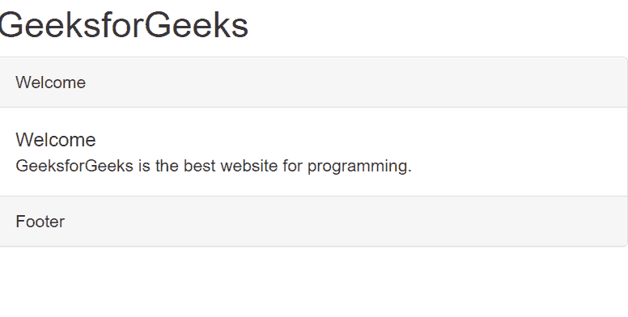

# 如何创建带页脚的引导面板？

> 原文:[https://www . geeksforgeeks . org/如何创建带页脚的引导面板/](https://www.geeksforgeeks.org/how-to-create-bootstrap-panel-with-footer/)

Bootstrap 是一个免费的开源工具，用于设计现代和响应性的网站和网络应用程序。它是开发反应灵敏且美观的网站的最受欢迎的工具。引导面板是有或没有边框的盒子。您可能想要将您的内容放在一些盒子中，以获得独特的设计。所以在这篇文章中，我们将学习如何在我们的网站上实现一个面板，以及如何定制它。

**方法:**我们将创建一个 div 元素并使用**。面板和。面板-默认**类创建面板。**。面板-默认**创建一个面板，在 div 容器内放置的内容周围有一个边框。然后我们将实现标题和页脚使用。面板标题和。面板页脚类。它们将被放置在 **div** 容器内。

在标题标签之间导入我们项目中的引导 CSS CDN。

> <link rel="”stylesheet”" href="”https://stackpath.bootstrapcdn.com/bootstrap/3.4.1/css/bootstrap.min.css”">

**语法:**创建一个 div 元素并使用类。面板和。面板-默认。然后放置另一个 div 元素。里面的面板体。

```html
<div class="panel panel-default">
    <div class="panel-body">Welcome</div>
</div>

```

要改变颜色，我们可以使用其他格式的面板，如

*   面板-默认
*   面板-主要
*   面板-成功
*   面板警告
*   面板信息
*   面板-危险

**示例:**现在我们将使用创建面板标题、面板标题和面板页脚。面板标题。面板标题类和页脚。面板页脚类。通常，放置元素的层次结构首先是标题，然后是正文，最后是页脚。在面板主体内部，我们放置面板标题和面板内容。

## 超文本标记语言

```html
<!DOCTYPE html>
<html>

<head>
    <meta charset="utf-8">
    <meta name="viewport" content="width=device-width">
    <link rel="stylesheet" href=
"https://stackpath.bootstrapcdn.com/bootstrap/3.4.1/css/bootstrap.min.css">
</head>

<body>
    <h2>GeeksforGeeks</h2>
    <div class="panel panel-default">
        <div class="panel-heading">Welcome</div>
        <div class="panel-body">
            <div class="panel-title">Welcome</div>
            <div>
                GeeksforGeeks is the best
                website for programming.
            </div>
        </div>
        <div class="panel-footer">Footer</div>
    </div>
</body>

</html>
```

**输出:**

