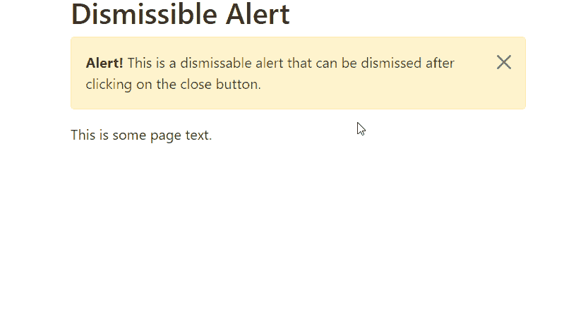

# 如何在 Bootstrap 中创建可消除的警报？

> 原文:[https://www . geeksforgeeks . org/如何在引导中创建可消除的警报/](https://www.geeksforgeeks.org/how-to-create-dismissible-alerts-in-bootstrap/)

警报是引导数据库中非常重要的组件。它们用于向用户显示任何消息，如提交的表单、发送的动态口令或表单中输入的不正确信息。换句话说，警报用于根据用户与网站的交互向用户提供反馈消息。

在本文中，我们将学习如何使用引导库创建**可消除的警报**。可消除的警报使我们的网站像一个现代网站，我们可以在阅读后消除警报。我们需要通过在我们的网页上包含编译后的引导 JavaScript 来加载警报插件。

我们可以添加关闭按钮并使用*。警报解除*类，在警报右侧增加额外的填充，定位关闭按钮。在关闭按钮上，我们使用*data-bs-mission = " alert "*属性，该属性触发 JavaScript 功能。这里建议使用 *<按钮>* 元素，以便所有设备都能正常工作。我们可以使用*。淡化*和*。显示*类以在警报被消除时激活警报。

**语法:**

```html
<div class="alert alert-warning alert-dismissible" role="alert">
    <strong>Alert!</strong>This is a dismissable alert
    <button type="button" class="btn-close" 
      data-bs-dismiss="alert"
      aria-label="Close">
    </button>
</div>
```

**示例:**

## 超文本标记语言

```html
<!DOCTYPE html>
<html lang="en">
  <head>
    <!-- Bootstrap CSS -->
    <link href=
"https://cdn.jsdelivr.net/npm/bootstrap@5.1.1/dist/css/bootstrap.min.css" 
          rel="stylesheet">

    <!-- Bootstrap JS -->
    <script src=
"https://cdn.jsdelivr.net/npm/bootstrap@5.1.1/dist/js/bootstrap.bundle.min.js">
    </script>
  </head>
  <body class="container">
    <h1>Dismissible Alert</h1>
    <div class="alert alert-warning 
                alert-dismissible 
                fade show" role="alert">
        <strong>Alert!</strong>
          This is a dismissable
          alert that can be dismissed after
        clicking on the close button.
        <button type="button" class="btn-close" 
                  data-bs-dismiss="alert" 
                  aria-label="Close">
        </button>
    </div>
    <p>This is some page text.</p>
  </body>
</html>
```

**输出:**

