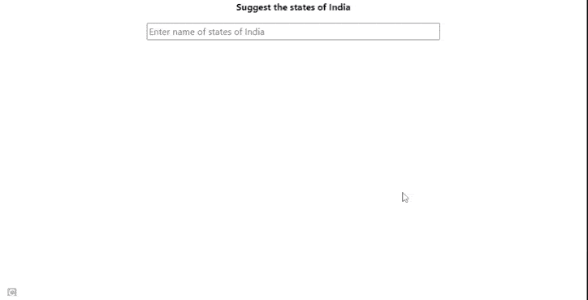

# 如何使用 Bootstrap Typeahead 创建动态自动完成搜索？

> 原文:[https://www . geesforgeks . org/how-create-dynamic-autocomplete-search-use-bootstrap-type ahead/](https://www.geeksforgeeks.org/how-to-create-dynamic-autocomplete-search-using-bootstrap-typeahead/)

在本文中，我们将学习使用 Bootstrap Typeahead 实现动态自动完成搜索。**Bootstrap****type ahead**是一个插件，帮助在搜索栏中添加一个漂亮的自动完成选项。

在这种方法中，我们将使用静态数据进行自动完成，但是我们也可以使用动态 JSON 数据来显示搜索选项。类型先行插件中使用的方法如下。

*   **。提前键入(选项):**用提前键入初始化输入。
*   **。查找:**从外部触发查找功能。
*   **。getactivity:**要获取当前活动项，您将获得一个字符串或一个 JSON 对象，具体取决于您如何初始化 typeahead。它只适用于第一场比赛。

**示例:****以下示例演示了使用 Bootstrap Typehead 的动态自动完成搜索。**

## **超文本标记语言**

```html
<!DOCTYPE html>
<html lang="en">

<head>
    <meta charset="UTF-8" />
    <meta name="viewport" content=
        "width=device-width, initial-scale=1.0" />
    <script src=
"https://ajax.googleapis.com/ajax/libs/jquery/3.5.1/jquery.min.js">
    </script>

    <script src=
"https://cdnjs.cloudflare.com/ajax/libs/bootstrap-3-typeahead/4.0.2/bootstrap3-typeahead.min.js">
    </script>

    <link href=
"https://maxcdn.bootstrapcdn.com/bootstrap/4.0.0/css/bootstrap.min.css"
        rel="stylesheet" />

    <style>
        .typeahead {
            width: 50%;
            top: 60px !important;
            left: 50px !important;
        }
    </style>
</head>

<body style="text-align: center">
    <div>
        <b><p>Suggest the states of India</p></b>

        <input type="text" class="typeahead" 
            data-provide="typeahead" 
            placeholder="Enter name of states of India " />
    </div>

    <script>

        // Initializes  input( name of states)
        // with a typeahead
        var $input = $(".typeahead");
        $input.typeahead({
            source: [
                "Andhra Pradesh",
                "Arunachal Pradesh",
                "Assam",
                "Bihar",
                "Chhattisgarh",
                "Goa",
                "Gujarat",
                "Haryana",
                "Himachal Pradesh",
                "Jharkhand",
                "Karnataka",
                "Kerala",
                "Madhya Pradesh",
                "Maharashtra",
                "Manipur",
                "Meghalaya",
                "Mizoram",
                "Nagaland",
                "Odisha",
                "Punjab",
                "Rajasthan",
                "Sikkim",
                "Tamil Nadu",
                "Telangana",
                "Tripura",
                "Uttar Pradesh",
                "Uttarakhand",
                "West Bengal",
            ],
            autoSelect: true,
        });

        $input.change(function () {
            var current = $input.typeahead("getActive");
            matches = [];

            if (current) {

                // Some item from your input matches
                // with entered data
                if (current.name == $input.val()) {
                    matches.push(current.name);
                }
            }
        });
    </script>
</body>

</html>
```

****输出**:**

**

动态自动提前打字**