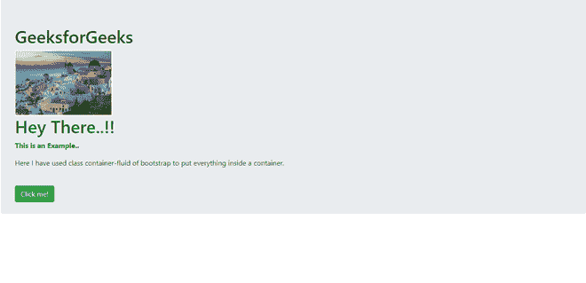

# 如何使用 bootstrap 创建全宽容器？

> 原文:[https://www . geeksforgeeks . org/如何使用引导程序创建全宽容器/](https://www.geeksforgeeks.org/how-to-create-full-width-container-using-bootstrap/)

我们可以使用 bootstrap 的“容器-流体”类创建全宽容器

容器是 Bootstrap 中最基本的布局元素，在使用我们默认的网格系统时是必需的。从响应性的固定宽度容器(意味着其最大宽度在每个断点处变化)或流体宽度容器(意味着其一直是 100%宽)中进行选择。**容器-流体**类可用于获得全宽容器。

**容器-流体**类提供了一个横跨视口整个宽度的全宽容器。在下面的例子中，类别为“container-fluid”的 div 将占据视口的整个宽度，并且在视口调整大小时将会扩展或收缩。

**方法:**

基本上，我们必须创建一个

(不一定是 div，但如果我们使用 div 会更好)，我们必须给它一个类容器-fluid(或容器，取决于宽度)，并把所有的文本放在 div 里面，我们希望这些文本放在一个容器里

**语法:**

*   。每个断点处的容器最大宽度变化

<！–此处内容–>
</div>

*   。容器-流体- 100%宽度

```html
<div class="container-fluid">

        <!-- Content here -->

  </div>
```

**例:**

## 超文本标记语言

```html
<!DOCTYPE html>
<html lang="en">
    <head>
        <!-- Required meta tags -->
        <meta charset="utf-8" />
        <meta
            name="viewport"
            content="width=device-width,
                    initial-scale=1,
                    shrink-to-fit=no"
        />
        <!-- Bootstrap CSS -->
        <link rel="stylesheet"
              href=
"https://stackpath.bootstrapcdn.com/bootstrap/4.5.0/css/bootstrap.min.css"
              integrity=
"sha384-9aIt2nRpC12Uk9gS9baDl411NQApFmC26EwAOH8WgZl5MYYxFfc+NcPb1dKGj7Sk"
              crossorigin="anonymous" />
        <script src=
"https://kit.fontawesome.com/577845f6a5.js"
                crossorigin="anonymous">
      </script>

        <title>Use of class container</title>
        <style type="text/css">
            .bottom-left {
                left: 0;
            }
        </style>
    </head>
    <body>
        <!--class container: max-width
             changes at each breakpoint
       All the text is pushed inside a container-->
        <div class="container">
            <!--class jumbotron: to highlight
               how the class container works-->
            <div class="jumbotron">
                <h1 style="color: #006400;">
                    GeeksforGeeks
                </h1>
                <div>
                    
                </div>
                <div class="position-relative"
                     style="color: green;">
                    <h1>Hey There..!!</h1>
                    <p><b>This is an Example..</b></p>
                    <p>Here I have used class container
                      of bootstrap to put
                      everything inside a container.</p>
                    <br />
                </div>
                <div class="position-relative">
                    <div class=
                         "position-absolute bottom-left">
                        <button type="button"
                                class="btn btn-success">
                            Click me!
                        </button>
                    </div>
                </div>
            </div>
        </div>
    </body>
</html>
```


显示类容器的图像

这里，类容器在顶部 div 标签中使用，将所有文本限制在宽度固定的容器中

**例:**

## 超文本标记语言

```html
<!DOCTYPE html>
<html lang="en">
    <head>
        <!-- Required meta tags -->
        <meta charset="utf-8" />
        <meta
            name="viewport"
            content="width=device-width,
                    initial-scale=1,
                    shrink-to-fit=no"
        />
        <!-- Bootstrap CSS -->
        <link rel="stylesheet"
              href=
"https://stackpath.bootstrapcdn.com/bootstrap/4.5.0/css/bootstrap.min.css"
              integrity=
"sha384-9aIt2nRpC12Uk9gS9baDl411NQApFmC26EwAOH8WgZl5MYYxFfc+NcPb1dKGj7Sk"
              crossorigin="anonymous" />
        <script src=
"https://kit.fontawesome.com/577845f6a5.js"
                crossorigin="anonymous">
      </script>

        <title>Use of class container-fluid</title>
        <style type="text/css">
            .bottom-left {
                left: 0;
            }
        </style>
    </head>
    <body>
        <!--class container-fluid: 100% width-->
        <div class="container-fluid">
            <!--class jumbotron: to highlight
              how the class container works-->
            <div class="jumbotron">
                <h1 style="color: #006400;">
                    GeeksforGeeks
                </h1>
                <div>
                    
                </div>
                <div class="position-relative"
                     style="color: green;">
                    <h1>Hey There..!!</h1>
                    <p><b>This is an Example..</b></p>
                    <p>Here I have used class
                      container-fluid of bootstrap
                      to put everything inside a
                      container.</p>
                    <br />
                </div>
                <div class="position-relative">
                    <div class=
                         "position-absolute bottom-left">
                        <button type="button"
                                class="btn btn-success">
                            Click me!
                        </button>
                    </div>
                </div>
            </div>
        </div>
    </body>
</html>
```

**输出:**



显示类容器-流体的图像

这里 class container-fluid 用于将所有文本限制在宽度为屏幕 10%的容器中