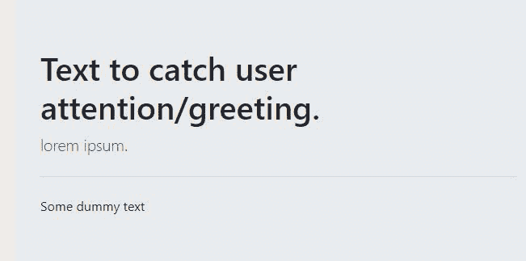
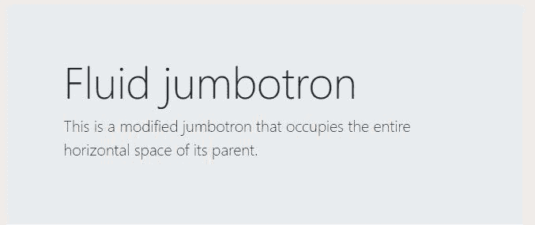
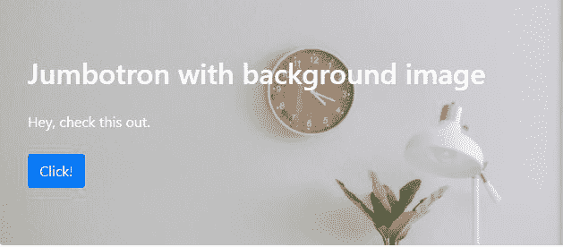

# 如何使用 Bootstrap 5 创建大屏幕？

> 原文:[https://www . geeksforgeeks . org/how-create-jumbo tron-using-bootstrap-5/](https://www.geeksforgeeks.org/how-to-create-jumbotron-using-bootstrap-5/)

Bootstrap Jumbotron 是一个响应组件，其主要目标是吸引访问者的注意力或突出一条特殊的信息。在大屏幕中，您可以使用几乎任何其他引导代码来进一步增加其参与价值。

**大屏幕的用途:**

*   形象展示
*   突出显示内容
*   某个主题的介绍

**进场:**

*   创建一个 Jumbotron 引导程序提供了一个名为**“Jumbotron”**的类。
*   Bootstrap 使用了一些应用于 Jumbotron 的默认属性，使其成为一个非常好的“吸引眼球的东西”。

**示例 1:** 创建一个简单的大屏幕:

## 超文本标记语言

```
<!DOCTYPE html>
<html>

<head>
    <link rel="stylesheet" href=
"https://maxcdn.bootstrapcdn.com/bootstrap/4.0.0/css/bootstrap.min.css"
        integrity=
"sha384-Gn5384xqQ1aoWXA+058RXPxPg6fy4IWvTNh0E263XmFcJlSAwiGgFAW/dAiS6JXm" 
        crossorigin="anonymous">
</head>

<body>
    <div class="jumbotron">
        <h1>Text to catch user attention/greeting.</h1>
        <p class="lead">lorem ipsum.</p>

        <hr class="my-4">

        <p>Some dummy text</p>
    </div>
</body>
</html>
```

**输出:**



**示例 2:** 为了创建一个全宽的大屏幕，我们使用了**大屏幕流体**类和大屏幕类。

## 超文本标记语言

```
<!DOCTYPE html>   
<html>

<head>
    <link rel="stylesheet" href=
"https://maxcdn.bootstrapcdn.com/bootstrap/4.0.0/css/bootstrap.min.css" 
        integrity=
"sha384-Gn5384xqQ1aoWXA+058RXPxPg6fy4IWvTNh0E263XmFcJlSAwiGgFAW/dAiS6JXm" 
        crossorigin="anonymous">
</head>

<body>
    <div class="jumbotron jumbotron-fluid">
        <div class="container">
            <h1 class="display-4">Fluid jumbotron</h1>
            <p class="lead">
                This is a modified jumbotron that 
                occupies the entire horizontal 
                space of its parent.
            </p>
        </div>
    </div>
</body>

</html>
```

**输出**



**示例 3:** 我们还可以对 Jumbotron 进行样式化，并添加背景图像，使其更具吸引力，如下图所示。

## 超文本标记语言

```
<!DOCTYPE html>
<html>

<head>
    <link rel="stylesheet" href=
"https://maxcdn.bootstrapcdn.com/bootstrap/4.0.0/css/bootstrap.min.css" 
        integrity=
"sha384-Gn5384xqQ1aoWXA+058RXPxPg6fy4IWvTNh0E263XmFcJlSAwiGgFAW/dAiS6JXm" 
        crossorigin="anonymous">

    <style>
        .jumbotron-image {
            background-position: center center;
            background-repeat: no-repeat;
            background-size: cover;
        }
    </style>
</head>

<body>
    <div class="jumbotron text-white jumbotron-image shadow" 
        style="background-image: url(
https://media.geeksforgeeks.org/wp-content/uploads/20200914000601/gfg-300x200.jpg
 );">
        <h2 class="mb-4">
            Jumbotron with background image
        </h2>

        <p class="mb-4">
            Hey, check this out.
        </p>

        <a class="btn btn-primary">
            Click!
        </a>
    </div>
</body>

</html>
```

**输出**

