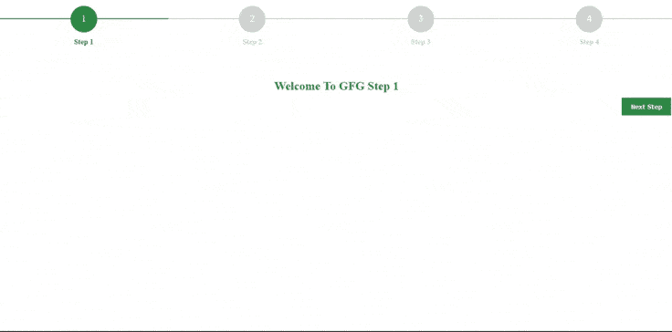

# 如何使用 Bootstrap 创建多步进度条？

> 原文:[https://www . geeksforgeeks . org/如何创建-多步-进度条-使用-引导/](https://www.geeksforgeeks.org/how-to-create-multi-step-progress-bar-using-bootstrap/)

在本文中，我们将使用 Bootstrap 创建一个多步进度条。除了 Bootstrap 之外，我们还将使用 jQuery 进行 DOM 操作。

进度条用于可视化已完成的工作量。进度条的强度表示工作的进度。它通常用于在线网络应用程序，如 YouTube、GitHub 等，以显示页面到目前为止是如何加载的。您也可以在将内容下载或上传到 web 应用程序时找到进度条。

多步进度条用于以**步格式显示工作进度。**

**例如:**

```html
 Step1 -> Step2 -> Step3 -> Final
```

每个步骤都有一个进度条，显示到达下一步的进度。

**示例:**要创建多步进度条，让我们创建 3 个文件**【index.html】****style . CSS****script . js**。

**index.html:**

## 超文本标记语言

```html
<!DOCTYPE html>
<html>

<head>
    <link href=
'https://stackpath.bootstrapcdn.com/bootstrap/4.3.1/css/bootstrap.min.css'>

    <script src=
'https://stackpath.bootstrapcdn.com/bootstrap/4.3.1/js/bootstrap.bundle.min.js'>
    </script>

    <script src=
'https://cdnjs.cloudflare.com/ajax/libs/jquery/3.2.1/jquery.min.js'>
    </script>

    <link rel="stylesheet" href="styles.css">
</head>

<body>
    <div class="container">
        <div class="row justify-content-center">
            <div class="col-11 col-sm-9 col-md-7 
                col-lg-6 col-xl-5 text-center p-0 mt-3 mb-2">
                <div class="px-0 pt-4 pb-0 mt-3 mb-3">
                    <form id="form">
                        <ul id="progressbar">
                            <li class="active" id="step1">
                                <strong>Step 1</strong>
                            </li>
                            <li id="step2"><strong>Step 2</strong></li>
                            <li id="step3"><strong>Step 3</strong></li>
                            <li id="step4"><strong>Step 4</strong></li>
                        </ul>
                        <div class="progress">
                            <div class="progress-bar"></div>
                        </div> <br>
                        <fieldset>
                            <h2>Welcome To GFG Step 1</h2>
                            <input type="button" name="next-step" 
                                class="next-step" value="Next Step" />
                        </fieldset>
                        <fieldset>
                            <h2>Welcome To GFG Step 2</h2>
                            <input type="button" name="next-step" 
                                class="next-step" value="Next Step" />
                            <input type="button" name="previous-step" 
                                class="previous-step" 
                                value="Previous Step" />
                        </fieldset>
                        <fieldset>
                            <h2>Welcome To GFG Step 3</h2>
                            <input type="button" name="next-step" 
                                class="next-step" value="Final Step" />
                            <input type="button" name="previous-step" 
                                class="previous-step" 
                                value="Previous Step" />
                        </fieldset>
                        <fieldset>
                            <div class="finish">
                                <h2 class="text text-center">
                                    <strong>FINISHED</strong>
                                </h2>
                            </div>
                            <input type="button" name="previous-step" 
                                class="previous-step" 
                                value="Previous Step" />
                        </fieldset>
                    </form>
                </div>
            </div>
        </div>
    </div>
</body>
<script src="script.js"></script>

</html>
```

风格. css:

## 半铸钢ˌ钢性铸铁(Cast Semi-Steel)

```html
* {
    margin: 0;
    padding: 0
}

html {
    height: 100%
}

h2{
    color: #2F8D46;
}
#form {
    text-align: center;
    position: relative;
    margin-top: 20px
}

#form fieldset {
    background: white;
    border: 0 none;
    border-radius: 0.5rem;
    box-sizing: border-box;
    width: 100%;
    margin: 0;
    padding-bottom: 20px;
    position: relative
}

.finish {
    text-align: center
}

#form fieldset:not(:first-of-type) {
    display: none
}

#form .previous-step, .next-step {
    width: 100px;
    font-weight: bold;
    color: white;
    border: 0 none;
    border-radius: 0px;
    cursor: pointer;
    padding: 10px 5px;
    margin: 10px 5px 10px 0px;
    float: right
}

.form, .previous-step {
    background: #616161;
}

.form, .next-step {
    background: #2F8D46;
}

#form .previous-step:hover,
#form .previous-step:focus {
    background-color: #000000
}

#form .next-step:hover,
#form .next-step:focus {
    background-color: #2F8D46
}

.text {
    color: #2F8D46;
    font-weight: normal
}

#progressbar {
    margin-bottom: 30px;
    overflow: hidden;
    color: lightgrey
}

#progressbar .active {
    color: #2F8D46
}

#progressbar li {
    list-style-type: none;
    font-size: 15px;
    width: 25%;
    float: left;
    position: relative;
    font-weight: 400
}

#progressbar #step1:before {
    content: "1"
}

#progressbar #step2:before {
    content: "2"
}

#progressbar #step3:before {
    content: "3"
}

#progressbar #step4:before {
    content: "4"
}

#progressbar li:before {
    width: 50px;
    height: 50px;
    line-height: 45px;
    display: block;
    font-size: 20px;
    color: #ffffff;
    background: lightgray;
    border-radius: 50%;
    margin: 0 auto 10px auto;
    padding: 2px
}

#progressbar li:after {
    content: '';
    width: 100%;
    height: 2px;
    background: lightgray;
    position: absolute;
    left: 0;
    top: 25px;
    z-index: -1
}

#progressbar li.active:before,
#progressbar li.active:after {
    background: #2F8D46
}

.progress {
    height: 20px
}

.progress-bar {
    background-color: #2F8D46
}
```

**script.js**

## java 描述语言

```html
$(document).ready(function () {
    var currentGfgStep, nextGfgStep, previousGfgStep;
    var opacity;
    var current = 1;
    var steps = $("fieldset").length;

    setProgressBar(current);

    $(".next-step").click(function () {

        currentGfgStep = $(this).parent();
        nextGfgStep = $(this).parent().next();

        $("#progressbar li").eq($("fieldset")
            .index(nextGfgStep)).addClass("active");

        nextGfgStep.show();
        currentGfgStep.animate({ opacity: 0 }, {
            step: function (now) {
                opacity = 1 - now;

                currentGfgStep.css({
                    'display': 'none',
                    'position': 'relative'
                });
                nextGfgStep.css({ 'opacity': opacity });
            },
            duration: 500
        });
        setProgressBar(++current);
    });

    $(".previous-step").click(function () {

        currentGfgStep = $(this).parent();
        previousGfgStep = $(this).parent().prev();

        $("#progressbar li").eq($("fieldset")
            .index(currentGfgStep)).removeClass("active");

        previousGfgStep.show();

        currentGfgStep.animate({ opacity: 0 }, {
            step: function (now) {
                opacity = 1 - now;

                currentGfgStep.css({
                    'display': 'none',
                    'position': 'relative'
                });
                previousGfgStep.css({ 'opacity': opacity });
            },
            duration: 500
        });
        setProgressBar(--current);
    });

    function setProgressBar(currentStep) {
        var percent = parseFloat(100 / steps) * current;
        percent = percent.toFixed();
        $(".progress-bar")
            .css("width", percent + "%")
    }

    $(".submit").click(function () {
        return false;
    })
});
```

**输出:**



jQuery 是一个开源的 JavaScript 库，它简化了 HTML/CSS 文档之间的交互，它以其“少写多做”的理念而闻名。
跟随本 [jQuery 教程](https://www.geeksforgeeks.org/jquery-tutorials/)和 [jQuery 示例](https://www.geeksforgeeks.org/jquery-examples/)可以从头开始学习 jQuery。