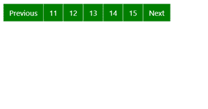
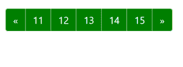
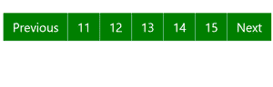
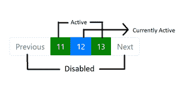
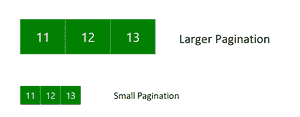
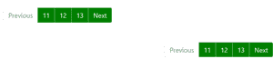

# 如何在 Bootstrap 4 中创建分页？

> 原文:[https://www . geeksforgeeks . org/如何在引导中创建分页-4/](https://www.geeksforgeeks.org/how-to-create-pagination-in-bootstrap-4/)

**Bootstrap** 是一个免费的开源工具集合，用于创建响应性网站和网络应用程序。它是最流行的 HTML、CSS 和 JavaScript 框架，用于开发响应迅速、移动优先的网站。它解决了我们曾经遇到的许多问题，其中之一就是跨浏览器兼容性问题。

**分页**是一个元素，用于指示多个跑步者之间一系列附属内容的现状，并支持在他们之间导航。

**分页介绍:**我们利用一个巨大的关联连接方块来进行分页，使得连接很难被遗漏，并且具有有效的适应性——同时提供巨大的命中区域。分页是通过一个 HTML 组件列表来完成的，因此每个用户的屏幕都可以报告可访问的连接数。利用包装<导航>组件，将其作为路由区来区分每个用户和其他辅助进步。

此外，由于页面可能有不止一个这样的路线区域，谨慎的做法是给

<nav>一个明确的咏叹调名称。例如，如果分页部分用于在一堆列表项之间进行浏览，那么一个合适的名称可以是 aria-label=“搜索结果页面”。</nav>

**示例:**

## 超文本标记语言

```html
<!DOCTYPE html>
<html lang="en">

<head>
    <meta charset="UTF-8">
    <meta http-equiv="X-UA-Compatible" 
        content="IE=edge">
    <meta name="viewport" content=
        "width=device-width, initial-scale=1.0">
    <link rel="stylesheet" href=
"https://maxcdn.bootstrapcdn.com/bootstrap/4.0.0/css/bootstrap.min.css"
        integrity=
"sha384-Gn5384xqQ1aoWXA+058RXPxPg6fy4IWvTNh0E263XmFcJlSAwiGgFAW/dAiS6JXm"
        crossorigin="anonymous">

    <style>
        .pagination {
            padding: 12rem 0 0 22rem;
        }

        .page-link {
            background-color: green;
            color: white;
        }
    </style>
</head>

<body>
    <nav aria-label="navigation example">
        <ul class="pagination border-success">
            <li><a class="page-link" href="#">Previous</a></li>
            <li><a class="page-link" href="#">11</a></li>
            <li><a class="page-link" href="#">12</a></li>
            <li><a class="page-link" href="#">13</a></li>
            <li><a class="page-link" href="#">14</a></li>
            <li><a class="page-link" href="#">15</a></li>
            <li><a class="page-link" href="#">Next</a></li>
        </ul>
    </nav>
</body>

</html>
```

**输出:**



**使用图标:**希望在一些分页连接中使用符号或图像来代替文本。确保为每个用户提供合法的屏幕支持。仅 sr

**示例:**

## 超文本标记语言

```html
<!DOCTYPE html>
<html lang="en">

<head>
    <meta charset="UTF-8">
    <meta http-equiv="X-UA-Compatible"
        content="IE=edge">
    <meta name="viewport" content=
        "width=device-width, initial-scale=1.0">
    <link rel="stylesheet" href=
"https://maxcdn.bootstrapcdn.com/bootstrap/4.0.0/css/bootstrap.min.css"
        integrity=
"sha384-Gn5384xqQ1aoWXA+058RXPxPg6fy4IWvTNh0E263XmFcJlSAwiGgFAW/dAiS6JXm"
        crossorigin="anonymous">

    <style>
        .pagination {
            padding: 12rem 0 0 22rem;
        }

        .page-link {
            background-color: green;
            color: white;
        }
    </style>
</head>

<body>
    <nav aria-label="Page navigation">
        <ul class="pagination">
            <li class="page-item">
                <a class="page-link" href="#" 
                    aria-label="Previous">
                    <span aria-hidden="true">«</span>
                    <span class="sr-only">Previous</span>
                </a>
            </li>
            <li><a class="page-link" href="#">11</a></li>
            <li><a class="page-link" href="#">12</a></li>
            <li><a class="page-link" href="#">13</a></li>
            <li><a class="page-link" href="#">14</a></li>
            <li><a class="page-link" href="#">15</a></li>
            <li>
                <a class="page-link" href="#" aria-label="Next">
                    <span aria-hidden="true">»</span>
                    <span class="sr-only">Next</span>
                </a>
            </li>
        </ul>
    </nav>
</body>

</html>
```

**输出:**



**禁用和激活状态:**

*   **活动:**分页连接可针对各种条件进行调整。使用**。**激活显示当前页面。

**示例:**

## 超文本标记语言

```html
<!DOCTYPE html>
<html lang="en">

<head>
    <meta charset="UTF-8">
    <meta http-equiv="X-UA-Compatible" 
        content="IE=edge">
    <meta name="viewport" content=
        "width=device-width, initial-scale=1.0">
    <link rel="stylesheet" href=
"https://maxcdn.bootstrapcdn.com/bootstrap/4.0.0/css/bootstrap.min.css"
        integrity=
"sha384-Gn5384xqQ1aoWXA+058RXPxPg6fy4IWvTNh0E263XmFcJlSAwiGgFAW/dAiS6JXm"
        crossorigin="anonymous">

    <style>
        .pagination {
            padding: 12rem 0 0 22rem;
        }

        .page-link {
            background-color: green;
            color: white;
        }
    </style>
</head>

<body>
    <nav aria-label="...">
        <ul class="pagination">
            <li>
                <a class="page-link" href="#" 
                    tabindex="-1">Previous</a>
            </li>
            <li><a class="page-link" href="#">11</a></li>
            <li class="active">
                <a class="page-link" href="#">12</a>
            </li>
            <li><a class="page-link" href="#">13</a></li>
            <li class="active">
            <li><a class="page-link" href="#">14</a></li>
            <li class="active">
            <li><a class="page-link" href="#">15</a></li>
            <li class="active">
                <a class="page-link" href="#">Next</a>
            </li>
        </ul>
    </nav>
</body>

</html>
```

**输出:**



*   **禁用:**而。disabled 类利用指针场合:无试图削弱< a >的连接有用性，CSS 属性尚未规范化，不代表控制台路由。因此，您应该始终如一地在受损的连接上添加 tab index =“-1”，并利用自定义 JavaScript 来完全禁用它们的有用性。

**示例:**

## 超文本标记语言

```html
<!DOCTYPE html>
<html lang="en">

<head>
    <meta charset="UTF-8">
    <meta http-equiv="X-UA-Compatible" 
        content="IE=edge">
    <meta name="viewport" content=
        "width=device-width, initial-scale=1.0">
    <link rel="stylesheet" href=
"https://maxcdn.bootstrapcdn.com/bootstrap/4.0.0/css/bootstrap.min.css"
        integrity=
"sha384-Gn5384xqQ1aoWXA+058RXPxPg6fy4IWvTNh0E263XmFcJlSAwiGgFAW/dAiS6JXm"
    crossorigin="anonymous">

    <style>
        .pagination {
            padding: 12rem 0 0 22rem;
        }

        .page-link {
            background-color: green;
            color: white;
        }
    </style>
</head>

<body>
    <nav aria-label="...">
        <ul class="pagination">
            <li class="page-item disabled">
                <span class="page-link">Previous</span>
            </li>
            <li class="page-item">
                <a class="page-link" href="#">11</a>
            </li>
            <li class="page-item active">
                <span class="page-link">
                    12
                    <span class="sr-only">(current)</span>
                </span>
            </li>
            <li class="page-item">
                <a class="page-link" href="#">13</a>
            </li>
            <li class="page-item disabled">
                <a class="page-link" href="#">Next</a>
            </li>
        </ul>
    </nav>
</body>

</html>
```

**输出:**



**大小:大和小:**在这种情况下，我们将设置分页列表的大小。

**示例:**

## 超文本标记语言

```html
<!DOCTYPE html>
<html lang="en">

<head>
    <meta charset="UTF-8">
    <meta http-equiv="X-UA-Compatible" 
        content="IE=edge">
    <meta name="viewport" content=
        "width=device-width, initial-scale=1.0">
    <link rel="stylesheet" href=
"https://maxcdn.bootstrapcdn.com/bootstrap/4.0.0/css/bootstrap.min.css"
        integrity=
"sha384-Gn5384xqQ1aoWXA+058RXPxPg6fy4IWvTNh0E263XmFcJlSAwiGgFAW/dAiS6JXm"
        crossorigin="anonymous">

    <style>
        .pagination {
            padding: 2rem 0 0 2rem;
        }

        .page-link {
            background-color: green;
            color: white;
        }
    </style>
</head>

<body>
    <nav aria-label="larger">
        <ul class="pagination pagination-lg">
            <li class=" disabled">
                <a class="page-link" 
                    href="#" tabindex="-1">11</a>
            </li>
            <li><a class="page-link" href="#">12</a></li>
            <li><a class="page-link" href="#">13</a></li>
        </ul>
    </nav>
    <nav aria-label="small">
        <ul class="pagination pagination-sm">
            <li class="disabled">
                <a class="page-link" 
                    href="#" tabindex="-1">11</a>
            </li>
            <li><a class="page-link" href="#">12</a></li>
            <li><a class="page-link" href="#">13</a></li>
        </ul>
    </nav>
</body>

</html>
```

**输出:**



**对齐:**在这种情况下，我们将使用 flexbox 更改分页组件的对齐方式。

**示例:**

## 超文本标记语言

```html
<!DOCTYPE html>
<html lang="en">

<head>
    <meta charset="UTF-8">
    <meta http-equiv="X-UA-Compatible"
        content="IE=edge">
    <meta name="viewport" content=
        "width=device-width, initial-scale=1.0">
    <link rel="stylesheet" href=
"https://maxcdn.bootstrapcdn.com/bootstrap/4.0.0/css/bootstrap.min.css"
        integrity=
"sha384-Gn5384xqQ1aoWXA+058RXPxPg6fy4IWvTNh0E263XmFcJlSAwiGgFAW/dAiS6JXm"
        crossorigin="anonymous">

    <style>
        .pagination {
            padding: 2rem 0 0 0;
        }

        .page-link {
            background-color: green;
            color: white;
        }
    </style>
</head>

<body>
    <!-- Pagination in Center -->
    <nav aria-label="Page navigation">
        <ul class="pagination justify-content-center">
            <li class="page-item disabled">
                <a class="page-link" href="#" 
                    tabindex="-1">Previous
                </a>
            </li>
            <li class="page-item">
                <a class="page-link" href="#">11</a>
            </li>
            <li class="page-item">
                <a class="page-link" href="#">12</a>
            </li>
            <li class="page-item">
                <a class="page-link" href="#">13</a>
            </li>
            <li class="page-item">
                <a class="page-link" href="#">Next</a>
            </li>
        </ul>
    </nav>
    <!-- Pagination in End -->
    <nav aria-label="Page navigation">
        <ul class="pagination justify-content-end">
            <li class="page-item disabled">
                <a class="page-link" href="#" 
                    tabindex="-1">Previous
                </a>
            </li>
            <li class="page-item">
                <a class="page-link" href="#">11</a>
            </li>
            <li class="page-item">
                <a class="page-link" href="#">12</a>
            </li>
            <li class="page-item">
                <a class="page-link" href="#">13</a>
            </li>
            <li class="page-item">
                <a class="page-link" href="#">Next</a>
            </li>
        </ul>
    </nav>
</body>

</html>
```

**输出:**

