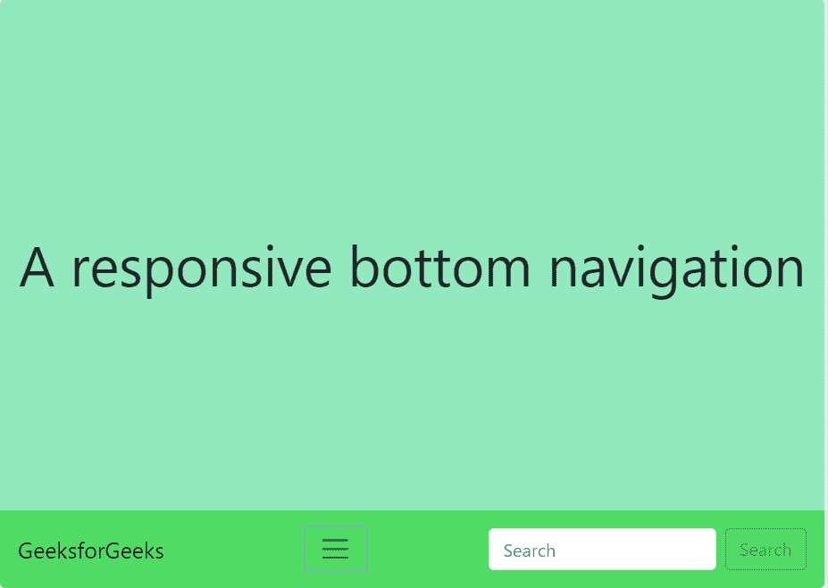
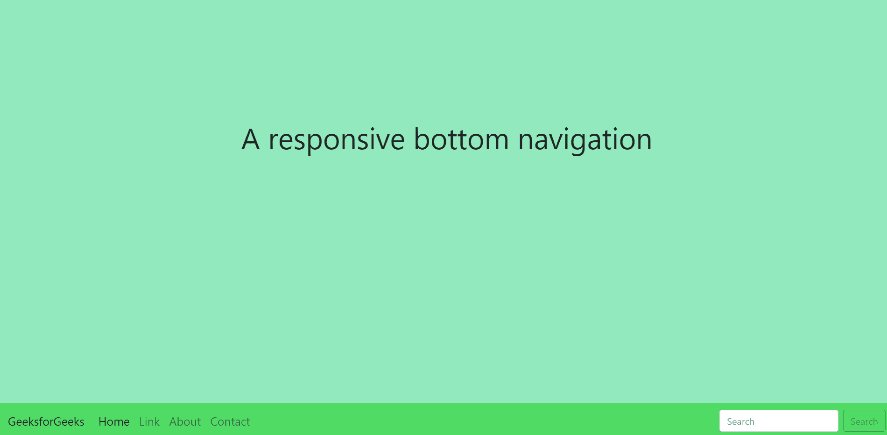
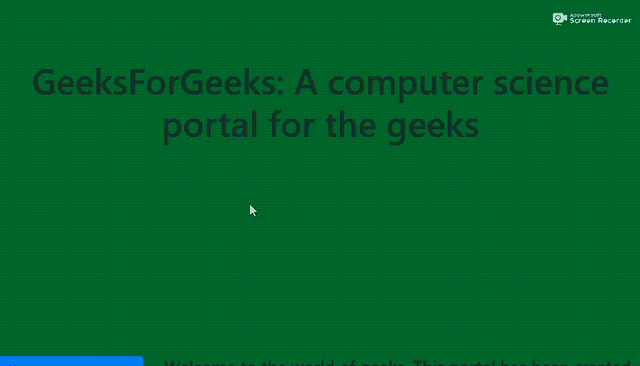

# 如何使用 Bootstrap 创建响应性底部导航栏？

> 原文:[https://www . geesforgeks . org/how-create-responsive-bottom-导航栏-使用-bootstrap/](https://www.geeksforgeeks.org/how-to-create-responsive-bottom-navigation-bar-using-bootstrap/)

每个网站都使用导航栏，以使其更加用户友好，从而使网站导航变得容易，用户可以直接搜索他们感兴趣的主题。
航海一词是指从一个地方移动到另一个地方的科学。在本文中，我们在网页的底部创建了一个导航栏。网页或网站底部的导航，可以是固定的，也可以是移动的，可以在各种屏幕尺寸下进行调整。本文介绍了在 Bootstrap 中创建“响应底部导航”的过程。

**示例 1:** 在这段代码中，我们创建了一个导航菜单，并将其固定在页面底部。这是拥有底部导航最简单的方法之一。“固定底部”类将导航栏粘贴到页面底部。

```
<!DOCTYPE html>
<html>

<head>
    <title>
        Responsive Bottom navigation
    </title>

    <link rel="stylesheet" 
          href=
"https://stackpath.bootstrapcdn.com/bootstrap/4.3.1/css/bootstrap.min.css" 
          integrity=
"sha384-ggOyR0iXCbMQv3Xipma34MD+dH/1fQ784/j6cY/iJTQUOhcWr7x9JvoRxT2MZw1T" 
          crossorigin="anonymous">

    <script src="https://code.jquery.com/jquery-3.3.1.slim.min.js" 
            integrity=
"sha384-q8i/X+965DzO0rT7abK41JStQIAqVgRVzpbzo5smXKp4YfRvH+8abtTE1Pi6jizo"
            crossorigin="anonymous">
  </script>

    <script src=
"https://cdnjs.cloudflare.com/ajax/libs/popper.js/1.14.7/umd/popper.min.js" 
            integrity=
"sha384-UO2eT0CpHqdSJQ6hJty5KVphtPhzWj9WO1clHTMGa3JDZwrnQq4sF86dIHNDz0W1" 
            crossorigin="anonymous">
  </script>

    <script src=
"https://stackpath.bootstrapcdn.com/bootstrap/4.3.1/js/bootstrap.min.js" 
            integrity=
"sha384-JjSmVgyd0p3pXB1rRibZUAYoIIy6OrQ6VrjIEaFf/nJGzIxFDsf4x0xIM+B07jRM" 
            crossorigin="anonymous">
  </script>

    <meta charset="utf-8">

    <meta name="viewport" 
          content="width=device-width, initial-scale=1, shrink-to-fit=no">

    <style>
        .navbar {
            width: 100%;
            background-color: rgb(80, 220, 100);
        }

        ul {
            font-size: 20px;
        }

        body {
            text-align: center;
            padding-top: 200px;
        }

        h1 {
            color: green;
        }
    </style>
</head>

<body>
    <h1>GeeksforGeeks</h1>

    <h3>A responsive bottom navigation<h3>

    <nav class="navbar fixed-bottom navbar-expand-lg navbar-light">
        <a class="navbar-brand" href="#">GeeksforGeeks</a>
        <button class="navbar-toggler"
                type="button"
                data-toggle="collapse"
                data-target="#navbarSupportedContent"
                aria-controls="navbarSupportedContent"
                aria-expanded="false"
                aria-label="Toggle navigation">
            <span class="navbar-toggler-icon"></span>
        </button>

        <div class="collapse navbar-collapse"
                    id="navbarSupportedContent">
            <ul class="navbar-nav mr-auto">
                <li class="nav-item active">
                    <a class="nav-link" href="#">
                        Home 
                        <span class="sr-only">
                            (current)
                        </span>
                    </a>
                </li>
                <li class="nav-item">
                    <a class="nav-link" href="#">
                        Link
                    </a>
                </li>
                <li class="nav-item">
                    <a class="nav-link" href="#">
                        About
                    </a>
                </li>
                <li class="nav-item">
                    <a class="nav-link" href="#">
                        Contact
                    </a>
                </li>
            </ul>
        </div>

        <div>
            <form class="form-inline my-2 my-lg-0">
                <input class="form-control mr-sm-2"
                        type="search" placeholder="Search"
                        aria-label="Search">
                <button class="btn btn-outline-success my-2 my-sm-0"
                            type="submit">
                    Search
                </button>
            </form>
        </div>
    </nav> 
</body>

</html>
```

**输出:**

*   **小屏幕上的导航条:**
    
*   **大屏幕中的导航条:**
    

**示例 2:** 在上面的代码中，我们看到了如何在页面底部固定一个简单的导航菜单。在这个例子中，我们在页面底部放置了一个垂直的小药丸，上面有一个可以导航的菜单。

```
<!DOCTYPE html>
<html>

<head>
    <title>Responsive Navigation</title>

    <link rel="stylesheet"
          href=
"https://stackpath.bootstrapcdn.com/bootstrap/4.3.1/css/bootstrap.min.css" 
          integrity=
"sha384-ggOyR0iXCbMQv3Xipma34MD+dH/1fQ784/j6cY/iJTQUOhcWr7x9JvoRxT2MZw1T" 
          crossorigin="anonymous">

    <script src="https://code.jquery.com/jquery-3.3.1.slim.min.js" 
            integrity=
"sha384-q8i/X+965DzO0rT7abK41JStQIAqVgRVzpbzo5smXKp4YfRvH+8abtTE1Pi6jizo"
            crossorigin="anonymous">
  </script>

    <script src=
"https://cdnjs.cloudflare.com/ajax/libs/popper.js/1.14.7/umd/popper.min.js" 
            integrity=
"sha384-UO2eT0CpHqdSJQ6hJty5KVphtPhzWj9WO1clHTMGa3JDZwrnQq4sF86dIHNDz0W1" 
            crossorigin="anonymous">
  </script>

    <script src=
"https://stackpath.bootstrapcdn.com/bootstrap/4.3.1/js/bootstrap.min.js" 
            integrity=
"sha384-JjSmVgyd0p3pXB1rRibZUAYoIIy6OrQ6VrjIEaFf/nJGzIxFDsf4x0xIM+B07jRM"
            crossorigin="anonymous">
  </script>

    <meta charset="utf-8">

    <meta name="viewport" 
          content="width=device-width, initial-scale=1, shrink-to-fit=no">

    <style>
        h1 {
            text-align: center;
            font-size: 50px;
            padding-top: 200px;
            margin-bottom: 300px;
        }

        body {
            background-color: rgb(11, 102, 35);
        }
    </style>
</head>

<body>
    <h1>
        GeeksForGeeks: A computer
        science portal for the geeks
    </h1>

    <div class="row">
        <div class="col-3">
            <div class="nav flex-column nav-pills" 
                 id="v-pills-tab"
                 role="tablist"
                 aria-orientation="vertical">

                <a class="nav-link active" 
                   id="v-pills-home-tab" 
                   data-toggle="pill" 
                   href="#v-pills-home" 
                   role="tab" 
                   aria-controls="v-pills-home" 
                   aria-selected="true">
                    <h6>
                        <font color="black">Home</font>
                    </h6>
                </a>

                <a class="nav-link" 
                   id="v-pills-profile-tab"
                   data-toggle="pill"
                   href="#v-pills-profile"
                   role="tab" 
                   aria-controls="v-pills-profile" 
                   aria-selected="false">
                    <h6>
                        <font color="black">Policies</font>
                    </h6>
                </a>

                <a class="nav-link" 
                   id="v-pills-messages-tab" 
                   data-toggle="pill" 
                   href="#v-pills-messages" 
                   role="tab" 
                   aria-controls="v-pills-messages" 
                   aria-selected="false">
                    <h6>
                        <font color="black">Vacancies</font>
                    </h6>
                </a>

                <a class="nav-link" 
                   id="v-pills-settings-tab" 
                   data-toggle="pill"
                   href="#v-pills-settings" 
                   role="tab" 
                   aria-controls="v-pills-settings" 
                   aria-selected="false">
                    <h6>
                        <font color="black">Contact</font>
                    </h6>
                </a>
            </div>
        </div>

        <div class="col-9">
            <div class="tab-content" 
                 id="v-pills-tabContent">

                <div class="tab-pane fade show active" 
                     id="v-pills-home"
                     role="tabpanel" 
                     aria-labelledby="v-pills-home-tab">
                    <h4>
                        Welcome to the world of geeks. 
                        This portal has been created to 
                        provide well written, well thought
                        and well-explained solutions for 
                        selected questions. It is the best 
                        place to learn exciting things about
                        the world of programming. We've got 
                        exciting problems for interviews, 
                        placements and much more.                                 
                    </h4>
                </div>
                <div class="tab-pane fade" 
                     id="v-pills-profile" 
                     role="tabpanel" 
                     aria-labelledby="v-pills-profile-tab">
                    <h4>
                        Application Privacy Statement
                        We Sanchhaya Education Pvt. Ltd.,
                        are registered and headquartered at
                        BC 227, 2nd Floor, Matrix Business
                        Tower, B4, Sector 132, Noida, UP-201301,
                        hereinafter referred to as GeeksforGeeks.
                        We also offer paid Courses managed by
                        Sanchhaya Classes Pvt. Ltd. with registered 
                        office address B-142, Vishwas Park, Uttam Nagar,
                        New Delhi, North Delhi, Delhi, India, 110059. 
                        At GeeksforGeeks, we value your trust & respect
                        your privacy. This privacy statement
                        (“Privacy Statement”) applies to the 
                        treatment of personally identifiable information
                        submitted by, or otherwise obtained from, you in
                        connection with the associated application 
                        (“Application”). The Application is provided by 
                        GeeksforGeeks (and may be provided by Geeksforgeeks
                        on behalf of a GeeksforGeeks licensor or partner 
                        (“Application Partner”). By using or otherwise 
                        accessing the Application, you acknowledge that
                        you accept the practices and policies outlined in
                        this Privacy Statement.
                    </h4>
                </div>
                <div class="tab-pane fade" 
                     id="v-pills-messages" 
                     role="tabpanel" 
                     aria-labelledby="v-pills-messages-tab">
                    <h4>
                        What impact will you make?
                        Are you ready to apply your knowledge and background
                        to exciting new challenges? From learning to leadership,
                        this is your chance to take your career to the next level.
                        Apply for below-listed vacancies and our team will
                        get in touch with you.
                    </h4>
                </div>
                <div class="tab-pane fade" 
                     id="v-pills-settings" 
                     role="tabpanel" 
                     aria-labelledby="v-pills-settings-tab">
                    <h4>
                        Address: GeeksforGeeks 4th,5th & 6th Floor, 
                        Royal Kapsons, A- 118, Sector- 136, Noida,
                        Uttar Pradesh (201305) For feedback and queries: 
                        feedback@geeksforgeeks.org For course related queries:
                        geeks.classes@geeksforgeeks.org For payment related issues:
                        geeks.classes@geeksforgeeks.org For any issue in a purchased
                        course : complaints@geeksforgeeks.org
                    </h4>
                </div>
            </div>
        </div>
    </div>
</body>

</html>
```

**输出:**
