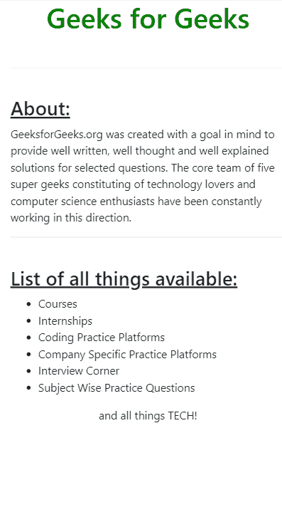

# 如何使用 Bootstrap 在手机上创建缩小到全宽的响应网站？

> 原文:[https://www . geeksforgeeks . org/如何创建响应性网站-缩小至全宽-在移动中使用-bootstrap/](https://www.geeksforgeeks.org/how-to-create-responsive-website-zoomed-out-to-full-width-on-mobile-using-bootstrap/)

**容器类:**这是预定义的引导类之一，其中包含了网页的全部内容。有两个容器类，即**容器**和**容器-流体**类。这些类有不同的属性，人们可以使用适合自己需求的类。

**CONTAINER-FLUID:** 当网页的内容被包含在具有 CONTAINER-FLUID 类的 div 元素中时，div 中包含的所有元素都被填充到设备的整个宽度。

**CONTAINER:** 当网页的内容被包含在具有 CONTAINER 类的 div 元素中时，div 中包含的所有元素不会被填充到设备的整个宽度。相反，对于每个标准屏幕大小的断点，都有预定义的媒体查询。
例如:

*   ```
    @media (min-width: 1200px)
    .container {
        max-width: 1140px;}
    ```

*   ```
    @media (min-width: 992px)
    .container {
        max-width: 960px;
    }
    ```

很明显，使用**容器**类会提供一定量的左右边距，这是默认的，对于不同的屏幕尺寸是不同的。但是，有一个例外，当屏幕尺寸从平板尺寸变成移动尺寸时，容器类后面的媒体查询会自动改变，以占据 100%的屏幕宽度。

*   。集装箱{
    宽度:100%；
    填充-右侧:15px
    左填充:15px
    右边距:自动；
    左边距:汽车；
    }

**示例:**以下示例是适应设备屏幕宽度的响应网页。

```
<!DOCTYPE html>
<html>
    <head>
        <title>Responsive Div</title>
        <meta name="viewport" 
              content="width=device-width,
                       initial-scale=1" />

        <link rel="stylesheet" 
              href=
"https://maxcdn.bootstrapcdn.com/bootstrap/4.3.1/css/bootstrap.min.css" />
    </head>
    <body>
        <div class="container">
            <center>
                <h1 style="color: green;">
                    Geeks for Geeks
                </h1>
            </center>
            <br />
            <hr />
            <br />
            <h3><u>About:</u></h3>
            GeeksforGeeks.org was created with a goal
          in mind to provide well written, well thought
          and well explained solutions for selected 
          questions. The core team of five super geeks
          constituting of technology lovers and computer
          science enthusiasts have been constantly 
          working in this direction.
            <br />
            <hr />
            <br />
            <h3><u>List of all things available:</u></h3>
            <ul>
                <li>Courses</li>
                <li>Internships</li>
                <li>Coding Practice Platforms</li>
                <li>Company Specific Practice Platforms</li>
                <li>Interview Corner</li>
                <li>Subject Wise Practice Questions</li>
            </ul>
            <center>and all things TECH!</center>
        </div>
        <script src=
"https://ajax.googleapis.com/ajax/libs/jquery/3.3.1/jquery.min.js">
      </script>

        <script src=
"https://cdnjs.cloudflare.com/ajax/libs/popper.js/1.14.7/umd/popper.min.js">
      </script>

        <script src=
"https://maxcdn.bootstrapcdn.com/bootstrap/4.3.1/js/bootstrap.min.js">
      </script>
    </body>
</html>
```

**输出:**

*   **In Mobile (425 px)**

    