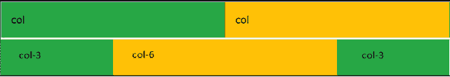

# 如何在 Bootstrap 中创建不等列？

> 原文:[https://www . geeksforgeeks . org/如何在引导数据库中创建不等列/](https://www.geeksforgeeks.org/how-to-create-unequal-columns-in-bootstrap/)

[Bootstrap](https://www.geeksforgeeks.org/bootstrap-4-introduction/) 是 Twitter 创建的一个响应框架。它用于创建响应站点。它有一个预定义的类和设计。在 Bootstrap 中，我们可以在代码中添加预定义的类，而无需编写代码。我们还有一个预定义的*。col"* 类创建列。

[**网格布局系统**](https://www.geeksforgeeks.org/bootstrap-4-grid-system/)【T4:整个工作屏(桌面、平板、移动)分为 12 个大小相等的行。我们可以使用“col-number”类(预定义)制作不相等的列，其中数字决定该列的比率/大小，数字应该小于或等于 12。

**引导程序中实现不等列的分步指南:**

**第一步:**包括 Bootstrap 和 [jQuery CDN](https://ajax.googleapis.com/ajax/libs/jquery/3.5.1/jquery.min.js) [](https://www.geeksforgeeks.org/how-to-add-jquery-code-to-html-file/)到<头>标签之前的所有其他样式表加载我们的 CSS。

> <src 脚本= " https://Ajax . Google APIs . com/Ajax/libs/jquery/3 . 5 . 1/jquery . min . js "></script><src 脚本= " https://cdnjs . cloudflare . com/Ajax/libs/popper . js

**第二步:**用*加类。col-3* 和*。col-6* 类具有不相等的列划分。

```html
<div class=".col-3">
    <!-- Column 1 content -->
</div>
<div class=".col-6">
    <!-- Column 2 content -->
</div>
```

**第三步:**添加 [< div >](https://www.geeksforgeeks.org/div-tag-html/) 类标签*容器-流体*，同时添加另一个< div >类*。行*将所有不相等的列放在一行中。

**示例 1:** 以下示例将创建长度不等的列的 25%/50%/25%拆分。

## 超文本标记语言

```html
<!DOCTYPE html>
<html lang="en">

<head>
    <meta charset="utf-8">
    <meta name="viewport" content=
        "width=device-width, initial-scale=1">
    <link rel="stylesheet" href=
"https://maxcdn.bootstrapcdn.com/bootstrap/4.5.2/css/bootstrap.min.css">
    <script src=
"https://ajax.googleapis.com/ajax/libs/jquery/3.5.1/jquery.min.js">
    </script>
    <script src=
"https://cdnjs.cloudflare.com/ajax/libs/popper.js/1.16.0/umd/popper.min.js">
    </script>
    <script src=
"https://maxcdn.bootstrapcdn.com/bootstrap/4.5.2/js/bootstrap.min.js">
    </script>
</head>

<body>
    <div class="container-fluid">
        <div class="row">

            <! -- columns having unequal lengths -->
            <! -- bg-success is background color -->
            <div class="col-3 bg-success">col-3</div>
            <div class="col-6 bg-warning">col-6</div>
            <div class="col-3 bg-success">col-3</div>
        </div>
    </div>
</body>

</html>
```

**输出:**


25% /50%/ 25%分成

**示例 2:** 在下面的示例中，我们使用了两个 *col* 元素，这两个元素的宽度各为相等列长度的 50%。Bootstrap 将识别存在多少元素，并相应地创建等宽列。

## 超文本标记语言

```html
<!DOCTYPE html>
<html lang="en">

<head>

    <meta charset="utf-8">
    <meta name="viewport" content=
        "width=device-width, initial-scale=1">
    <link rel="stylesheet" href=
"https://maxcdn.bootstrapcdn.com/bootstrap/4.5.2/css/bootstrap.min.css">
    <script src=
    "https://ajax.googleapis.com/ajax/libs/jquery/3.5.1/jquery.min.js">
    </script>
    <script src=
"https://cdnjs.cloudflare.com/ajax/libs/popper.js/1.16.0/umd/popper.min.js">
    </script>
    <script src=
"https://maxcdn.bootstrapcdn.com/bootstrap/4.5.2/js/bootstrap.min.js">
    </script>
</head>

<body>
    <div class="container-fluid">
        <div class="row">

            <! -- columns of equal width -->
            <! -- bg-success is bg color -->
            <div class="col bg-success">col</div>
            <div class="col bg-warning">col</div>
        </div><br/>

        <div class="row">

            <! -- columns having unequal lengths   -->
            <! -- bg-success is background color -->
            <div class="col-3 bg-success">col-3</div>
            <div class="col-6 bg-warning">col-6</div>
            <div class="col-3 bg-success">col-3</div>
        </div>
    </div>
</body>

</html>
```

**输出:**



第 1 行:- 50%/50%拆分，第 2 行:- 25%/50%/25%拆分