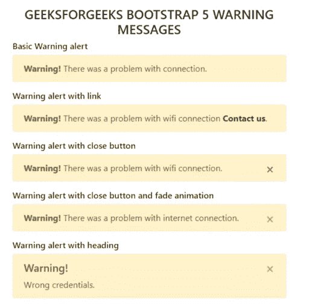

# 如何在 Bootstrap 中创建警告通知告警？

> 原文:[https://www . geesforgeks . org/如何创建-警告-通知-引导中的警报/](https://www.geeksforgeeks.org/how-to-create-warning-notification-alerts-in-bootstrap/)

在执行某项操作之前或之后，我们经常会在某些网站上遇到特定的通知。这些警报消息是突出显示的文本，在执行任务时应予以考虑。使用 Bootstrap 中的预设类，这些警报消息可以显示在网站上。

**接近:**的。警报类后跟上下文类用于在网站上显示警报消息。警报类别为:。警报-成功。警报信息。警告，警告。警戒-危险。警报一级。警报二级。警报灯和。警惕-黑暗。我们可以用。alert-warning 用于在引导数据库中创建警告通知警报。

以下是在引导数据库中实现简单警告警报的过程。

**步骤 1:** 将 Bootstrap 和 jQuery CDN 包含到所有其他样式表之前的<头>标签中，以加载我们的 CSS。

> <src 脚本= " https://Ajax . Google APIs . com/Ajax/libs/jquery/3 . 5 . 1/jquery . min . js "></script><src 脚本= " https://cdnjs . cloudflare . com/Ajax/libs/popper . js

**步骤 2:** 添加。警报和警告警报上下文类(例如。警报-警告)。

```html
<div class="alert alert-warning" role="alert">
  A simple warning alert—check it out!
</div>
```

**示例 1:** 在本例中，我们将在引导数据库中看到警报类型。用户可以使用任何类型的警告警报。

## index.html

```html
<!DOCTYPE html>
<html>
  <head>
    <title>Warning Alerts</title>
    <meta charset="utf-8" />
    <link
      rel="stylesheet"
      href=
"https://maxcdn.bootstrapcdn.com/bootstrap/4.1.3/css/bootstrap.min.css"
    />
    <script src=
"https://ajax.googleapis.com/ajax/libs/jquery/3.3.1/jquery.min.js">
    </script>
    <script src=
"https://maxcdn.bootstrapcdn.com/bootstrap/4.1.3/js/bootstrap.min.js">
    </script>
  </head>
  <body>
    <div class="container py-5">
      <h4 class="text-center text-uppercase">
        GeeksForGeeks Bootstrap 5 warning messages
      </h4>
      <h6>Basic Warning alert</h6>
      <div class="alert alert-warning">
        <strong>Warning!</strong>
        There was a problem with connection.
      </div>
      <h6>Warning alert with link</h6>
      <div class="alert alert-warning">
        <strong>Warning!</strong> 
        There was a problem with wifi connection<a
          href="#"
          class="alert-link">
          Contact us</a>.
      </div>
      <h6>Warning alert with close button</h6>
      <div class="alert alert-warning">
        <button type="button" 
                class="close" 
                data-dismiss="alert">
          ×
        </button>
        <strong>Warning!</strong>
        There was a problem with wifi connection.
      </div>
      <h6>Warning alert with close button and fade animation</h6>
      <div class="alert alert-warning alert-dismissible fade show">
        <button type="button" 
                class="close" 
                data-dismiss="alert">
          ×
        </button>
        <strong>Warning!</strong> 
        There was a problem with internet connection.
      </div>
      <h6>Warning alert with heading</h6>
      <div class="alert alert-warning alert-dismissible fade show">
        <button type="button" 
                class="close"
                data-dismiss="alert">
          ×
        </button>
        <h5 class="alert-heading">Warning!</h5>
        Wrong credentials.
      </div>
    </div>
  </body>
</html>
```

**输出:**



引导数据库中的警告警报类型

**示例 2:** 在本例中，我们将使用按钮点击来使用警告警报。当用户单击按钮时，将生成警告警报。

## index.html

```html
<!DOCTYPE html>
<html lang="en">

<head>
    <meta http-equiv="Content-Type" 
        content="text/html; charset=utf-8" />
    <title>Buttons and alerts</title>
    <link href=
"https://maxcdn.bootstrapcdn.com/bootstrap/3.1.1/css/bootstrap.min.css"
        rel="stylesheet">
    <script src=
"https://ajax.googleapis.com/ajax/libs/jquery/1.11.0/jquery.min.js">
    </script>
    <script src=
"https://netdna.bootstrapcdn.com/twitter-bootstrap/2.0.4/js/bootstrap-alert.js">
    </script>
    <script src=
"https://maxcdn.bootstrapcdn.com/bootstrap/3.1.1/js/bootstrap.min.js">
    </script>

    <script type="text/javascript">
        $(document).ready(function () {
            $('#success').click(function (e) {
                e.preventDefault()
                $('#message').html(`
                <div class="alert alert-success fade in">
                    <button type="button class="close close-alert" 
                        data-dismiss="alert" aria-hidden="true">
                        ×
                    </button>This is a success message
                </div>`);
            })

            $('#warning').click(function (e) {
                e.preventDefault()
                $('#message').html(`
                <div class="alert alert-warning fade in">
                    <button type="button" class="close close-alert" 
                        data-dismiss="alert" aria-hidden="true">
                        ×
                    </button> This is a warning message
                </div>`);
            });
        });
    </script>
</head>

<body>
    <div class="container">
        <h2>GeeksForGeeks</h2>
        <p class="lead">
            Warning Alert message using bootstrap
        </p>

        <p>
        <form method="post">
            <button type="button" 
                class="btn btn-success" id="success">
                Success
            </button>
            <button type="button" 
                class="btn btn-warning" id="warning">
                Warning
            </button>
        </form>
        </p>

        <div id="message"></div>
    </div>
</body>

</html>
```

**输出:**

