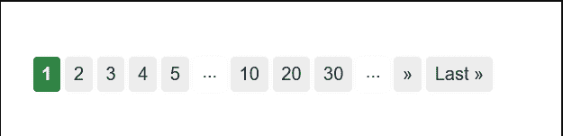

# 如何在 Bootstrap 中自定义分页的链接？

> 原文:[https://www . geesforgeks . org/如何自定义引导中分页链接/](https://www.geeksforgeeks.org/how-to-customize-links-for-pagination-in-bootstrap/)

在许多网站中，我们注意到当我们搜索某个东西时，所有相关的内容都会显示出来，但是如果内容的数量很大，那么就会使网站变得更长。

为了解决这个问题，网页中有分页，即内容被分成许多页面，用户点击后可以浏览相关内容。

**注意:**分页用于管理跨多个页面存在的一系列相关内容。



**方法:**使用*分页*类在网站上显示分页。使用包装 [<导航>](https://www.geeksforgeeks.org/html-nav-tag/) 元素将其识别为屏幕阅读器的导航部分。使用[无序列表](https://www.geeksforgeeks.org/html-ul-tag/)创建带有链接的页面列表。

下面是在引导数据库中通过自定义实现简单分页的过程。

**第一步:**将 Bootstrap 和 jQuery CDN 包含到 [<头>](https://www.geeksforgeeks.org/html-head-tag/) 标签中，先于所有其他样式表加载我们的 CSS。

> <src 脚本= " https://Ajax . Google APIs . com/Ajax/libs/jquery/3 . 5 . 1/jquery . min . js "></script><src 脚本= " https://cdnjs . cloudflare . com/Ajax/libs/popper . js

**第二步:**

*   为无序列表添加带有 [< ul >标签](https://www.geeksforgeeks.org/html-ul-tag/)的 p *想象*类。添加带有类名*的列表项-页面项。*
*   此外，由于页面可能有不止一个这样的导航部分，因此为 [*<导航>*](https://www.geeksforgeeks.org/html-nav-tag/) 提供一个描述性的咏叹调标签，以反映其目的。
*   要自定义每个页面的链接，只需删除“#”并添加所需的链接。
*   要将其与中心对齐，请使用[<【ul】>](https://www.geeksforgeeks.org/html-ul-tag/)*中的类*调整内容中心*。*

## 超文本标记语言

```html
<nav aria-label="Page navigation example">
    <ul class="pagination justify-content-center">
        <li class="page-item">
            <a class="page-link" href="#">Previous</a>
        </li>

        <li class="page-item">
            <a class="page-link" href="#">1</a>
        </li>

        <li class="page-item">
            <a class="page-link" href="#">2</a>
        </li>

        <li class="page-item">
            <a class="page-link" href="#">3</a>
        </li>

        <li class="page-item">
            <a class="page-link" href="#">Next</a>
        </li>
    </ul>
</nav>
```

*   为每个页面添加分页，以确保指向上一页的链接比当前页面少一页，并且用户可以轻松地在页面间移动。

**示例:**

## 超文本标记语言

```html
<!DOCTYPE html>
<html>

<head>
    <meta charset="utf-8" />
    <link rel="stylesheet" href=
"https://maxcdn.bootstrapcdn.com/bootstrap/4.1.3/css/bootstrap.min.css" />
    <script src=
"https://ajax.googleapis.com/ajax/libs/jquery/3.3.1/jquery.min.js">
    </script>
    <script src=
"https://maxcdn.bootstrapcdn.com/bootstrap/4.1.3/js/bootstrap.min.js">
    </script>
</head>

<body style="text-align: center;">
    <h2>GeeksforGeeks</h2><br><br>
    <h3>Contents of Page 3</h3>
    <br><br><br><br>
    <nav aria-label="Page navigation example">
        <ul class="pagination justify-content-center">
            <li class="page-item">
                <a class="page-link" href="Page2.html">Previous</a>
            </li>
            <li class="page-item">
                <a class="page-link" href="Page1.html">1</a>
            </li>
            <li class="page-item">
                <a class="page-link" href="Page2.html">2</a>
            </li>
            <li class="page-item">
                <a class="page-link" href="Page3.html">3</a>
            </li>
        </ul>
    </nav>
</body>

</html>
```