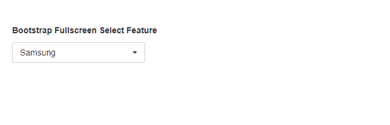
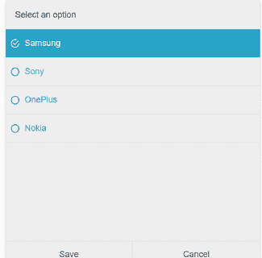
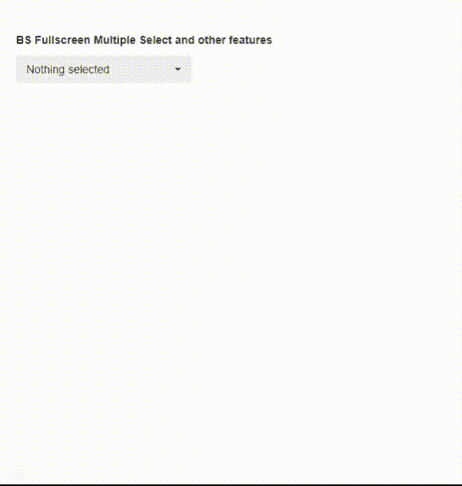
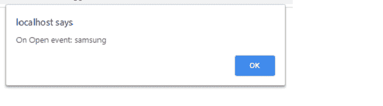
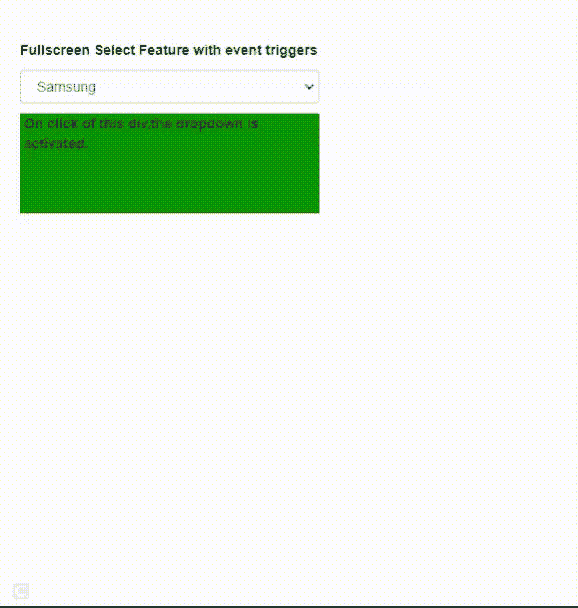
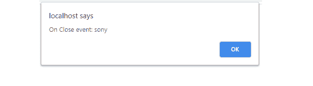

# 如何为手机设计引导全屏选择功能？

> 原文:[https://www . geesforgeks . org/how-design-bootstrap-full screen-select-feature-for-mobiles/](https://www.geeksforgeeks.org/how-to-design-bootstrap-fullscreen-select-feature-for-mobiles/)

在本文中，我们将学习如何为移动设备设计**引导全屏选择**功能。

**引导全屏选择**插件的关键功能如下。

*   它提供了高级的 HTML 全屏选择功能。
*   它提供输入和输出动画。
*   它提供打开和关闭事件函数回调。
*   它提供了 CSS3 动画按钮、下拉菜单和文本。

请从[链接](https://github.com/craftpip/bootstrap-fullscreen-select)下载所需的预编译库，并保存在相关的工作文件夹中，以实现以下示例。开发人员应该在编码和运行时注意正确的文件路径。

**示例 1:** 以下代码是**引导全屏选择**插件的基本示例。在接下来的示例中，我们将在这个基本代码中设置属性。

```
<!doctype html>
<html>

<head>
    <meta charset="utf-8">
    <meta http-equiv="X-UA-Compatible" 
            content="chrome=1">

    <meta name="viewport" content=
        "width=device-width,initial-scale=1, 
        user-scalable=no">

    <script src="demo/libs/jquery.min.js">
    </script>
    <script src="demo/libs/bootstrap.min.js">
    </script>

    <link rel="stylesheet" href=
        "demo/libs/bootstrap.min.css">

    <link rel="stylesheet" href=
        "demo/libs/bootstrap-theme.min.css">

    <link rel="stylesheet" 
        href="demo/demo.min.css">

    <link rel="stylesheet" type="text/css" 
    href="css/bootstrap-fullscreen-select.css"/>

    <script type="text/javascript" 
        src="js/bootstrap-fullscreen-select.js">
    </script>

    <style type="text/css">
        body {
            font-family: Arial, sans-serif;
            padding: 20px;
            margin: 0 auto;

        }
    </style>

</head>

<body><br />
    <b>Bootstrap Fullscreen Select Feature</b>
    <p></p>

    <div id="containerID">
        <select class="form-control mobileSelect">
            <option value="samsung">Samsung</option>
            <option value="sony">Sony</option>
            <option value="oneplus">OnePlus</option>
            <option value="nokia">Nokia</option>
        </select>

    </div>
    <script type="text/javascript">
        $(function () {
            $('.mobileSelect').mobileSelect();
        });
    </script>

    <script type="text/javascript" 
        src="demo/demo.min.js">
    </script>
</body>

</html>
```

**输出:**

*   **之前选择:**
    
*   **选择后:**
    

**注:**以上基本 HTML 代码结构用于进一步举例。代码片段如下。

**示例 2:** 在下面的示例代码中，我们将添加 Bootstrap 多选功能，并将禁用第二个下拉组。在代码的 JavaScript 部分，我们将学习添加*动画*和*填充*选项。各种其他选项也是可用的，开发者可以根据自己的需要进行尝试。

```
<div id="containerID">
    <select class="form-control mobileSelect" 
            data-style="primary" multiple>
        <optgroup label="first group">
            <option value="samsung">Samsung</option>
            <option value="sony">Sony</option>
            <option value="oneplus">OnePlus</option>
        </optgroup>

        <!-- Making the second group as disabled-->
        <optgroup label="Second group" 
                data-style="danger" disabled>
            <option value="nokia">Nokia</option>
            <option value="apple">Apple</option>
        </optgroup>
    </select>
</div>
<script type="text/javascript">
    $(function () {
        $('.mobileSelect').mobileSelect({
            title: 'For all selected phones',

            // For animate effect of screen
            animation: 'zoom',

            padding: {
                top: '50px',
                left: '50px',
                right: '50px',
                bottom: '50px'
            }
        }
        );
    });
</script>
```

**输出:**


**示例 3:** 下面的代码演示了插件的“点击”、“打开”和“关闭”事件触发器。打开动画开始时，*开启*被触发，关闭动画执行后，*开启*被触发。

```
<!doctype html>
<html>

<head>
    <meta charset="utf-8">
    <meta http-equiv="X-UA-Compatible" 
            content="chrome=1">

    <meta name="viewport" content=
        "width=device-width, 
        initial-scale=1, user-scalable=no">

    <script src="demo/libs/jquery.min.js">
    </script>
    <script src="demo/libs/bootstrap.min.js">
    </script>

    <link rel="stylesheet" href=
        "demo/libs/bootstrap.min.css">

    <link rel="stylesheet" href=
        "demo/libs/bootstrap-theme.min.css">

    <link rel="stylesheet" 
        href="demo/demo.min.css">

    <link rel="stylesheet" type="text/css" 
    href="css/bootstrap-fullscreen-select.css" />

    <script type="text/javascript" 
        src="js/bootstrap-fullscreen-select.js">
    </script>

    <style type="text/css">
        body {
            font-family: Arial, sans-serif;
            padding: 20px;
            margin: 0 auto;

        }

        #containerID {
            width: 300px;
        }

        #clickDivID {
            width: 300px;
            height: 100px;
            color: white;
            background-color: green;
        }
    </style>
</head>

<body>
    <b>
        Fullscreen Select Feature 
        with event triggers
    </b>

    <div id="containerID">
        <select class="form-control mobileSelect" 
            data-triggerOn="#clickDivID">
            <option value="samsung">Samsung</option>
            <option value="sony">Sony</option>
            <option value="oneplus">OnePlus</option>
            <option value="nokia">Nokia</option>
        </select>

        <div id="clickDivID">
            <b>On click of this div, the 
                dropdown is activated.
            </b>
        </div>

    </div>
    <script type="text/javascript">
        $(function () {
            $('.mobileSelect').mobileSelect({
                title: 'Select any option',
                buttonClear: 'Clear',
                onClose: function () {
                    alert('On Close event: ' 
                            + $(this).val());
                },
                onOpen: function () {
                    alert('On Open event: ' 
                            + this.val());
                }
            });
        });
    </script>

    <script type="text/javascript" 
        src="demo/demo.min.js">
    </script>
</body>

</html>
```

**Output:**

*   当引导全屏选择插件触发“打开”事件时，弹出以下消息框。

    

    *   当用户在为 HTML“div”触发“click”事件后选择一个选项时，将显示以下输出。

    

    *   当插件触发“关闭”事件时，弹出以下消息框。

    