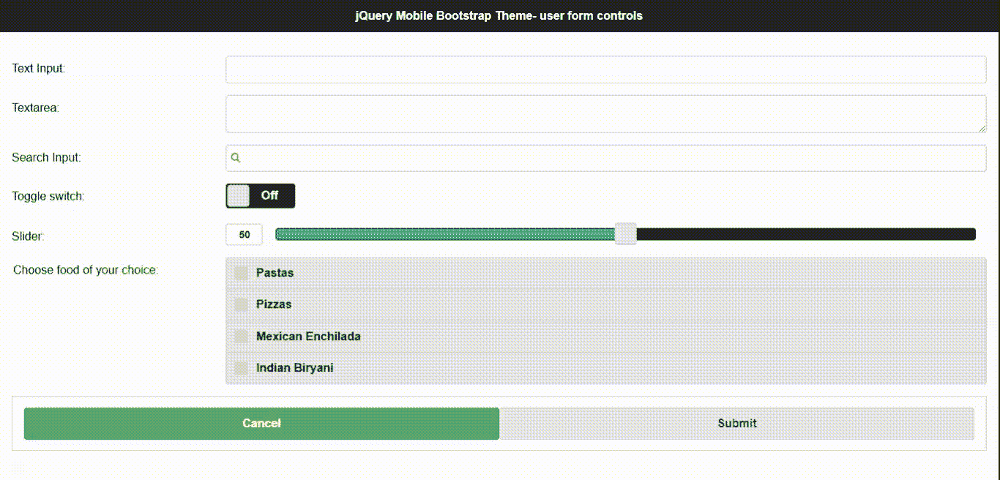
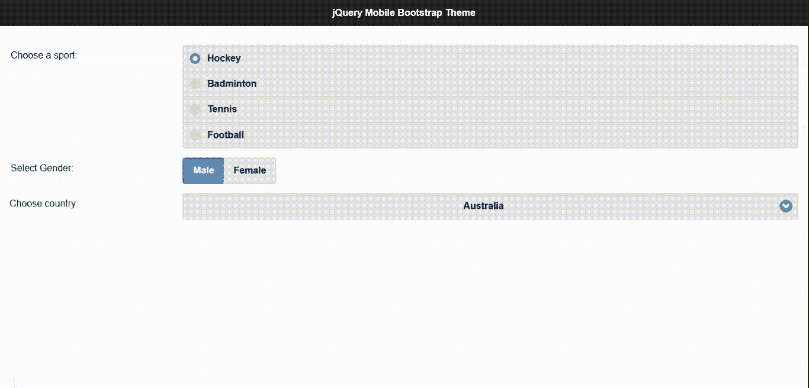
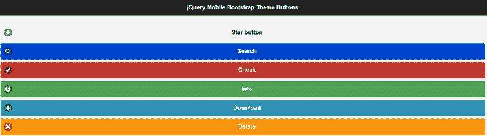
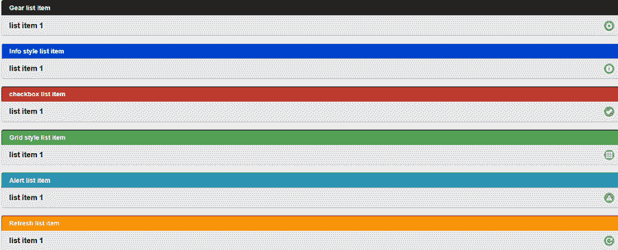
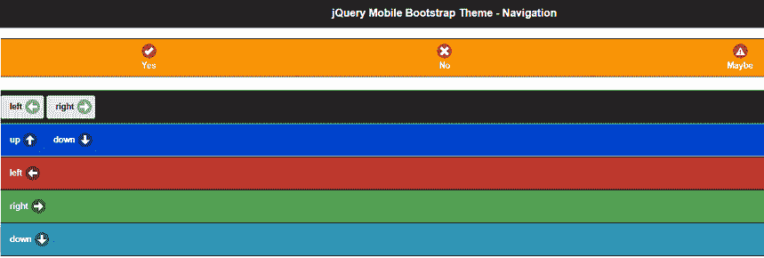

# 如何使用 jQuery Mobile BootstrapTheme 插件为手机设计表单控件？

> 原文:[https://www . geesforgeks . org/how-design-form-controls-for-mobiles-use-jquery-mobile-bootstraptheme-plugin/](https://www.geeksforgeeks.org/how-to-design-form-controls-for-mobiles-using-jquery-mobile-bootstraptheme-plugin/)

本文的目的是为使用 **jQuery 移动引导主题**插件的移动网页设计者介绍一些表单或用户输入控件。这些基于 CSS 的用户界面控件非常有吸引力和交互性，可以帮助开发人员构建漂亮的应用程序。

要设计和实现插件，请从[链接](https://github.com/commadelimited/jQuery-Mobile-Bootstrap-Theme)下载所需的预编译文件或库，并将其保存在您的工作文件夹中。编码时应该注意文件路径名。

**注意:**请将“head”部分包含在以下所有代码中，如第一个示例中实现的那样，以包含如上所示的插件的相关库。

**示例 1:** 下面的代码演示了使用上述插件的特定类的一些 UI 表单控件。参考输出图像，以便更好地了解控件。

## 超文本标记语言

```html
<!doctype html>
<html>

<head>
    <meta charset="utf-8">
    <meta name="viewport" 
        content="width=device-width,initial-scale=1">

    <!--The plugin CSS library -->
    <link rel="stylesheet" href="themes/Bootstrap.css">
    <link rel="stylesheet" 
href="http://code.jquery.com/mobile/1.4.0/jquery.mobile.structure-1.4.0.min.css" />

    <link rel="stylesheet" 
        href="themes/jquery.mobile.icons.min.css" />

    <script 
        src="http://code.jquery.com/jquery-1.8.2.min.js">
    </script>

    <!--Pre-compiled library for jQuery Mobile-->
    <script 
src="http://code.jquery.com/mobile/1.4.0/jquery.mobile-1.4.0.min.js">
    </script>       
</head>

<body>
    <div data-role="page" data-theme="a">
        <div data-role="header" data-position="inline">
            <h1>
                jQuery Mobile Bootstrap Theme - user form controls
            </h1>             
        </div>

        <div data-role="content" data-theme="a">                
            <form action="#" method="get">
                <!--Text input control -->
                <div data-role="fieldcontain">
                    <label for="name">Text Input:</label>
                    <input type="text" name="name" id="name"
                                value=""  />
                </div>
                <!--Text area control -->
                <div data-role="fieldcontain">
                    <label for="textarea">Textarea:</label>
                    <textarea cols="40" rows="8" 
                                 name="textarea" id="textarea">
                    </textarea>
                </div>

                <!--Search input control -->
                <div data-role="fieldcontain">
                    <label for="search">Search Input:</label>
                    <input type="search" name="password" 
                                 id="search" value=""  />
                </div>

                <!--Switch on/off control -->
                <div data-role="fieldcontain">
                    <label for="slider2">Toggle switch:</label>
                    <select name="slider2" id="slider2" data-role="slider">
                    <option value="off">Off</option>
                    <option value="on">On</option>
                    </select>
                </div>

                <!--Slider -->
                <div data-role="fieldcontain">
                    <label for="slider">Slider:</label>
                    <input type="range" name="slider" id="slider" 
                    value="50" min="0" max="100" data-highlight="true"  />
                </div>

                <!--Check box control -->
                <div data-role="fieldcontain">
                    <fieldset data-role="controlgroup">
                        <legend>Choose food of your choice:</legend>
                        <input type="checkbox" name="checkbox-1a" 
                                    id="checkbox-1a" class="custom" />
                        <label for="checkbox-1a">Pastas</label>

                        <input type="checkbox" name="checkbox-2a" 
                                    id="checkbox-2a" class="custom" />
                        <label for="checkbox-2a">Pizzas</label>

                        <input type="checkbox" name="checkbox-3a" 
                                    id="checkbox-3a" class="custom" />
                        <label for="checkbox-3a">Mexican Enchilada</label>

                        <input type="checkbox" name="checkbox-4a" 
                                    id="checkbox-4a" class="custom" />
                        <label for="checkbox-4a">Indian Biryani</label>
                    </fieldset>
                </div>

                <!--Submit buttons -->
                <div class="ui-body ui-body-b">
                    <fieldset class="ui-grid-a">
                        <div class="ui-block-a">
                            <button type="submit" data-theme="d">
                                Cancel
                            </button> 
                        </div>
                        <div class="ui-block-b">
                            <button type="submit" data-theme="a">
                                Submit
                            </button>
                        </div>
                    </fieldset>
                </div>
            </form>

        </div>
    </div>
</body>

</html>
```

**输出:**



**例 2:**

## 超文本标记语言

```html
<!doctype html>
<html>
<body>
    <div data-role="page" data-theme="a">
    <div data-role="header" data-position="inline">
       <h1>jQuery Mobile Bootstrap Theme</h1>                
    </div>
    <div data-role="content" data-theme="a">

      <form action="#" method="get">                

      <div data-role="fieldcontain">
         <fieldset data-role="controlgroup">
        <legend>Choose a sport:</legend>
        <input type="radio" name="radio-choice-1" 
                  id="radio-choice-1" value="choice-1" 
                  checked="checked" />
        <label for="radio-choice-1">Hockey</label>

        <input type="radio" name="radio-choice-1" 
                       id="radio-choice-2" value="choice-2"  />
        <label for="radio-choice-2">Badminton</label>

        <input type="radio" name="radio-choice-1" 
                      id="radio-choice-3" value="choice-3"  />
        <label for="radio-choice-3">Tennis</label>

        <input type="radio" name="radio-choice-1" 
                       id="radio-choice-4" value="choice-4"  />
        <label for="radio-choice-4">Football</label>
           </fieldset>
        </div>

        <div data-role="fieldcontain">
        <fieldset data-role="controlgroup" data-type="horizontal">
        <legend>Select Gender:</legend>
        <input type="radio" name="radio-choice-b" 
                       id="radio1" value="on" checked="checked" />
        <label for="radio1">Male</label>
        <input type="radio" name="radio-choice-b" 
                       id="radio2" value="off" />
        <label for="radio2">Female</label>

        </fieldset>
        </div>

        <div data-role="fieldcontain">
        <label for="select-choice-a" class="select">
                  Choose country:</label>
        <select name="select-choice-a" id="select-choice-a" 
                        data-native-menu="false">                            
          <option value="india">India</option>
          <option value="australia">Australia</option>
          <option value="china">China</option>
          <option value="japan">Japan</option>
        </select>
        </div>                    
            </form>
         </div>
    </div>
    </body>
</html>
```

**输出:**



**示例 3:** 下面的代码展示了一些用于移动 UI 设计的按钮。

## 超文本标记语言

```html
<html>
<body>
    <div data-role="page" data-theme="a">
      <div data-role="header" data-position="inline">
        <h1>jQuery Mobile Bootstrap Theme Buttons</h1>                
       </div>
       <div data-role="content" data-theme="a">                
        <!-- "yourFile.html" is the target file -->        
        <a href="yourfile.html" data-role="button" data-theme="a" 
             data-icon="star">Star button</a>
        <a href="" data-role="button" data-theme="b" 
              data-icon="search">Search</a>
         <a href="" data-role="button" data-theme="c" data-icon="check">
               Check</a>
         <a href="" data-role="button" data-theme="d" data-icon="info">
                Info</a>
         <a href="" data-role="button" data-theme="e" data-icon="arrow-d">
                Download</a>
          <a href="" data-role="button" data-theme="f" data-icon="delete">
                Delete</a>
         </div>
       </div>
    </body>
</html>
```

**输出:**



**示例 4:** 下面的代码展示了一些针对移动设计的 listviews。

## 超文本标记语言

```html
<html>
<head>
    <meta charset="utf-8">
    <meta name="viewport" 
        content="width=device-width,initial-scale=1">

    <!--The plugin CSS library -->
    <link rel="stylesheet" href="themes/Bootstrap.css">
    <link rel="stylesheet" 
href="http://code.jquery.com/mobile/1.4.0/jquery.mobile.structure-1.4.0.min.css" />

    <link rel="stylesheet" 
        href="themes/jquery.mobile.icons.min.css" />

    <script 
        src="http://code.jquery.com/jquery-1.8.2.min.js">
    </script>

    <!--Pre-compiled library for jQuery Mobile-->
    <script 
src="http://code.jquery.com/mobile/1.4.0/jquery.mobile-1.4.0.min.js">
    </script>       
</head>

<body>
    <div data-role="page" data-theme="a">
        <div data-role="header" data-position="inline">
            <h1>jQuery Mobile Bootstrap Theme Listviews</h1>                
        </div>

        <div data-role="content" data-theme="a">                
            <ul data-role="listview" data-inset="true" 
                 data-divider-theme="a">
                <li data-role="list-divider">Gear list item</li>
                <li data-icon="gear"><a href="">list item 1</a></li>                    
            </ul>

            <ul data-role="listview" data-inset="true" 
                  data-divider-theme="b">
                <li data-role="list-divider">Info style list item</li>
                <li data-icon="info"><a href="">list item 1</a></li>
            </ul>

            <ul data-role="listview" data-inset="true" 
                  data-divider-theme="c">
                <li data-role="list-divider">checkbox list item</li>
                <li data-icon="check"><a href="">list item 1</a></li>
            </ul>

            <ul data-role="listview" data-inset="true" 
                   data-divider-theme="d">
                <li data-role="list-divider">Grid style list item</li>
                <li data-icon="grid"><a href="">list item 1</a></li>
            </ul>

            <ul data-role="listview" data-inset="true" 
                   data-divider-theme="e">
                <li data-role="list-divider">Alert list item</li>
                <li data-icon="alert"><a href="">list item 1</a></li>
            </ul>

            <ul data-role="listview" data-inset="true" 
                  data-divider-theme="f">
                <li data-role="list-divider">Refresh list item</li>
                <li data-icon="refresh"><a href="">list item 1</a></li>
            </ul>

        </div>
    </div>
</body>

</html>
```

**输出:**



**示例 5:** 以下示例展示了移动设计的各种导航控件。“yourFile.html”是代码中使用的目标文件。开发人员可以根据需要包含文件名。

## 超文本标记语言

```html
<!doctype html>
<html>

<head>
    <meta charset="utf-8">
    <meta name="viewport" 
        content="width=device-width,initial-scale=1">

    <!--The plugin CSS library -->
    <link rel="stylesheet" href="themes/Bootstrap.css">
    <link rel="stylesheet" 
href="http://code.jquery.com/mobile/1.4.0/jquery.mobile.structure-1.4.0.min.css" />

    <link rel="stylesheet" 
        href="themes/jquery.mobile.icons.min.css" />

    <script 
        src="http://code.jquery.com/jquery-1.8.2.min.js">
    </script>

    <!--Pre-compiled library for jQuery Mobile-->
    <script 
src="http://code.jquery.com/mobile/1.4.0/jquery.mobile-1.4.0.min.js">
    </script>       
</head>

<body>
    <div data-role="page" data-theme="a">
        <div data-role="header" data-position="inline">
            <h1>jQuery Mobile Bootstrap Theme - Navigation</h1>                
        </div>

        <div data-role="content" data-theme="a">    
            <div data-role="footer" data-theme="f">
                <div data-role="navbar">
                <ul>
                <li><a href="#" data-icon="check">Yes</a></li>
                <li><a href="#" data-icon="delete">No</a></li>
                <li><a href="#" data-icon="alert">Maybe</a></li>
                </ul>
                </div>
            </div>
            <br/>

            <div data-role="footer" data-theme="a">
                <a href="yourFile.html" data-role="button" 
                          data-icon="arrow-l" data-iconpos="right">
                        left</a>
                <a href="yourFile.html" data-role="button" 
                          data-icon="arrow-r" data-iconpos="right">
                       right</a>                    
            </div>

            <div data-role="footer" data-theme="b">                 
                <a href="yourFile.html" data-role="button" 
                            data-icon="arrow-u"
                            data-iconpos="right">up</a>
                <a href="yourFile.html" data-role="button"
                           data-icon="arrow-d" 
                           data-iconpos="right">down</a>
            </div>

            <div data-role="footer" data-theme="c">
                <a href="yourFile.html" data-role="button" 
                        data-icon="arrow-l"
                        data-iconpos="right">left</a>                   
            </div>

            <div data-role="footer" data-theme="d">                 
                <a href="yourFile.html" data-role="button" 
                         data-icon="arrow-r" data-iconpos="right">
                        right</a>                   
            </div>

                <div data-role="footer" data-theme="e">
                <a href="yourFile.html" data-role="button" 
                         data-icon="arrow-d" data-iconpos="right">
                         down</a>
            </div>              
        </div>
    </div>
</body>

</html>
```

**输出:**

