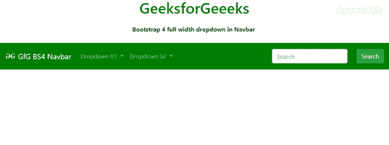
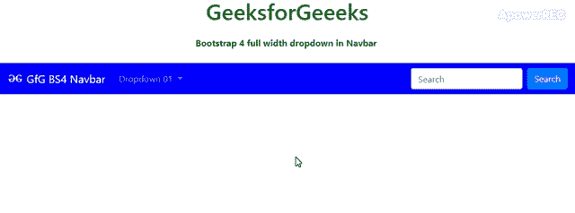

# 如何使用 Bootstrap 设计全宽下拉导航栏？

> 原文:[https://www . geesforgeks . org/how-design-full-width-drop down-nav bar-use-bootstrap/](https://www.geeksforgeeks.org/how-to-design-full-width-dropdown-navbar-using-bootstrap/)

在 Bootstrap 4 中，导航栏是用于菜单目的的基本组件。导航栏包含许多项目，如文本、链接文本、禁用链接、下拉按钮、表单等。通过使用 CSS 属性或使用 Bootstrap 4 的默认实用程序，可以将下拉子项目变成全宽。以下方法将解释清楚:

**方法 1:**

1.  在 Bootstrap 4 中，通过基于便利性在内部或外部添加 CSS 属性，Navbar 中的全宽下拉列表是可能的。只关注类下拉菜单和下拉菜单。
2.  首先聚焦下拉菜单的父类下拉菜单，然后使其在位置上保持静态，如下所示:

    ```
    <style>
    .dropdown {
        position:static !important;
    }
    </style>
    ```

3.  现在，使下拉菜单的上边距为零像素，宽度增加到 100%。
4.  然后添加框阴影以突出显示下拉菜单(装饰目的)，如下所示:

    ```
    <style>
    .dropdown-menu {
        box-shadow: 0 .5rem 1rem rgba(0, 0, 0, .15)!important;
        margin-top:0px !important;
        width:100% !important;
    }
    </style>
    ```

5.  我们也可以通过内联方法使用 CSS 属性。

**示例 1:** 下面的示例说明了如何使用 CSS 属性在导航栏中制作 Bootstrap 4 全宽下拉列表。

```
<!DOCTYPE html>
<html lang="en">

<head>
    <meta charset="utf-8">
    <meta name="viewport" 
          content="width=device-width, initial-scale=1">
    <link rel="stylesheet" href=
"https://maxcdn.bootstrapcdn.com/bootstrap/4.3.1/css/bootstrap.min.css">
    <script src=
"https://ajax.googleapis.com/ajax/libs/jquery/3.4.1/jquery.min.js">
    </script>
    <script src=
"https://cdnjs.cloudflare.com/ajax/libs/popper.js/1.14.7/umd/popper.min.js">
    </script>
    <script src=
"https://maxcdn.bootstrapcdn.com/bootstrap/4.3.1/js/bootstrap.min.js">
    </script>
    <style>
        .dropdown {
            position: static !important;
        }

        .dropdown-menu {
            box-shadow: 0 .5rem 1rem rgba(0, 0, 0, .15)!important;
            margin-top: 0px !important;
            width: 100% !important;
        }
    </style>
</head>

<body>
    <div class="fluid-container">
        <center>
            <h1 style="color:green;padding:13px;">
              GeeksforGeeeks
            </h1>
            <b>Bootstrap 4 full width dropdown in Navbar</b>
            <br>
            <br>
            <nav class="navbar navbar-expand-lg navbar-dark
                        justify-content-between text-white"
                 style="background-color: green;">
                <a class="navbar-brand" href="#">
                     
                  GfG BS4 Navbar
                </a>
                <button class="navbar-toggler " 
                        type="button" data-toggle="collapse" 
                        data-target="#navbarNavDropdown01" 
                        aria-controls="navbarNavDropdown01"
                        aria-expanded="false" 
                        aria-label="Toggle navigation" 
                        style="outline-color:#fff">
                    <span class="navbar-toggler-icon"></span>
                </button>

                <div class="collapse navbar-collapse" 
                     id="navbarNavDropdown01">

                    <ul class="navbar-nav ">

                        <!--dropdown item of menu-->
                        <li class="nav-item dropdown">
                            <a class="nav-link dropdown-toggle" 
                               href="#" id="navbarDropdown" 
                               role="button" data-toggle="dropdown"
                               aria-haspopup="true" 
                               aria-expanded="false">
                              Dropdown 01
                            </a>

                            <!--dropdown sub items of menu-->
                            <div class="dropdown-menu"
                                 aria-labelledby="navbarDropdown">
                                <a class="dropdown-item" href="#">
                                  Action 01
                                </a>
                                <a class="dropdown-item" href="#">
                                  Action 02
                                </a>
                                <div class="dropdown-divider"></div>
                                <a class="dropdown-item" href="#">
                                  More Content here 
                                </a>
                            </div>
                        </li>
                        <li class="nav-item dropdown">
                            <a class="nav-link dropdown-toggle" 
                               href="#" id="navbarDropdown" 
                               role="button"
                               data-toggle="dropdown" 
                               aria-haspopup="true" 
                               aria-expanded="false">
                              Dropdown 02
                            </a>

                            <!--dropdown sub items of menu-->
                            <div class="dropdown-menu" 
                                 aria-labelledby="navbarDropdown" 
                                 style="max-width: 1366px;">
                                <a class="dropdown-item" href="#">
                                  Action 01
                                </a>
                                <a class="dropdown-item" href="#">
                                  Action 02
                                </a>
                                <div class="dropdown-divider"></div>
                                <a class="dropdown-item" href="#">
                                  More Content here 
                                </a>
                            </div>
                        </li>
                    </ul>

                    <!--Form item of menu for search purpose-->
                    <form class="form-inline ml-auto ">

                        <input class="form-control mr-sm-4"
                               type="search" placeholder="Search"
                               aria-label="Search">
                        <button class="btn btn-success my-4 my-sm-2 "
                                type="submit">Search</button>
                    </form>
                </div>
            </nav>
        </center>
    </div>

</body>

</html>
```

**输出:**


**方法 2:**

1.  在 Bootstrap 4 中，通过使用 Bootstrap 4 实用程序，可以在导航栏中显示全宽下拉列表。
2.  类似于方法 1，只关注类下拉菜单和下拉菜单。
3.  添加类位置-静态连同下拉类，下拉类是下拉菜单的父类，如下:

    ```
    <li class="nav-item dropdown position-static">
    ```

4.  现在，添加 w-100，mt-0 类以及下拉菜单类如下:

    ```
    <div class="dropdown-menu mt-0 w-100 shadow border-outline-success" 
    aria-labelledby="navbarDropdown">
    ```

**示例 2:** 下面的示例说明了如何使用 Bootstrap 4 实用程序在导航栏中制作 Bootstrap 4 全宽下拉列表。

```
<!DOCTYPE html>
<html lang="en">

<head>
    <meta charset="utf-8">
    <meta name="viewport" 
          content="width=device-width, initial-scale=1">
    <link rel="stylesheet" href=
"https://maxcdn.bootstrapcdn.com/bootstrap/4.3.1/css/bootstrap.min.css">
    <script src=
"https://ajax.googleapis.com/ajax/libs/jquery/3.4.1/jquery.min.js">
    </script>
    <script src=
"https://cdnjs.cloudflare.com/ajax/libs/popper.js/1.14.7/umd/popper.min.js">
    </script>
    <script src=
"https://maxcdn.bootstrapcdn.com/bootstrap/4.3.1/js/bootstrap.min.js">
    </script>
</head>

<body>
    <div class="fluid-container">
        <center>
            <h1 style="color:green;padding:13px;">
              GeeksforGeeeks
            </h1>
            <b>Bootstrap 4 full width dropdown in Navbar</b>
            <br>
            <br>
            <nav class="navbar navbar-expand-lg navbar-dark
                        justify-content-between text-white" 
                 style="background-color: blue;">
                <a class="navbar-brand" href="#">
                     
                  GfG BS4 Navbar
                </a>
                <button class="navbar-toggler " 
                        type="button"
                        data-toggle="collapse"
                        data-target="#navbarNavDropdown01" 
                        aria-controls="navbarNavDropdown01"
                        aria-expanded="false" 
                        aria-label="Toggle navigation"
                        style="outline-color:#fff">
                    <span class="navbar-toggler-icon"></span>
                </button>

                <div class="collapse navbar-collapse"
                     id="navbarNavDropdown01">

                    <ul class="navbar-nav ">

                        <!--dropdown item of menu-->
                        <li class="nav-item dropdown position-static">
                            <a class="nav-link dropdown-toggle" 
                               href="#" id="navbarDropdown" 
                               role="button" data-toggle="dropdown" 
                               aria-haspopup="true"
                               aria-expanded="false">
                              Dropdown 01
                            </a>

                            <!--dropdown sub items of menu-->
                            <div class="dropdown-menu mt-0 w-100 
                                        shadow border-outline-success" 
                                 aria-labelledby="navbarDropdown">
                                <a class="dropdown-item" href="#">Action</a>
                                <a class="dropdown-item" href="#">
                                  Another action
                                </a>
                                <div class="dropdown-divider"></div>
                                  <a class="dropdown-item" href="#">
                                    Something else here
                                  </a>
                                </div>
                        </li>

                    </ul>

                    <!--Form item of menu for search purpose-->
                    <form class="form-inline ml-auto ">

                        <input class="form-control mr-sm-2" 
                               type="search" placeholder="Search"
                               aria-label="Search">
                        <button class="btn btn-primary my-2 my-sm-0 " 
                                type="submit">Search</button>
                    </form>
                </div>
            </nav>
        </center>
    </div>

</body>

</html>
```

**输出:**


**参考:**T2】https://getbootstrap.com/docs/4.0/components/navbar/