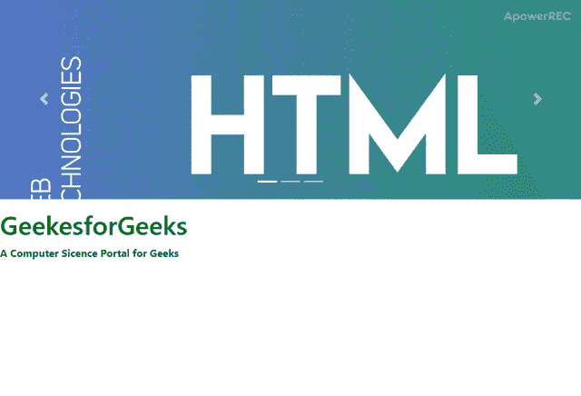

# 如何在 Bootstrap 中设计半页轮播？

> 原文:[https://www . geesforgeks . org/how-design-半页轮播-in-bootstrap/](https://www.geeksforgeeks.org/how-to-design-half-page-carousel-in-bootstrap/)

它可以使用“bootstrap.js”或“bootstrap.min.js”包含在您的网页中。在 Internet Explorer 中不正确支持旋转木马，这是因为它们使用 CSS3 过渡和动画来实现幻灯片效果。[**【Bootstrap Carousel】**](https://www.geeksforgeeks.org/bootstrap-carousel/)是你网页的图片幻灯片，让它看起来更有吸引力。但是普通的 Bootstrap Carousel 拍下了整个网页，如果使用的图片尺寸很大，Bootstrap Carousel 还有一个问题，就是页面变大的时候会放大。为了处理这种情况，在本文中，我们将设计一个仅占页面一半的引导转盘。
以下示例说明了上述方法:
**示例:**在此示例中，我们将更改三个类别 CSS 属性的值，它们是**转盘-内部**、**项目.活动的**和**项目 img** 。它将固定页面转盘的高度。

## 超文本标记语言

```html
<!DOCTYPE html>
<html>

<head>
    <title>Bootstrap Example</title>
    <meta charset="utf-8">
    <meta name="viewport"
        content="width=device-width, initial-scale=1">
    <link rel="stylesheet"
        href=
"https://stackpath.bootstrapcdn.com/bootstrap/4.3.1/css/bootstrap.min.css"
        integrity=
"sha384-ggOyR0iXCbMQv3Xipma34MD+dH/1fQ784/j6cY/iJTQUOhcWr7x9JvoRxT2MZw1T"
        crossorigin="anonymous">
    <script src=
"https://code.jquery.com/jquery-3.3.1.slim.min.js"
            integrity=
"sha384-q8i/X+965DzO0rT7abK41JStQIAqVgRVzpbzo5smXKp4YfRvH+8abtTE1Pi6jizo"
            crossorigin="anonymous">
    </script>

    <script src=
"https://stackpath.bootstrapcdn.com/bootstrap/4.3.1/js/bootstrap.min.js"
            integrity=
"sha384-JjSmVgyd0p3pXB1rRibZUAYoIIy6OrQ6VrjIEaFf/nJGzIxFDsf4x0xIM+B07jRM"
            crossorigin="anonymous">
    </script>
    <style>
        article {
            margin: 15px;
        }
        h1 {
            color: green;
        }
        .carousel-inner {
            height: 310px;
        }

        .item.active {
            height: 310px!important;
        }

        .item img {
            object-fit: cover;
            height: 100%!important;
        }
    </style>
</head>

<body>

    <div class="container-fluid">
        <div id="carousel1"
            class="carousel slide carousel-fade"
            data-ride="carousel" style="height:50vh">

            <!--Indicators-->
            <ol class="carousel-indicators">
                <li data-target="#carousel1"
                    data-slide-to="0"
                    class="active"></li>
                <li data-target="#carousel1"
                    data-slide-to="1"></li>
                <li data-target="#carousel1"
                    data-slide-to="2"></li>
            </ol>

            <!--Slides-->
            <div class="carousel-inner" role="listbox">
                <div class="carousel-item active">
                    <div class="view">
                        
                        <div class="mask rgba-black-light"></div>
                    </div>
                </div>
                <div class="carousel-item">

                    <!-- Slideer 1 -->
                    <div class="view">
                        
                        <div class="mask rgba-black-strong"></div>
                    </div>
                </div>
                <div class="carousel-item">

                    <!-- Slideer 2 -->
                    <div class="view">
                        
                        <div class="mask rgba-black-slight"></div>
                    </div>
                </div>
            </div>

            <!-- Slideer 3 -->
            <a class="carousel-control-prev"
            href="#carousel1" role="button"
            data-slide="prev">
                <span class="carousel-control-prev-icon"
                    aria-hidden="true"></span>
                <span class="sr-only">Previous</span>
            </a>
            <a class="carousel-control-next"
            href="#carousel1" role="button"
            data-slide="next">
                <span class="carousel-control-next-icon"
                    aria-hidden="true"></span>
                <span class="sr-only">Next</span>
            </a>
        </div>
    </div>
    <article>
        <h1>GeekesforGeeks</h1>
        <b>A Computer Science Portal for Geeks</b>
    </article>
</body>

</html>                               
```

**输出:**



**支持的浏览器:**

*   谷歌 Chrome
*   微软边缘
*   火狐浏览器
*   歌剧
*   旅行队