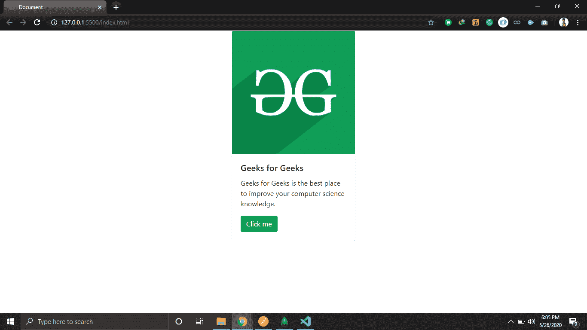
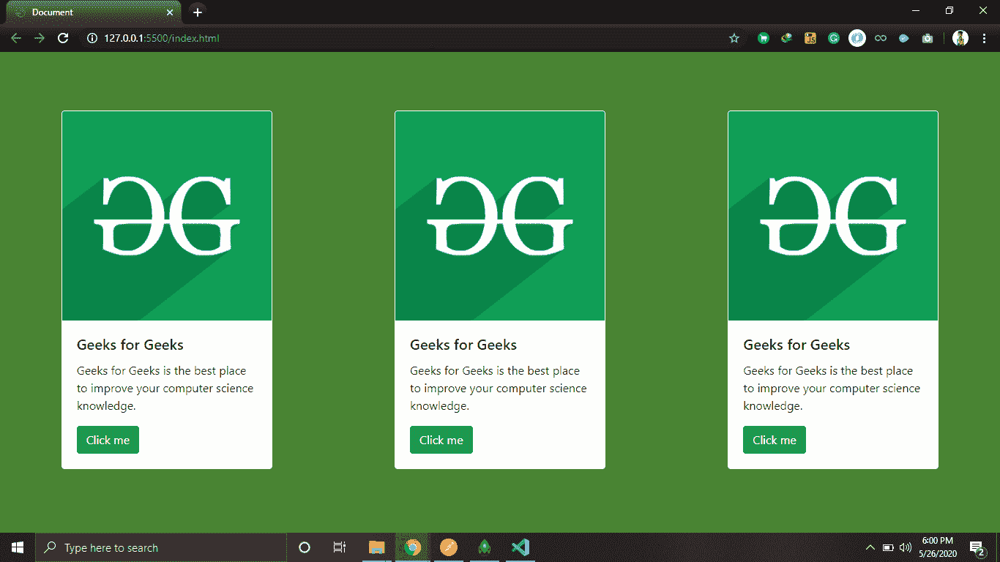

# 如何在 Bootstrap 中设计固定宽度的响应式卡牌？

> 原文:[https://www . geeksforgeeks . org/如何设计响应固定宽度的卡片组自举/](https://www.geeksforgeeks.org/how-to-design-responsive-card-deck-with-fixed-width-in-bootstrap/)

自举卡为我们提供了很多可以玩的功能。我们也可以让它们有反应，而且大小也是固定的，这完全取决于我们的需要。下面给出了固定大小的引导卡组的代码。我们提供的代码没有使用 CSS 属性，所以看起来更简单，更容易理解。

在本文中，我们将使用一些 Bootstrap 类来设计响应卡。

你也可以寻找如何创建卡片的代码，然后根据你的需要使用它。您可以使用卡片类 div 中给出的 img 标签修改图片。

**例 1:**

## 超文本标记语言

```html
<!DOCTYPE html>
<html lang="en">

<head>
    <meta charset="UTF-8">
    <meta name="viewport" content=
        "width=device-width, initial-scale=1.0">

    <title>
        How to design Responsive card-deck 
        with fixed width in Bootstrap ?   
    </title>

    <!-- bootstrap linked-->
    <link rel="stylesheet" href=
"https://maxcdn.bootstrapcdn.com/bootstrap/4.0.0/css/bootstrap.min.css"
        integrity=
"sha384-Gn5384xqQ1aoWXA+058RXPxPg6fy4IWvTNh0E263XmFcJlSAwiGgFAW/dAiS6JXm"
        crossorigin="anonymous">
</head>

<body>

    <!-- Card design with bootstrap class mx-auto 
        for making it centered in the div-->
    <div class="card mx-auto" style="width:18rem;">
        

        <div class="card-body">
            <h5 class="card-title">
                GeeksforGeeks
            </h5>

            <p class="card-text">
                Geeks for Geeks is the best place 
                to improve your computer science 
                knowledge.
            </p>

            <a href="#" class="btn btn-success">
                Click me
            </a>
        </div>
    </div>

    <!--card end here-->
    <script src="https://code.jquery.com/jquery-3.2.1.slim.min.js"
        integrity=
"sha384-KJ3o2DKtIkvYIK3UENzmM7KCkRr/rE9/Qpg6aAZGJwFDMVNA/GpGFF93hXpG5KkN"
        crossorigin="anonymous">
    </script>

    <script src=
"https://cdnjs.cloudflare.com/ajax/libs/popper.js/1.12.9/umd/popper.min.js"
        integrity=
"sha384-ApNbgh9B+Y1QKtv3Rn7W3mgPxhU9K/ScQsAP7hUibX39j7fakFPskvXusvfa0b4Q"
        crossorigin="anonymous">
    </script>

    <script src=
"https://maxcdn.bootstrapcdn.com/bootstrap/4.0.0/js/bootstrap.min.js"
        integrity=
"sha384-JZR6Spejh4U02d8jOt6vLEHfe/JQGiRRSQQxSfFWpi1MquVdAyjUar5+76PVCmYl"
        crossorigin="anonymous">
    </script>
</body>

</html>
```

**输出:**



**例 2:**

## 超文本标记语言

```html
<!DOCTYPE html>
<html lang="en">

<head>
    <meta charset="UTF-8">
    <meta name="viewport" content=
        "width=device-width, initial-scale=1.0">

    <title>
        How to design Responsive card-deck 
        with fixed width in Bootstrap ?
    </title>

    <!-- bootstrap linked-->
    <link rel="stylesheet" href=
"https://maxcdn.bootstrapcdn.com/bootstrap/4.0.0/css/bootstrap.min.css"
        integrity=
"sha384-Gn5384xqQ1aoWXA+058RXPxPg6fy4IWvTNh0E263XmFcJlSAwiGgFAW/dAiS6JXm"
        crossorigin="anonymous">
</head>

<body>
    <div class="container-fluid p-0 m-0 
                align-items-center 
                justify-content-center d-flex"
            style="min-height: 100vh; 
            background-color: #498433;">

        <!-- Row for the card-->
        <div class="row w-100 p-0 w-0">

            <!-- Column for card-->
            <div class="col-lg-4 mb-2">
                <div class="card mx-auto" style="width:18rem;">
                    

                    <div class="card-body">
                        <h5 class="card-title">
                            Geeks for Geeks
                        </h5>
                        <p class="card-text">
                            Geeks for Geeks is the best place 
                            to improve your computer science
                            knowledge.
                        </p>

                        <a href="#" class="btn btn-success">
                            Click me
                        </a>
                    </div>
                </div>
            </div>

            <!-- Another column for card -->
            <div class="col-lg-4 mb-2">
                <div class="card  mx-auto" style="width:18rem;">
                    

                    <div class="card-body">
                        <h5 class="card-title">
                            Geeks for Geeks
                        </h5>

                        <p class="card-text">
                            Geeks for Geeks is the best place 
                            to improve your computer science
                            knowledge.
                        </p>

                        <a href="#" class="btn btn-success">
                            Click me
                        </a>
                    </div>
                </div>
            </div>

            <!-- Another column for card -->
            <div class="col-lg-4 mb-2">
                <div class="card  mx-auto" style="width:18rem;">
                    

                    <div class="card-body">
                        <h5 class="card-title">
                            Geeks for Geeks
                        </h5>

                        <p class="card-text">
                            Geeks for Geeks is the best place 
                            to improve your computer science
                            knowledge.
                        </p>

                        <a href="#" class="btn btn-success">
                            Click me
                        </a>
                    </div>
                </div>
            </div>
        </div>
    </div>

    <script src="https://code.jquery.com/jquery-3.2.1.slim.min.js"
        integrity=
"sha384-KJ3o2DKtIkvYIK3UENzmM7KCkRr/rE9/Qpg6aAZGJwFDMVNA/GpGFF93hXpG5KkN"
        crossorigin="anonymous">
    </script>

    <script src=
"https://cdnjs.cloudflare.com/ajax/libs/popper.js/1.12.9/umd/popper.min.js"
        integrity=
"sha384-ApNbgh9B+Y1QKtv3Rn7W3mgPxhU9K/ScQsAP7hUibX39j7fakFPskvXusvfa0b4Q"
        crossorigin="anonymous">
    </script>

    <script src=
"https://maxcdn.bootstrapcdn.com/bootstrap/4.0.0/js/bootstrap.min.js"
        integrity=
"sha384-JZR6Spejh4U02d8jOt6vLEHfe/JQGiRRSQQxSfFWpi1MquVdAyjUar5+76PVCmYl"
        crossorigin="anonymous">
    </script>
</body>

</html>
```

**输出:**



**注:**示例 1 表示如何制作一张卡片，而示例 2 表示如何有效地嵌入该卡片，使其具有响应性。