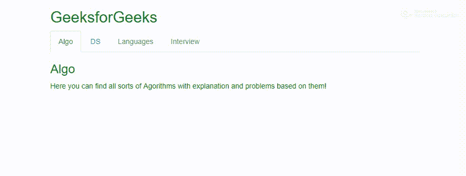

# 如何禁用 Bootstrap 中的标签？

> 原文:[https://www . geesforgeks . org/如何禁用引导中的选项卡/](https://www.geeksforgeeks.org/how-to-disable-tabs-in-bootstrap/)

要禁用选项卡，我们可以从包含在*‘a’*元素下的选项卡部分删除**属性:data-toggle=“选项卡”**。
进一步我们可以添加类。禁用到父列表项元素，使其看起来像**视觉禁用**。(类似于列表项中的 class =“disabled”)
为了展示禁用选项卡的情况，首先，我们来看一个启用选项卡的示例。

## 超文本标记语言

```
<ul class="nav nav-tabs">
    <li class="active"><a data-toggle="tab" href="#home">Algo</a></li>
    <li><a data-toggle="tab" href="#menu1">DS</a></li>
    <li><a data-toggle="tab" href="#menu2">Languages</a></li>
    <li><a data-toggle="tab" href="#menu3">Interview</a></li>
</ul>
```

这里是展示选项卡禁用的无序列表部分，用于直接比较:

## 超文本标记语言

```
<ul class="nav nav-tabs">
    <li class="active"><a data-toggle="tab" href="#home">Algo</a></li>
    <li><a href="#menu1">DS</a></li>
    <li class ="disabled"><a data-toggle="tab" href="#menu2">Languages</a></li>
    <li class="disabled"><a href="#menu3">Interview</a></li>
  </ul>
```

考虑到上述可切换选项卡的代码，下面是禁用一个选项卡的示例，使一个选项卡在视觉上被禁用，同时禁用一个选项卡并使其看起来在视觉上被禁用:
**示例:**

## 超文本标记语言

```
<!DOCTYPE html>
<html lang="en">

<head>
    <link rel="stylesheet"
          href=
"https://maxcdn.bootstrapcdn.com/bootstrap/3.4.0/css/bootstrap.min.css">
    <script src=
 "https://ajax.googleapis.com/ajax/libs/jquery/3.4.1/jquery.min.js">
  </script>
    <script src=
"https://maxcdn.bootstrapcdn.com/bootstrap/3.4.0/js/bootstrap.min.js">
  </script>
</head>

<body>

    <div class="container"
         style="color:green">
        <h2>GeeksforGeeks</h2>

        <ul class="nav nav-tabs">
            <li class="active">
              <a data-toggle="tab" href="#home">Algo</a>
          </li>
            <li><a href="#menu1">DS</a></li>
            <li class="disabled">
              <a data-toggle="tab" href="#menu2">
                Languages
              </a>
          </li>
            <li class="disabled">
              <a href="#menu3">
                Interview
              </a>
          </li>
        </ul>

        <div class="tab-content">
            <div id="home"
                 class="tab-pane fade in active">
                <h3>Algo</h3>

<p>Here you can find all sorts of Algorithms
                  with explanation and problems based on them!
              </p>

            </div>
            <div id="menu1" class="tab-pane fade">
                <h3>DS</h3>

<p>Here you can find all sorts of Data
                  Structures explained and problems wherein
                  we need to use those!</p>

            </div>
            <div id="menu2" class="tab-pane fade">
                <h3>Languages</h3>

<p>Here you can find all different scripting/query
                  languages!
              </p>

            </div>
            <div id="menu3" class="tab-pane fade">
                <h3>Interview</h3>

<p>Here, you can find 'Interview Experiences'
                  for all the companies!
              </p>

            </div>
        </div>
    </div>

</body>

</html>
```

**输出:**



在禁用标签的代码中，我们没有改变第一个列表项(带有文本‘Algo’)(显示启用标签的情况)，因此它是可点击/可切换的，并且没有任何视觉障碍。
对于第二个列表项(带有文本‘DS’)，我们删除了“ *data-toggle="tab"* ”部分，因此该选项卡变得不可切换，如果我们尝试单击它，则不会发生任何事情。
对于第三个列表项(带有文本‘语言’)，我们添加了类*。禁用*(class =“disabled”)到我们的列表项，这样它就变成了视觉禁用，即当我们将光标悬停在它上面时显示一个禁用的图标。
但是，请注意，由于“ *data-toggle="tab"* ”部分在*“a”*中仍然存在，因此该选项卡是可切换的，可以单击。
对于第四个列表项(带有文本“面试”)，我们在列表项中添加了禁用类，并删除了“ *data-toggle="tab"* ”部分。这使得该选项卡不可切换/点击禁用(当我们点击时)和视觉禁用。这将是使其完全失效的情况。