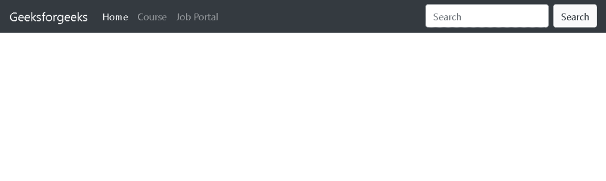
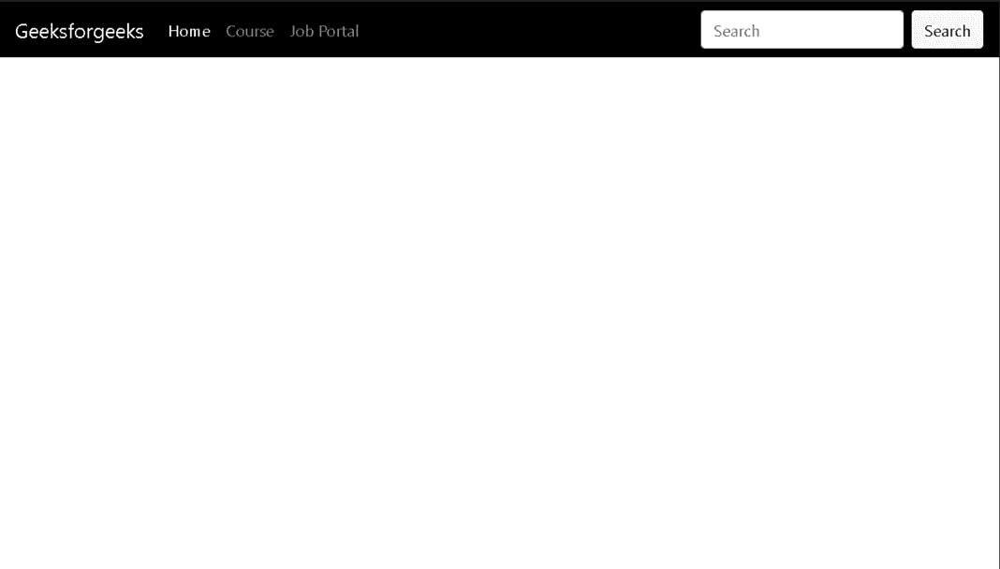

# 如何在 Bootstrap 中显示黑色导航栏？

> 原文:[https://www . geesforgeks . org/how-display-black-navigation-bar-in-bootstrap/](https://www.geeksforgeeks.org/how-to-display-black-navigation-bar-in-bootstrap/)

每个网站都使用导航栏，以使其更加用户友好，从而使网站导航变得容易，用户可以直接搜索他们感兴趣的主题。有以下两种方式显示黑色导航栏。

[**使用** ***。nav bar-深色*** **和** ***。BG-暗黑*** **类**](https://www.geeksforgeeks.org/how-to-change-navigation-bar-color-in-bootstrap/) **:** 本 *。navbar-dark* 类的 bootstrap 使文本在 *navbar* *中变成白色*和*。BG-深色*类使*导航条*类*的背景色为黑色*。

**示例:**

## 超文本标记语言

```html
<!DOCTYPE html>
<html lang="en">
  <head>
    <meta charset="utf-8" />
    <meta name="viewport"
          content="width=device-width, initial-scale=1" />

    <link
      rel="stylesheet"
      href=
"https://maxcdn.bootstrapcdn.com/bootstrap/4.3.1/css/bootstrap.min.css"/>

    <script src=
"https://ajax.googleapis.com/ajax/libs/jquery/3.3.1/jquery.min.js">
    </script>
    <script src=
"https://cdnjs.cloudflare.com/ajax/libs/popper.js/1.14.7/umd/popper.min.js">
    </script>
    <script src=
"https://maxcdn.bootstrapcdn.com/bootstrap/4.3.1/js/bootstrap.min.js">
    </script>
  </head>
  <body>
    <nav class="navbar navbar-expand-lg navbar-dark bg-dark">
      <a class="navbar-brand" href="#">Geeksforgeeks</a>

      <div class="collapse navbar-collapse">
        <ul class="navbar-nav mr-auto">
          <li class="nav-item active">
            <a class="nav-link" href="#">Home</a>
          </li>
          <li class="nav-item">
            <a class="nav-link" href="#">Course</a>
          </li>
          <li class="nav-item">
            <a class="nav-link" href="#">Job Portal</a>
          </li>
        </ul>
        <form class="form-inline my-2 my-lg-0">
          <input
            class="form-control mr-sm-2"
            type="search"
            placeholder="Search"
            aria-label="Search"/>
          <button class="btn btn-light my-2 my-sm-0"
                  type="submit">
            Search
          </button>
        </form>
      </div>
    </nav>
  </body>
</html>
```

**输出:**



输出

**使用** [**样式**](https://www.geeksforgeeks.org/how-to-apply-inline-css/) **属性设置背景颜色:**我们可以使用 [<导航>](https://www.geeksforgeeks.org/html-nav-tag/) 标签的*样式*属性来设置*导航条*的背景颜色。

**示例:**

## 超文本标记语言

```html
<!DOCTYPE html>
<html lang="en">
  <head>
    <meta charset="utf-8" />
    <meta name="viewport" content="width=device-width, initial-scale=1" />

    <link
      rel="stylesheet"
      href=
"https://maxcdn.bootstrapcdn.com/bootstrap/4.3.1/css/bootstrap.min.css"/>

    <script src=
"https://ajax.googleapis.com/ajax/libs/jquery/3.3.1/jquery.min.js">
    </script>
    <script src=
"https://cdnjs.cloudflare.com/ajax/libs/popper.js/1.14.7/umd/popper.min.js">
    </script>
    <script src=
"https://maxcdn.bootstrapcdn.com/bootstrap/4.3.1/js/bootstrap.min.js">
    </script>
  </head>
  <body>
    <nav
      class="navbar navbar-expand-lg navbar-dark"
      style="background-color: black"
    >
      <a class="navbar-brand" href="#">Geeksforgeeks</a>

      <div class="collapse navbar-collapse">
        <ul class="navbar-nav mr-auto">
          <li class="nav-item active">
            <a class="nav-link" href="#">Home</a>
          </li>
          <li class="nav-item">
            <a class="nav-link" href="#">Course</a>
          </li>
          <li class="nav-item">
            <a class="nav-link" href="#">Job Portal</a>
          </li>
        </ul>
        <form class="form-inline my-2 my-lg-0">
          <input
            class="form-control mr-sm-2"
            type="search"
            placeholder="Search"
            aria-label="Search"/>
          <button class="btn btn-light my-2 my-sm-0" 
                  type="submit">
            Search
          </button>
        </form>
      </div>
    </nav>
  </body>
</html>
```

**输出:**

