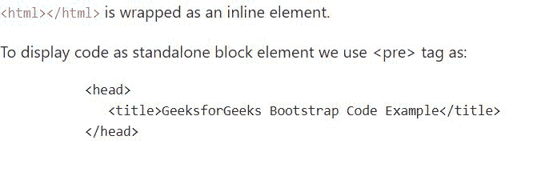

# 如何用 Bootstrap 显示代码？

> 原文:[https://www . geesforgeks . org/如何使用引导程序显示代码/](https://www.geeksforgeeks.org/how-to-display-code-with-bootstrap/)

为了在我们的网页中显示代码，bootstrap 有一些标签可以用来显示代码。

**方法 1:** 内联代码使用 [**<代码>**](https://www.geeksforgeeks.org/html-code-tag/) 标签来内联显示代码。 **<代码>** 标签包装了一段内联代码。内联代码应包裹在 **<代码>** 标签中。生成的文本将以固定宽度的字体显示，并呈现红色字体。
**注:**:<>标签应替换为**&lt；** 和**&gt；**分别为。

**语法:**

```html
<code>
    <!--inline code goes here-->
</code>
```

**方法 2:** 代码块使用 [**< pre >**](https://www.geeksforgeeks.org/html-pre-tag/) 标签将代码显示为独立的块元素。当我们想要显示多行代码时，也可以使用这个标签。多行代码应包装在 **<前置>** 标签中。生成的文本将以固定宽度的字体显示，并保留空格和换行符。

**语法:**

```html
<pre>
    <!-- code block goes here -->
</pre>
```

**使用引导显示代码的分步指南:**

**步骤 1:** 将 [Bootstrap](https://www.geeksforgeeks.org/bootstrap-4-introduction/) 和 [jQuery CDN](https://www.geeksforgeeks.org/how-to-add-jquery-code-to-html-file/) 包含到所有其他样式表之前的<头>标签中，以加载我们的 CSS。

> <src 脚本= " https://Ajax . Google APIs . com/Ajax/libs/jquery/3 . 5 . 1/jquery . min . js "></script><src 脚本= " https://cdnjs . cloudflare . com/Ajax/libs/popper . js

**第二步:**添加 **<代码>** 标签显示内联代码， **<前置>** 标签显示代码块。

```html
<code>&lt;html&gt;&lt;/html&gt;</code> are 
wrapped as an inline elements.

<pre>
    &lt;head&gt;
        &lt;title&gt;
            GeeksforGeeks Bootstrap Code Example
        &lt;/title&gt;
    &lt;/head&gt;
</pre> 
```

**示例:**

## 超文本标记语言

```html
<!DOCTYPE html>
<html>

<head>
    <title>Bootstrap Code Block Example</title>

    <!--Include latest bootstrap, CSS, jQuery CDN-->
    <link rel="stylesheet" href=
"https://maxcdn.bootstrapcdn.com/bootstrap/4.5.2/css/bootstrap.min.css">
    <script src=
    "https://ajax.googleapis.com/ajax/libs/jquery/3.5.1/jquery.min.js">
    </script>
    <script src=
"https://cdnjs.cloudflare.com/ajax/libs/popper.js/1.16.0/umd/popper.min.js">
    </script>
    <script src=
"https://maxcdn.bootstrapcdn.com/bootstrap/4.5.2/js/bootstrap.min.js">
    </script>
</head>

<body>

    <p>
        <!-- Include <code> tag for inline code -->
        <code><html></html></code> is 
        wrapped as an inline element.
    </p>

    <p>
        To display code as standalone block 
        element we use <pre> tag as:

        <!-- Include <pre> tag for multiple 
            lines of code -->
        <pre>
            <head>
                <title>
                    GeeksforGeeks Bootstrap Code Example
                </title>
            </head>
        </pre>
    </p>
</body>

</html>
```

**输出:**

