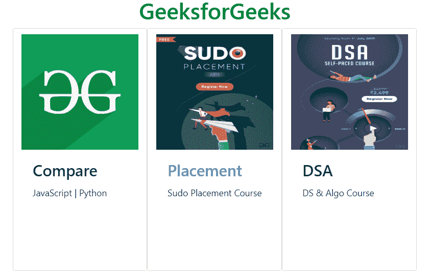

# 如何在 Bootstrap 卡中显示多张水平图像？

> 原文:[https://www . geesforgeks . org/如何在引导卡中显示多水平图像/](https://www.geeksforgeeks.org/how-to-display-multiple-horizontal-images-in-bootstrap-card/)

**先决条件:** [引导卡](https://www.geeksforgeeks.org/bootstrap-4-cards/)

引导卡提供了灵活且可扩展的内容容器，具有多种变体和选项，例如表格样式、水平/垂直堆叠多个图像、使堆叠的内容具有响应性等。卡片包括许多自定义背景、边框、页眉、页脚、颜色等的选项。

要在引导卡中显示多个水平图像，您需要清除引导卡的基础知识，有一种简单的方法可以完成这项任务。此外，还有一些预定义的引导代码，它们会给出类似的输出，之后您可以在 CSS 的帮助下轻松修改这一点，它们是

*   网格标记
*   卡片组
*   纸牌
*   卡片列

**示例:**本示例在 Bootstrap 卡中水平插入多个图像。

```html
<!DOCTYPE html> 
<html lang="en"> 
<head> 
    <title>
        How to show multiple horizontal
        images in Bootstrap card ?
    </title> 

    <meta charset="utf-8"> 
    <meta name="viewport" content="width=device-width, initial-scale=1"> 

    <link rel="stylesheet" href= 
"https://maxcdn.bootstrapcdn.com/bootstrap/4.3.1/css/bootstrap.min.css"> 

    <script src= 
"https://ajax.googleapis.com/ajax/libs/jquery/3.3.1/jquery.min.js"> 
    </script> 

    <script src= 
"https://cdnjs.cloudflare.com/ajax/libs/popper.js/1.14.7/umd/popper.min.js"> 
    </script> 

    <script src= 
"https://maxcdn.bootstrapcdn.com/bootstrap/4.3.1/js/bootstrap.min.js"> 
    </script> 

    <style>
        img {
            max-width: 100%;
            max-height: 50%;
            padding-top:10px;
        }
        h1 {
            color: green;
        }
    </style>
</head> 

<body> 
    <h1 style="color:green;text-align:center;"> 
        GeeksforGeeks 
    </h1> 

    <div class="container">
        <div class="card-group">

            <!--bootstrap card with 3 horizontal images-->
            <div class="row">
                <div class="card col-md-4">
                    

                    <div class="card-body">
                        <h3 class="card-title">Compare</h3>
                        <p class="card-text">JavaScript | Python</p>
                    </div>
                </div>

                <div class="card col-md-4">
                    

                    <div class="card-body">
                        <h3 class="card-title text-primary">Placement</h3>
                        <p class="card-text">Sudo Placement Course</p>
                    </div>
                </div>

                <div class="card col-md-4">
                    

                    <div class="card-body">
                        <h3 class="card-title">DSA</h3>
                        <p class="card-text">DS & Algo Course</p>
                    </div>
                </div>
            </div>
        </div>
    </div>
</body>
</html>                    
```

**输出:**
