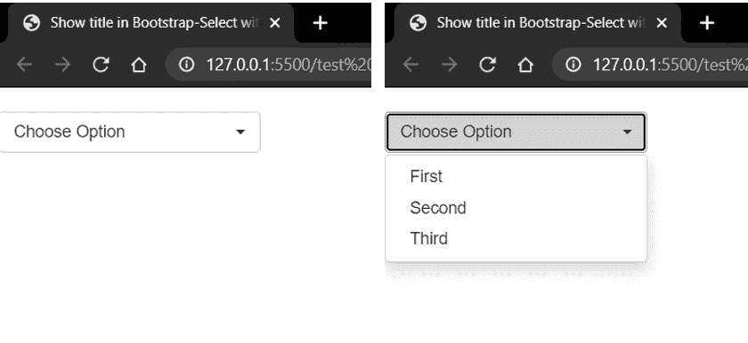

# 如何在 Bootstrap-Select 中显示没有空元素的标题？

> 原文:[https://www . geesforgeks . org/如何在引导中显示标题-选择不带空元素/](https://www.geeksforgeeks.org/how-to-display-title-in-bootstrap-select-without-empty-element/)

在本文中，我们将介绍如何在引导-选择中显示标题，而不在选择下拉菜单中显示任何空元素。引导选择是一个表单控件，它显示了可以选择的不同值的可折叠列表。这可用于向用户显示表单或菜单。

**示例 1:** 使用第一个选项标签中的数据隐藏属性在列表视图中隐藏项目。这将第一个数据设置为隐藏，同时，我们可以在标题中看到它。

## 超文本标记语言

```html
<!DOCTYPE html>
<html>

<head>
    <link href=
"https://cdnjs.cloudflare.com/ajax/libs/twitter-bootstrap/3.3.7/css/bootstrap.css"
        rel="stylesheet" />
    <link href=
"https://cdnjs.cloudflare.com/ajax/libs/bootstrap-select/1.6.3/css/bootstrap-select.css"
        rel="stylesheet" />
    <script src="https://cdnjs.cloudflare.com/ajax/libs/jquery/2.2.4/jquery.js">
    </script>
    <script src=
"https://cdnjs.cloudflare.com/ajax/libs/twitter-bootstrap/3.3.7/js/bootstrap.js">
    </script>
    <script src=
"https://cdnjs.cloudflare.com/ajax/libs/bootstrap-select/1.6.3/js/bootstrap-select.js">
    </script>
</head>

<body>
    <select class="selectpicker" 
            title="Pick One">

    <option data-hidden="true">
        Choose Option
    </option>
    <option>First</option>
    <option>Second</option>
    <option>Third</option>
  </select>
</body>

</html>
```

**输出:**



根据要求设置标题，不带空元素

**示例 2:** 使用多重选项，在选择标记中选择属性，并将 data-max-属性限制为 1。之后，我们根据我们的要求设置标题属性。

## 超文本标记语言

```html
<!DOCTYPE html>
<html>

<head>
    <link href=
"https://cdnjs.cloudflare.com/ajax/libs/twitter-bootstrap/3.3.7/css/bootstrap.css"
        rel="stylesheet" />
    <link href=
"https://cdnjs.cloudflare.com/ajax/libs/bootstrap-select/1.6.3/css/bootstrap-select.css"
        rel="stylesheet" />
    <script src="https://cdnjs.cloudflare.com/ajax/libs/jquery/2.2.4/jquery.js">
    </script>
    <script src=
"https://cdnjs.cloudflare.com/ajax/libs/twitter-bootstrap/3.3.7/js/bootstrap.js">
    </script>
    <script src=
"https://cdnjs.cloudflare.com/ajax/libs/bootstrap-select/1.6.3/js/bootstrap-select.js">
    </script>
</head>

<body>
    <select class="selectpicker" 
        multiple data-max-options="1" 
        title="Choose Option">
    <option>First</option>
    <option>Second</option>
    <option>Third</option>
  </select>
</body>

</html>
```

**输出:**


根据要求设置标题，不带空元素

**例 3:** 使用 CSS 隐藏第一个选项，按照我们的要求设置标题。

## 超文本标记语言

```html
<!DOCTYPE html>
<html>

<head>
    <link href=
"https://cdnjs.cloudflare.com/ajax/libs/twitter-bootstrap/3.3.7/css/bootstrap.css"
        rel="stylesheet" />
    <link href=
"https://cdnjs.cloudflare.com/ajax/libs/bootstrap-select/1.6.3/css/bootstrap-select.css"
        rel="stylesheet" />
    <script src="https://cdnjs.cloudflare.com/ajax/libs/jquery/2.2.4/jquery.js">
    </script>
    <script src=
"https://cdnjs.cloudflare.com/ajax/libs/twitter-bootstrap/3.3.7/js/bootstrap.js">
    </script>
    <script src=
"https://cdnjs.cloudflare.com/ajax/libs/bootstrap-select/1.6.3/js/bootstrap-select.js">
    </script>

    <style>
        .bootstrap-select ul.dropdown-menu li:first-child {
            display: none;
        }
    </style>
</head>

<body>
    <br>
    <select class="selectpicker" 
        title="Choose Option">
    <option></option>
    <option>First</option>
    <option>Second</option>
    <option>Third</option>
  </select>
</body>

</html>
```

**输出:**


根据要求设置标题，不带空元素