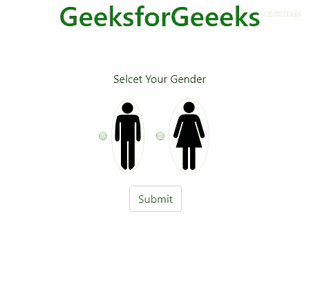
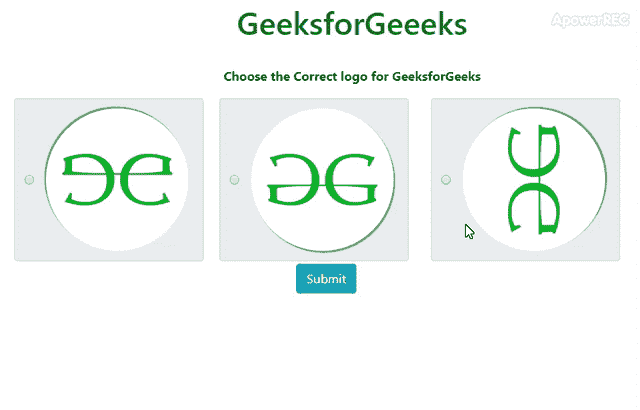

# 如何使用 Bootstrap 4 显示带有内嵌图像的单选按钮的验证消息？

> 原文:[https://www . geesforgeks . org/how-display-validation-message-for-radio-button-with-inline-images-use-bootstrap-4/](https://www.geeksforgeeks.org/how-to-display-validation-message-for-radio-buttons-with-inline-images-using-bootstrap-4/)

默认情况下，Bootstrap 4 具有各种表单功能，用于内嵌图像的单选按钮。这里 HTML 5 有默认的验证特性，但是，对于自定义验证，我们必须使用 JavaScript 或 jQuery。以下方法将有助于内嵌图像的单选按钮的显示验证消息。
**方法 1:** 首先使用 form-check-inline 类包装单选按钮及其标签。然后在上面的标签后包装中添加 img 标签。通过添加单选按钮的必需属性，使用默认的必需验证。最后，使用 alert 类显示消息，并使用 jquery[**attr()**](https://www.geeksforgeeks.org/jquery-attr-method/)、 [**addClass()**](https://www.geeksforgeeks.org/jquery-addclass-with-examples/) 和 [**html()**](https://www.geeksforgeeks.org/jquery-html-method/) 方法仅在单选按钮未选中时触发。

*   **示例:**下面的程序说明了如何基于上述方法显示带有内嵌图像的单选按钮的验证消息。

## 超文本标记语言

```html
<!DOCTYPE html>
<html lang="en">

<head>
    <meta charset="utf-8">

    <meta name="viewport" content=
            "width=device-width, initial-scale=1">
    <link rel="stylesheet" href=
"https://maxcdn.bootstrapcdn.com/bootstrap/4.3.1/css/bootstrap.min.css">

    <script src=
"https://ajax.googleapis.com/ajax/libs/jquery/3.4.1/jquery.min.js">
    </script>

    <script src=
"https://cdnjs.cloudflare.com/ajax/libs/popper.js/1.14.7/umd/popper.min.js">
    </script>

    <script src=
"https://maxcdn.bootstrapcdn.com/bootstrap/4.3.1/js/bootstrap.min.js">
    </script>

    <style>
        body {
            text-align: center;
        }
        h1 {
            color: green;
        }
    </style>
</head>

<body>
    <div class="container">
        <h1>GeeksforGeeeks</h1>

        <br><br>

<p>Select Your Gender</p>

        <form>
            <div class="form-check form-check-inline">
                <input class="form-check-input"
                        type="radio"
                        name="inlineRadioOptions"
                        id="inlineRadio2"
                        value="option2" required>
                <label class="form-check-label"
                                for="inlineRadio2">
                    
                </label>
            </div>

            <div class="form-check form-check-inline">
                <input class="form-check-input"
                        type="radio"
                        name="inlineRadioOptions"
                        id="inlineRadio3"
                        value="option3" required>
                <label class="form-check-label"
                            for="inlineRadio3">
                    
                </label>
            </div>
            <br>

            <div class="form-check form-check-inline">
                <input type="submit"
                        class="form-control mt-3 "
                        value="Submit"
                        name="submit"
                        id="checked" />
            </div>
        </form>

        <br><br>

        <span id="msg"></span>
    </div>

    <script>

        // On clicking submit do following
        $("input[type=submit]").click(function() {

            var atLeastOneChecked = false;
            $("input[type=radio]").each(function() {

                // If radio button not checked
                // display alert message
                if ($(this).attr("checked") != "checked") {

                    // Alert message by displaying
                    // error message
                    $("#msg").html(
        "<span class='alert alert-danger' id='error'>"
        + "Please Choose atleast one</span>");
                }
            });
        });
    </script>
</body>

</html>
```

*   **输出:**



**方法 2:** 通过使用表单内联和输入组类，将单选按钮与 img 标签一起包装为内联。然后使用 alert 类显示消息，并使用 jQuery [**attr()**](https://www.geeksforgeeks.org/jquery-attr-method/) 、 [**addClass()**](https://www.geeksforgeeks.org/jquery-addclass-with-examples/) 和 [**html()**](https://www.geeksforgeeks.org/jquery-html-method/) 方法仅在单选按钮未选中时触发。最后，使用 jQuery val()函数获取选中的值，并将其与 Bootstrap 警报组件连接起来，以显示表单提交成功/失败的消息。另外，使用[**【preventDefault()】**](https://www.geeksforgeeks.org/jquery-event-preventdefault-method/)功能防止提交后表单重置，因为要显示提交成功/失败的消息。别忘了在上面的标签后包装中添加 img 标签。
**注意:**在更宽的窗口运行该代码。
**示例:**下面的示例说明了如何基于上述方法显示带有内嵌图像的单选按钮的验证消息。

## 超文本标记语言

```html
<!DOCTYPE html>
<html lang="en">

<head>
    <meta charset="utf-8">

    <meta name="viewport" content=
                "width=device-width, initial-scale=1">

    <link rel="stylesheet" href=
"https://maxcdn.bootstrapcdn.com/bootstrap/4.3.1/css/bootstrap.min.css">

    <script src=
"https://ajax.googleapis.com/ajax/libs/jquery/3.4.1/jquery.min.js">
    </script>

    <script src=
"https://cdnjs.cloudflare.com/ajax/libs/popper.js/1.14.7/umd/popper.min.js">
    </script>

    <script src=
"https://maxcdn.bootstrapcdn.com/bootstrap/4.3.1/js/bootstrap.min.js">
    </script>

    <style>
        body {
            text-align: center;
        }
        #option3img {
            transform: rotate(270deg);
        }

        #option1img {
            transform: rotate(180deg);
        }
        body {
            margin: 55px;
        }

        input[type=submit] {
            position: absolute;
            left: 43%;
            top: 52%;
        }

        h1 {
            color: green;
        }
    </style>
</head>

<body>
    <div class="container">
        <h1>GeeksforGeeeks</h1>
        <br>

<p><strong>
            Choose the Correct logo for GeeksforGeeks
        </strong></p>

        <form>
            <div class="form-inline">

                <!--form group with image inline-->
                <div class="input-group mr-sm-2">
                    <div class="form-check-inline">
                        <label class="form-check-label input-group-text ml-2">
                            <input type="radio" aria-label=
                                "Radio button for following text input"
                                name="Radiobtn" id="option1" value="option1">

                            
                        </label>
                    </div>   
                </div>

                <div class="input-group mr-sm-2">
                    <div class="form-check-inline">
                        <label class="form-check-label input-group-text ">
                            <input type="radio"
                                aria-label="Radio button for following text input"
                                name="Radiobtn" id="option2" value="option2">

                            
                        </label>
                    </div>
                </div>

                <div class="input-group mr-sm-2">
                    <div class="input-group-prepend">
                        <div class="form-check-inline">
                            <label class="form-check-label input-group-text ml-2">
                                <input type="radio"
                                    aria-label="Radio button for following text input"
                                    name="Radiobtn" id="option3" value="option3">

                                
                            </label>
                        </div>
                    </div>
                </div>
            </div>

            <div class="form-inline mt-5">
                <input class="form-control mr-3 btn btn-info"
                        type="submit" value="Submit">
            </div>
        </form>

        <div class="mt-3" id="msg"></div>
        <div class="mt-3" id="ans"></div>
    </div>

    <script>

        // On clicking submit do following
        $("input[type=submit]").click(function() {
            var atLeastOneChecked = false;

            // If radio button not checked
            // display alert message
            $("input[type=radio]").each(function() {
                if ($(this).attr("checked") != "checked") {

                    // Alert message by displaying
                    // error message
                    $("#msg").html(
'<span class="alert alert-danger alert-dismissible fade show" id="alert1">'+
'Make atleast one choice'+
' <button type="button" class="close" data-dismiss="alert" aria-label="Close">'+
'<span aria-hidden="true" >×</span></button></span>');
                } else {
                    $("#msg").html(
'<span class="alert alert-success alert-dismissible fade show" id="alert2">'+
'Success Choise Made'+
'<button type="button" class="close" data-dismiss="alert" aria-label="Close">'+
'<span aria-hidden="true" >×</span></button></span>');
                }
            });
        });
    </script>

    <script>
        $(document).ready(function() {

            // Validation message for empty choice submission
            $("input[type='submit']").click(function() {
                var radioValue = $("input[name='Radiobtn']:checked").val();

                if (radioValue) {
                    $("#msg").html(
'<span class="alert alert-success alert-dismissible fade show" id="alert3">'+
'Success..! You Made your Choise : <strong>' + radioValue +
 '</strong><button type="button" class="close" data-dismiss="alert" aria-label="Close">'+
 '<span aria-hidden="true" >×</span></button></span>');
                    if (radioValue == 'option2') {

                        // Validation message for correct choice
                        $("#ans").html(
'<span class="alert alert-success alert-dismissible fade show" id="alert4">'+
'You Have Made Correct Choise : <strong>' + radioValue +
'</strong><button type="button" class="close" data-dismiss="alert" aria-label="Close">'+
'<span aria-hidden="true" >×</span></button></span>');
                    } else {

                        // Validation message for wrong choice
                        $("#ans").html(
'<span class="alert alert-warning alert-dismissible fade show" id="alert5">'+
'Warning ..! You Have Made Wrong Choise : <strong>' + radioValue +
'</strong><button type="button" class="close" data-dismiss="alert" aria-label="Close">'+
'<span aria-hidden="true" >×</span></button></span>');
                    }
                }
            });
        });

        // To avoid form reload after submission//
        $("form").submit(function(e) {
            e.preventDefault();
        });
    </script>
</body>

</html>
```

*   **输出:**



**参考:**T2https://getbootstrap.com/docs/4.4/components/forms/