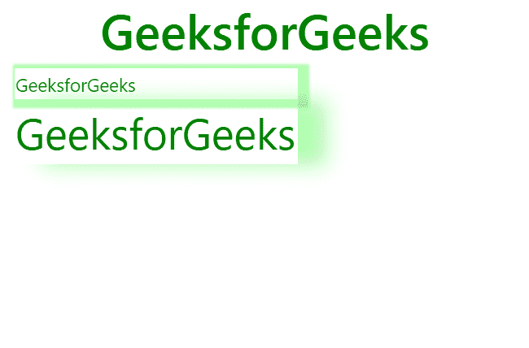
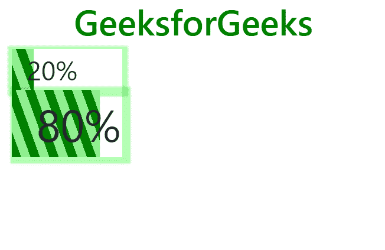

# 如何用 bootstrap 做进度条样式的方块阴影？

> 原文:[https://www . geesforgeks . org/how-do-box-shadow-with-progress-bar-style-use-bootstrap/](https://www.geeksforgeeks.org/how-to-do-box-shadow-with-progress-bar-style-using-bootstrap/)

进度条用于显示流程的进度。带有进度条样式的方框阴影突出显示带有方框阴影效果的任务/进程的用户进度。

**语法:**

```html
<td style="box-shadow: px px px px rgba()"></td> 
```

**返回值:**返回进度条样式的框阴影。

**例 1:**

```html
<!DOCTYPE html>
<html lang="en">

<head>
    <meta charset="utf-8">
    <meta name="viewport" 
          content="width=device-width, 
                   initial-scale=1">

    <link rel="stylesheet" 
          href=
"https://maxcdn.bootstrapcdn.com/bootstrap/4.3.1/css/bootstrap.min.css">

    <script src=
"https://ajax.googleapis.com/ajax/libs/jquery/3.3.1/jquery.min.js">
    </script>

    <script src=
"https://cdnjs.cloudflare.com/ajax/libs/popper.js/1.14.7/umd/popper.min.js">
    </script>

    <script src=
"https://maxcdn.bootstrapcdn.com/bootstrap/4.3.1/js/bootstrap.min.js">
    </script>

</head>

<body>
    <div class="container">

        <h1 style="text-align:center;color:green;"> 
            GeeksforGeeks 
        </h1>

        <table>
            <tr>
                <td style=
                  "box-shadow: 4px 2px 2px 5px rgba(0, 255, 0, 0.3);">
                  <span style="font-size:15px; color:green">
                    GeeksforGeeks
                  </span>

                </td>
            </tr>
            <tr>
                <td style=
                    "box-shadow:23px 1px 16px rgba(0, 255, 0, 0.3);">
                    <span style="font-size:35px; color:green">
                      GeeksforGeeks
                  </span>
                </td>
            </tr>
      </table>
    </div>
</body>

</html>
```

**输出:**



**例 2:**

```html
<!DOCTYPE html>
<html lang="en">

<head>

    <meta charset="utf-8">
    <meta name="viewport" 
          content="width=device-width, initial-scale=1">

    <link rel="stylesheet"
          href=
"https://maxcdn.bootstrapcdn.com/bootstrap/4.3.1/css/bootstrap.min.css">

    <script src=
 "https://ajax.googleapis.com/ajax/libs/jquery/3.3.1/jquery.min.js">
    </script>

    <script src=
  "https://cdnjs.cloudflare.com/ajax/libs/popper.js/1.14.7/umd/popper.min.js">
    </script>

    <script src=
 "https://maxcdn.bootstrapcdn.com/bootstrap/4.3.1/js/bootstrap.min.js">
    </script>
    <style>
        td {
            background: repeating-linear-gradient(
              70deg, green 0 10px, lightgreen 10px 20px) 0 0/100% 100% no-repeat;
        }
    </style>
</head>

<body>
    <div class="container">

        <h1 style="text-align:center;color:green;"> 
            GeeksforGeeks 
        </h1>

        <table>
            <tr>
                <td style="  
          box-shadow: 1px 2px 2px 5px rgba(0, 255, 0, 0.3); 
                           background-size:20% 100%;">
                    <span style="font-size:30px ">  20%</span>
                </td>
            </tr>
            <tr>
                <td style="  
          box-shadow: 4px 2px 2px 5px rgba(0, 255, 0, 0.3);
                           background-size:80% 100%;">
                  <span style="font-size:50px; ">  80%</span>
                </td>
            </tr>
        </table>
    </div>
</body>

</html>
```

**输出:**


**浏览器支持:**支持带进度条样式的框阴影的浏览器:

*   微软公司出品的 web 浏览器
*   谷歌 Chrome
*   歌剧
*   火狐浏览器
*   旅行队