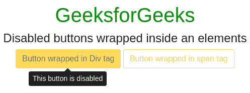
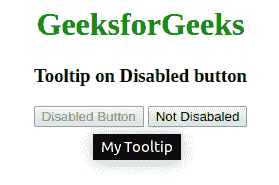
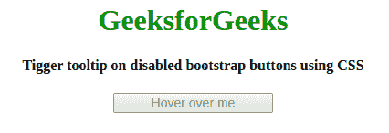

# 如何在禁用按钮上启用引导工具提示？

> 原文:[https://www . geesforgeks . org/如何启用引导-工具提示-打开-禁用-按钮/](https://www.geeksforgeeks.org/how-to-enable-bootstrap-tooltip-on-disabled-button/)

禁用了类和属性的按钮或链接元素不是交互式的。这意味着用户不能聚焦、悬停或点击它们来触发工具提示(或弹出)或任何功能。使用以下方法启用禁用按钮的工具提示。

*   使用 jQuery
*   使用 HTML
*   使用 CSS

**初始化工具提示:**

*   默认情况下，工具提示通过选择指定的元素并使用 jQuery 调用*工具提示()*方法来初始化。然后向指定的元素添加一个标题属性，该元素包含要在工具提示中显示的文本。
*   要定位工具提示数据，必须将放置属性添加到指定的元素中，并将顶部/底部/右侧/左侧作为其值。

```html
// Initializing the tooltip
$(document).ready(function() { 
    $('[data-toggle="tooltip"]').tooltip();    
}); 

```

**注意:**默认*数据-toggle=“工具提示”*将启用禁用按钮的工具提示。

**进场:**

*   使用指定的元素初始化引导禁用按钮中的工具提示，并调用 tooltip()方法。
*   通过将禁用按钮包装在 span 标签和div 标签中，然后分别添加“数据切换”、“数据放置”和“标题”属性及其值，触发禁用按钮上的工具提示。

**示例:**该示例通过在 div 和 span 标签内包装禁用按钮来说明触发工具提示。

```html
<!DOCTYPE html>
<html lang="en">

<head>
    <title>Disabled Button Tooltip</title>

    <meta charset="utf-8">
    <meta name="viewport" 
          content="width=device-width, initial-scale=1">

    <link rel="stylesheet" href=
"https://maxcdn.bootstrapcdn.com/bootstrap/4.3.1/css/bootstrap.min.css">

    <script src=
"https://ajax.googleapis.com/ajax/libs/jquery/3.3.1/jquery.min.js">
    </script>

    <script src=
"https://cdnjs.cloudflare.com/ajax/libs/popper.js/1.14.7/umd/popper.min.js">
    </script>

    <script src=
"https://maxcdn.bootstrapcdn.com/bootstrap/4.3.1/js/bootstrap.min.js">
    </script>
    <style>
        .disabled {
            pointer-events: all !important;
        }
    </style>
</head>

<body style="text-align:center;">

    <div class="container pt-5">

        <h1 style="color:green;"> 
            GeeksforGeeks 
        </h1>

        <h4>
          Disabled buttons wrapped inside an elements
        </h4>

        <div class="d-inline-block" tabindex="0" data-toggle="tooltip" 
             data-placement="bottom" title="This button is disabled">
            <button type="button" class="btn btn-warning" 
                    style="pointer-events: none;" disabled>
              Button wrapped in Div tag
            </button>
        </div>

        <span class="d-inline-block" tabindex="0" data-toggle="tooltip"
              data-placement="right" title="This button is disabled">
                <button class="btn btn-outline-warning" 
                        style="pointer-events: none;"type="button" disabled>
                  Button wrapped in span tag
                </button>
        </span>
    </div>

    <script>
        $(document).ready(function() {
            $('[data-toggle="tooltip"]').tooltip();
        });
    </script>

</body>

</html>       
```

**输出:**


**示例 2:** 本示例使用 HTML 在任何禁用的按钮上显示关于内容的工具提示信息。为此，只需禁用按钮并在其上添加标题属性。

```html
<!DOCTYPE html>
<html>

<head>
    <title>
        Tooltip on disabled button
    </title>

    <style>
        h1 {
            color: green;
        }
    </style>
</head>

<body>
    <center>
        <h1>GeeksforGeeks</h1>
        <h3>Tooltip on Disabled button</h3>
        <div>
            <button disabled="disabled" title="My Tooltip">
              Disabled Button
            </button>
            <button title="Here it's common">Not Disabaled</button>
        </div>
  </center>
</body>

</html>  
```

**输出:**


**示例 3:** 使用 CSS 禁用引导按钮的跳跳虎工具提示。

```html
<!DOCTYPE html>
<html>
<title>Disabled Button Tooltip</title>

<style>
    .tooltip1 {
        position: relative !important;
        display: inline-block !important;
        width: 175px !important;
        font-size: 14px;
    }

    .tooltip1 .tooltiptext {
        visibility: hidden;
        width: 120px !important;
        background-color: black !important;
        color: #fff !important;
        text-align: center !important;
        border-radius: 6px !important;
        padding: 5px 0 !important;
        position: absolute !important;
        z-index: 1 !important;
        top: -5px !important;
        left: 110% !important;
    }

    .tooltip1 .tooltiptext::after {
        content: "";
        position: absolute !important;
        top: 50% !important;
        right: 100% !important;
        margin-top: -5px !important;
        border-width: 5px !important;
        border-style: solid !important;
        border-color: transparent black transparent transparent !important;
    }

    .tooltip1:hover .tooltiptext {
        visibility: visible !important;
    }
</style>

<body style="text-align:center;">
    <div class="container pt-5">

        <h1 style="color:green;"> 
            GeeksforGeeks 
        </h1>

        <h4>
          Trigger tooltip on disabled 
          bootstrap buttons using CSS
        </h4>

        <button class="btn btn-outline-info tooltip1 " disabled>
          Hover over me
            <span class="tooltip1 tooltiptext">
              disabled button
            </span>
        </button>
    </div>

</body>

</html>
```

**输出:**
