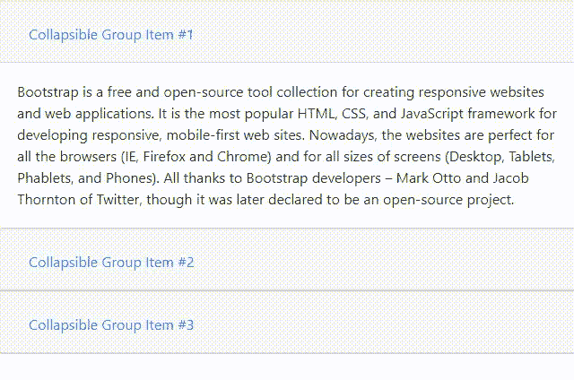

# 如何从 Bootstrap 中的 URL 展开手风琴？

> 原文:[https://www . geeksforgeeks . org/如何从引导中的 url 展开手风琴/](https://www.geeksforgeeks.org/how-to-expand-accordion-from-url-in-bootstrap/)

给定一个包含引导折叠的 HTML 文档，任务是根据网页 URL 中传递的查询展开折叠的特定部分。

**方法:**这个任务可以使用 URL 接口的 hash 属性来完成。URL 接口的哈希属性是一个 USVString，包含一个' # '后跟 URL 的片段标识符。我们可以使用 jQuery 提取这个散列，并根据散列字符串在特定的手风琴部分切换“show”类。

**例子:**在这个例子中，我们有一个自举手风琴，有三个部分，分别有 ID 的“collapseOne”、“collapseTwo”和“CollapseThree”。要显示手风琴的特定部分，我们只需要添加。

```html
*To show the first section,* 
https://<page URL>/#collapseOne

*To show the second section,*
https://<page URL>/#collapseTwo

*To show the third section,*
https://<page URL>/#collapseThree
```

## 超文本标记语言

```html
<!DOCTYPE html>
<html lang="en">

<head>
    <meta charset="UTF-8" />
    <meta name="viewport" content=
        "width=device-width, initial-scale=1.0" />

    <!--Bootstrap CSS CDN-->
    <link rel="stylesheet" href=
"https://maxcdn.bootstrapcdn.com/bootstrap/4.0.0/css/bootstrap.min.css"
        integrity=
"sha384-Gn5384xqQ1aoWXA+058RXPxPg6fy4IWvTNh0E263XmFcJlSAwiGgFAW/dAiS6JXm"
        crossorigin="anonymous" />

    <!--jQuery CDN-->
    <script src="https://code.jquery.com/jquery-3.3.1.slim.min.js"
        integrity=
"sha384-q8i/X+965DzO0rT7abK41JStQIAqVgRVzpbzo5smXKp4YfRvH+8abtTE1Pi6jizo"
        crossorigin="anonymous">
    </script>

    <script src=
"https://cdnjs.cloudflare.com/ajax/libs/popper.js/1.14.7/umd/popper.min.js"
        integrity=
"sha384-UO2eT0CpHqdSJQ6hJty5KVphtPhzWj9WO1clHTMGa3JDZwrnQq4sF86dIHNDz0W1"
        crossorigin="anonymous">
    </script>

    <script src=
"https://stackpath.bootstrapcdn.com/bootstrap/4.3.1/js/bootstrap.min.js"
        integrity=
"sha384-JjSmVgyd0p3pXB1rRibZUAYoIIy6OrQ6VrjIEaFf/nJGzIxFDsf4x0xIM+B07jRM"
        crossorigin="anonymous">
    </script>
</head>

<body>

    <!--Accordion-->
    <div class="accordion" id="accordionExample">
        <div class="card">
            <div class="card-header" id="headingOne">
                <h2 class="mb-0">
                    <button class="btn btn-link" 
                        type="button" data-toggle="collapse"
                        data-target="#collapseOne"
                        aria-expanded="true" 
                        aria-controls="collapseOne">
                        Collapsible Group Item #1
                    </button>
                </h2>
            </div>

            <div id="collapseOne" class="collapse show" 
                aria-labelledby="headingOne" 
                data-parent="#accordionExample">

                <div class="card-body">
                    Bootstrap is a free and open-source tool
                    collection for creating responsive websites
                    and web applications. It is the most popular
                    HTML, CSS, and JavaScript framework for 
                    developing responsive, mobile-first web sites.
                    Nowadays, the websites are perfect for all 
                    the browsers (IE, Firefox and Chrome) and 
                    for all sizes of screens (Desktop, Tablets,
                    Phablets, and Phones). All thanks to Bootstrap
                    developers – Mark Otto and Jacob Thornton of 
                    Twitter, though it was later declared to be 
                    an open-source project.
                </div>
            </div>
        </div>

        <div class="card">
            <div class="card-header" id="headingTwo">
                <h2 class="mb-0">
                    <button class="btn btn-link collapsed"
                        type="button" data-toggle="collapse"
                        data-target="#collapseTwo" 
                        aria-expanded="false" 
                        aria-controls="collapseTwo">
                        Collapsible Group Item #2
                    </button>
                </h2>
            </div>

            <div id="collapseTwo" class="collapse" 
                aria-labelledby="headingTwo" 
                data-parent="#accordionExample">

                <div class="card-body">
                    Bootstrap is a free and open-source tool
                    collection for creating responsive websites
                    and web applications. It is the most popular
                    HTML, CSS, and JavaScript framework for 
                    developing responsive, mobile-first web sites.
                    Nowadays, the websites are perfect for all 
                    the browsers (IE, Firefox and Chrome) and 
                    for all sizes of screens (Desktop, Tablets,
                    Phablets, and Phones). All thanks to Bootstrap
                    developers – Mark Otto and Jacob Thornton of 
                    Twitter, though it was later declared to be 
                    an open-source project.
                </div>
            </div>
        </div>

        <div class="card">
            <div class="card-header" id="headingThree">
                <h2 class="mb-0">
                    <button class="btn btn-link collapsed" 
                        type="button" data-toggle="collapse"
                        data-target="#collapseThree" 
                        aria-expanded="false" 
                        aria-controls="collapseThree">
                        Collapsible Group Item #3
                    </button>
                </h2>
            </div>

            <div id="collapseThree" class="collapse" 
                aria-labelledby="headingThree" 
                data-parent="#accordionExample">

                <div class="card-body">
                    Bootstrap is a free and open-source tool
                    collection for creating responsive websites
                    and web applications. It is the most popular
                    HTML, CSS, and JavaScript framework for 
                    developing responsive, mobile-first web sites.
                    Nowadays, the websites are perfect for all 
                    the browsers (IE, Firefox and Chrome) and 
                    for all sizes of screens (Desktop, Tablets,
                    Phablets, and Phones). All thanks to Bootstrap
                    developers – Mark Otto and Jacob Thornton of 
                    Twitter, though it was later declared to be 
                    an open-source project.
                </div>
            </div>
        </div>
    </div>

    <script>
        if (location.hash !== null && location.hash !== "") {
            $(location.hash + ".collapse").collapse("show");
        }
    </script>
</body>

</html>
```

**输出:**

