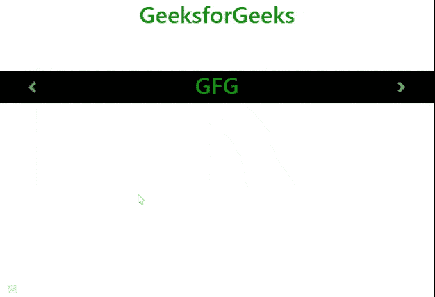

# 如何用 bootstrap 文本轮播淡入淡出背景？

> 原文:[https://www . geeksforgeeks . org/如何使用引导文本转盘淡入淡出背景/](https://www.geeksforgeeks.org/how-to-fade-in-and-fade-out-background-with-bootstrap-text-carousel/)

在本文中，我们将向您展示如何使用引导文本转盘淡入淡出背景。旋转木马是一个幻灯片，它用于循环组件，如图像或文本。

**方法:**为了用引导文本转盘创建淡入淡出背景，我们遵循了一些基本步骤。

*   **第一步**:将引导 CDN 添加到你的 HTML 代码中。

*   **步骤 2:** 要制作引导程序转盘，您必须在 HTML *div* 框中添加 *class = "carousel"* 。

*   **第三步:**要创建轮播淡入淡出过渡而不是滑块，你必须添加一个*类。*

*   **第 4 步:**最后在你的*分区*框中添加你想要在转盘中使用*类=“转盘-项目”*玩的文本。

**示例:**

## 超文本标记语言

```html
<!DOCTYPE html>
<html>
    <head>
        <link href=
"https://stackpath.bootstrapcdn.com/bootstrap/4.3.1/css/bootstrap.min.css" 
              rel="stylesheet" />
        <script src=
"https://cdnjs.cloudflare.com/ajax/libs/jquery/3.3.1/jquery.min.js">
        </script>
        <script src=
"https://cdnjs.cloudflare.com/ajax/libs/popper.js/1.14.7/umd/popper.min.js">
        </script>
        <script src=
"https://stackpath.bootstrapcdn.com/bootstrap/4.3.1/js/bootstrap.min.js">
        </script>

        <style>
            h1 {
                color: green;
            }
            *,
            *::before,
            *::after {
                margin: 0;
                padding: 0;
            }

            html {
                box-sizing: border-box;
            }
            body {
                box-sizing: inherit;
                color: #fff !important;
            }

            h1 {
                margin-top: 0;
                text-align: center;
                font-weight: 600;
            }
            .carousel {
                margin-top: 10%;
                width: 100%;
                background-color: black;
            }
        </style>
    </head>
    <body>
        <h1>GeeksforGeeks</h1>

        <div id="carouselExampleFade" 
             class="carousel slide carousel-fade" 
             data-ride="carousel">
            <div class="carousel-inner">
                <div class="carousel-item active">
                    <h1>Hii GeeksforGeeks</h1>
                </div>
                <div class="carousel-item">
                    <h1>Hello there</h1>
                </div>
                <div class="carousel-item">
                    <h1>GFG</h1>
                </div>
            </div>
            <a class="carousel-control-prev" 
               href="#carouselExampleFade" 
               role="button" data-slide="prev">
                <span class="carousel-control-prev-icon" 
                      aria-hidden="true">
                </span>
                <span class="sr-only">Previous</span>
            </a>
            <a class="carousel-control-next" 
               href="#carouselExampleFade" 
               role="button" data-slide="next">
                <span class="carousel-control-next-icon" 
                      aria-hidden="true"> 
                </span>
                <span class="sr-only">Next</span>
            </a>
        </div>
    </body>
</html>
```

**输出:**



旋转木马