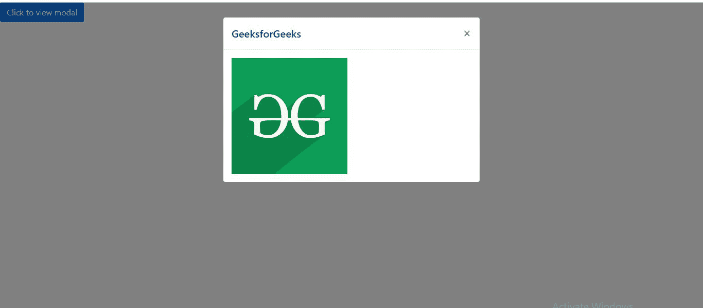
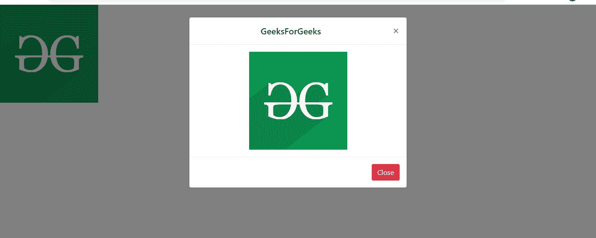

# 如何使用 Bootstrap 将图像拟合到模态弹出窗口中？

> 原文:[https://www . geeksforgeeks . org/如何使用引导程序将图像调整到模式弹出菜单/](https://www.geeksforgeeks.org/how-to-fit-the-image-into-modal-popup-using-bootstrap/)

模态插件允许我们添加一个显示在当前页面顶部的对话框弹出窗口。Bootstrap 提供了一种简单而有效的方法来将模式整合到我们的网页中。Modal 可以由任何内容以及页眉和页脚组成。

通过在*“模态体”* div 中包含 [< img >](https://www.geeksforgeeks.org/html-images/) 标签，可以使用 Bootstrap 在模态弹出窗口中拟合图像。*“模态体”* div 决定模态弹出的主要内容。通过使用 *< img >* 标签，可以将图像插入其中。

下面的示例说明了这一点:

**例 1:**

```
<!DOCTYPE html>
<html>
    <head>
        <link rel="stylesheet" 
              href=
"https://stackpath.bootstrapcdn.com/bootstrap/4.1.3/css/bootstrap.min.css" 
              integrity=
"sha384-MCw98/SFnGE8fJT3GXwEOngsV7Zt27NXFoaoApmYm81iuXoPkFOJwJ8ERdknLPMO" 
              crossorigin="anonymous" />
    </head>

    <body>
        <button type="button" 
                class="btn btn-primary" 
                data-toggle="modal" 
                data-target="#exampleModal">
            Click to view modal
        </button>

        <!--Bootstrap modal -->
        <div class="modal fade" 
             id="exampleModal"
             tabindex="-1" 
             role="dialog"
             aria-labelledby="exampleModalLabel" 
             aria-hidden="true">
            <div class="modal-dialog" 
                 role="document">
                <div class="modal-content">
                    <!-- Modal heading -->
                    <div class="modal-header">
                        <h5 class="modal-title" 
                            id="exampleModalLabel">
                          GeeksforGeeks
                      </h5>
                        <button type="button" 
                                class="close"
                                data-dismiss="modal" 
                                aria-label="Close">
                            <span aria-hidden="true">
                              ×
                          </span>
                        </button>
                    </div>

                    <!-- Modal body with image -->
                    <div class="modal-body">
                        
                    </div>
                </div>
            </div>
        </div>

        <script src=
"https://code.jquery.com/jquery-3.3.1.slim.min.js" 
                integrity=
"sha384-q8i/X+965DzO0rT7abK41JStQIAqVgRVzpbzo5smXKp4YfRvH+8abtTE1Pi6jizo" 
                crossorigin="anonymous"></script>
        <script src=
"https://cdnjs.cloudflare.com/ajax/libs/popper.js/1.14.3/umd/popper.min.js"
                integrity=
"sha384-ZMP7rVo3mIykV+2+9J3UJ46jBk0WLaUAdn689aCwoqbBJiSnjAK/l8WvCWPIPm49" 
                crossorigin="anonymous"></script>
        <script src=
"https://stackpath.bootstrapcdn.com/bootstrap/4.1.3/js/bootstrap.min.js" 
                integrity=
"sha384-ChfqqxuZUCnJSK3+MXmPNIyE6ZbWh2IMqE241rYiqJxyMiZ6OW/JmZQ5stwEULTy" 
                crossorigin="anonymous"></script>
    </body>
</html>
```

#### 输出:



**示例 2:** 这里使用了一个图像来代替按钮，它会在点击时触发模态弹出。模态的内容已经使用“文本对齐:居中”进行了居中对齐。类“w-100”已被添加到模式标题中，这样它就占据了父 div 的 100%宽度，并由于“文本对齐:居中”而变为居中对齐。

```
<!DOCTYPE html>
<html>
    <head>
        <link rel="stylesheet" 
              href=
"https://stackpath.bootstrapcdn.com/bootstrap/4.1.3/css/bootstrap.min.css" 
              integrity=
"sha384-MCw98/SFnGE8fJT3GXwEOngsV7Zt27NXFoaoApmYm81iuXoPkFOJwJ8ERdknLPMO" 
              crossorigin="anonymous" />

        <style>
            /* Content of modal div is center aligned */
            .modal {
                text-align: center;
            }
        </style>
    </head>

    <body>
        

        <div class="modal fade" 
             id="exampleModal"
             tabindex="-1" 
             role="dialog"
             aria-labelledby="exampleModalLabel" 
             aria-hidden="true">
            <div class="modal-dialog" 
                 role="document">
                <div class="modal-content">
                    <div class="modal-header">
                        <!-- w-100 class so that header
                div covers 100% width of parent div -->
                        <h5 class="modal-title w-100" 
                            id="exampleModalLabel">
                          GeeksForGeeks
                      </h5>
                        <button type="button"
                                class="close"
                                data-dismiss="modal" 
                                aria-label="Close">
                            <span aria-hidden="true">
                              ×
                          </span>
                        </button>
                    </div>

                    <!--Modal body with image-->
                    <div class="modal-body">
                        
                    </div>

                    <div class="modal-footer">
                        <button type="button"
                                class="btn btn-danger" 
                                data-dismiss="modal">
                          Close
                      </button>
                    </div>
                </div>
            </div>
        </div>

        <script src=
"https://code.jquery.com/jquery-3.3.1.slim.min.js" i
                ntegrity=
"sha384-q8i/X+965DzO0rT7abK41JStQIAqVgRVzpbzo5smXKp4YfRvH+8abtTE1Pi6jizo"
                crossorigin="anonymous"></script>
        <script src=
"https://cdnjs.cloudflare.com/ajax/libs/popper.js/1.14.3/umd/popper.min.js" 
                integrity=
"sha384-ZMP7rVo3mIykV+2+9J3UJ46jBk0WLaUAdn689aCwoqbBJiSnjAK/l8WvCWPIPm49" 
                crossorigin="anonymous"></script>
        <script src=
"https://stackpath.bootstrapcdn.com/bootstrap/4.1.3/js/bootstrap.min.js"
                integrity=
"sha384-ChfqqxuZUCnJSK3+MXmPNIyE6ZbWh2IMqE241rYiqJxyMiZ6OW/JmZQ5stwEULTy"
                crossorigin="anonymous"></script>
    </body>
</html>
```

**输出:**

