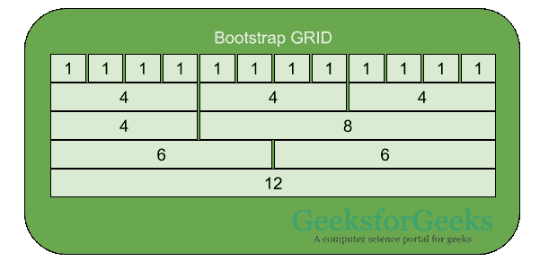
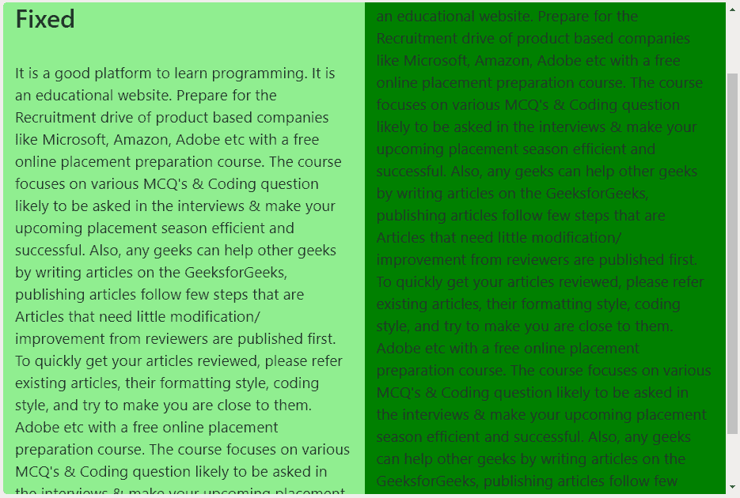

# 如何在 Bootstrap 中固定一列并可滚动其他一列或多列？

> 原文:[https://www . geeksforgeeks . org/如何在引导中固定一列和可滚动的其他列/](https://www.geeksforgeeks.org/how-to-fixed-one-column-and-scrollable-other-column-or-columns-in-bootstrap/)

Bootstrap 为用户提供了几个内置功能。这使得开发更快更流畅。但是，在某些情况下，必须对网页的编码实现外部 **CSS** 和 **jQuery** ，以赋予其个性化的触感。通常，引导网格用于将网页分成 12 个相等的栏。这些列可以组合在一起以创建更宽的列。这些柱子本质上是有反应的。这意味着这些列将覆盖大屏幕上的整个屏幕，但将在小屏幕设备上相互堆叠。
当网页被分成两个相等的栏目，栏目内的内容开始溢出时，栏目变得可滚动。但是，通过做一些小的修改，可以修复这些列。本文将演示如何保持一列固定，另一列可滚动。

**语法:**

*   修正了列不可滚动的问题。

    ```
    <div class="col-sm-6 col-2 fixed-top one">
    ```

*   使列可滚动。

    ```
    <div class="col-sm-6 offset-sm-6 two">
    ```

以下示例说明了上述方法:

**示例:**您可以通过点击运行按钮来运行代码，这样您就可以看到右边的列是可滚动的，但是左边是不可滚动的。

```
<!DOCTYPE html>
<html>
    <head>
        <meta name="viewport"
              content="width=device-width, initial-scale=1">
        <link rel="stylesheet" href=
"https://maxcdn.bootstrapcdn.com/bootstrap/4.3.1/css/bootstrap.min.css">
        <script src=
"https://ajax.googleapis.com/ajax/libs/jquery/3.4.1/jquery.min.js">
        </script>
        <script src=
"https://cdnjs.cloudflare.com/ajax/libs/popper.js/1.14.7/umd/popper.min.js">
        </script>
        <script src=
"https://maxcdn.bootstrapcdn.com/bootstrap/4.3.1/js/bootstrap.min.js">
        </script>

        <style>
            .one{
                background-color:lightgreen;
            }
            .two{
                background-color:green;
            }
            .container-fluid{
                font-size:120%;
            }
        </style>
    </head>
    <body>
        <div class="container-fluid">
            <div class="row">
                <div class="col-sm-6 col-2 fixed-top one">
                    <h2>Fixed</h2><br>
                    It is a good platform to learn programming. It is an 
                    educational website. Prepare for the Recruitment drive 
                    of product based companies like Microsoft, Amazon, 
                    Adobe etc with a free online placement preparation 
                    course. The course focuses on various MCQ's & Coding 
                    question likely to be asked in the interviews & make 
                    your upcoming placement season efficient and successful.
                    Also, any geeks can help other geeks by writing articles 
                    on the GeeksforGeeks, publishing articles follow few 
                    steps that are Articles that need little modification/ 
                    improvement from reviewers are published first. To 
                    quickly get your articles reviewed, please refer 
                    existing articles, their formatting style, coding 
                    style, and try to make you are close to them.
                    Adobe etc with a free online placement preparation 
                    course. The course focuses on various MCQ's & Coding 
                    question likely to be asked in the interviews & make 
                    your upcoming placement season efficient and successful.
                    Also, any geeks can help other geeks by writing articles 
                    on the GeeksforGeeks, publishing articles follow few 
                    steps that are Articles that need little modification/ 
                    improvement from reviewers are published first. To 
              </div>
              <div class="col-sm-6 offset-sm-6 two">
                    <h2>Scrollable</h2><br>
                    It is a good platform to learn programming. It is an 
                    educational website. Prepare for the Recruitment drive 
                    of product based companies like Microsoft, Amazon, 
                    Adobe etc with a free online placement preparation 
                    course. The course focuses on various MCQ's & Coding 
                    question likely to be asked in the interviews & make 
                    your upcoming placement season efficient and successful.
                    Also, any geeks can help other geeks by writing articles 
                    on the GeeksforGeeks, publishing articles follow few 
                    steps that are Articles that need little modification/ 
                    improvement from reviewers are published first. To 
                    quickly get your articles reviewed, please refer 
                    existing articles, their formatting style, coding 
                    style, and try to make you are close to them.
                    Adobe etc with a free online placement preparation 
                    course. The course focuses on various MCQ's & Coding 
                    question likely to be asked in the interviews & make 
                    your upcoming placement season efficient and successful.
                    Also, any geeks can help other geeks by writing articles 
                    on the GeeksforGeeks, publishing articles follow few 
                    steps that are Articles that need little modification/ 
                    improvement from reviewers are published first. To 
            </div>
        </div>
    </body>
</html>                    
```

**输出:**
