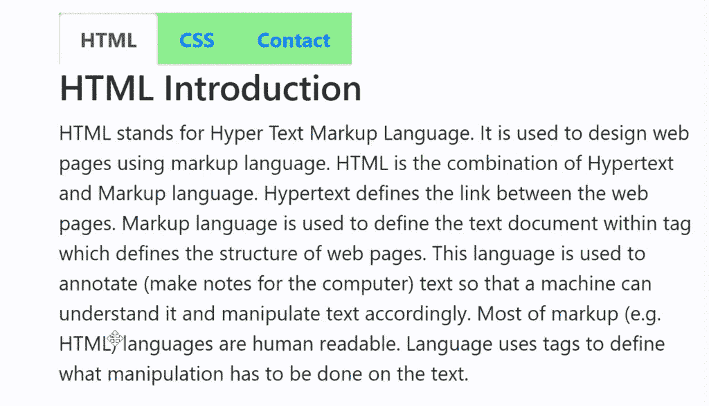

# 如何使用 Bootstrap 强制选项卡导航保持不变？

> 原文:[https://www . geeksforgeeks . org/如何强制-tab-导航-原地停留-使用-bootstrap/](https://www.geeksforgeeks.org/how-to-force-tab-navigation-to-stay-in-place-using-bootstrap/)

**标签页导航:**标签页由**<ul class = " nav-Tab ">**组成，我们使用**<Li class = " active ">**元素来标记当前页面。要固定导航标签样式的位置，**位置:固定；**属性被使用。

**语法:**

```html
<ul class="nav nav-tabs" id="myTab" role="tablist">
    <li class="nav-item">
        <a class="nav-link active" href="#home" data-toggle="tab">Home</a>
    </li>
    . . .
</ul>
<div class="tab-content">
    <div class="tab-pane fade show active" id="home">content....</div>
    . . .
</div>

```

**示例:**

```html
<!DOCTYPE html>
<html lang="en">

<head>
    <!-- Required meta tags -->
    <meta charset="utf-8">
    <meta name="viewport" content="width=device-width, 
            initial-scale=1, shrink-to-fit=no">

    <!-- Bootstrap CSS -->
    <link rel="stylesheet" href=
"https://stackpath.bootstrapcdn.com/bootstrap/4.5.0/css/bootstrap.min.css"
        integrity=
"sha384-9aIt2nRpC12Uk9gS9baDl411NQApFmC26EwAOH8WgZl5MYYxFfc+NcPb1dKGj7Sk"
        crossorigin="anonymous">

    <script src="https://kit.fontawesome.com/577845f6a5.js" 
        crossorigin="anonymous">
    </script>

    <!-- Optional JavaScript -->
    <!-- jQuery first, then Popper.js, then Bootstrap JS -->
    <script src="https://code.jquery.com/jquery-3.5.1.slim.min.js"
        integrity=
"sha384-DfXdz2htPH0lsSSs5nCTpuj/zy4C+OGpamoFVy38MVBnE+IbbVYUew+OrCXaRkfj"
        crossorigin="anonymous">
    </script>

    <script src=
"https://cdn.jsdelivr.net/npm/popper.js@1.16.0/dist/umd/popper.min.js"
        integrity=
"sha384-Q6E9RHvbIyZFJoft+2mJbHaEWldlvI9IOYy5n3zV9zzTtmI3UksdQRVvoxMfooAo"
        crossorigin="anonymous">
    </script>

    <script src=
"https://stackpath.bootstrapcdn.com/bootstrap/4.5.0/js/bootstrap.min.js"
        integrity=
"sha384-OgVRvuATP1z7JjHLkuOU7Xw704+h835Lr+6QL9UvYjZE3Ipu6Tp75j7Bh/kR0JKI"
        crossorigin="anonymous">
    </script>

    <style type="text/css">

        /* To stay in place use position property */
        .nav {
            position: fixed;
            background-color: lightgreen;
        }
    </style>
</head>

<body>
    <br>
    <nav class="container">
        <ul class="nav nav-tabs">
            <li class="nav-item">
                <a class="nav-link active" 
                    href="#html" data-toggle="tab">
                    <b>HTML</b>
                </a>
            </li>
            <li class="nav-item">
                <a class="nav-link" href="#css" 
                    data-toggle="tab">
                    <b>CSS</b>
                </a>
            </li>
            <li class="nav-item">
                <a class="nav-link" href="#contactus" 
                    data-toggle="tab">
                    <b>Contact</b>
                </a>
            </li>
        </ul>
    </nav>

    <!-- Tab content -->
    <div class="tab-content">
        <div class="container tab-pane active" id="html">
            <h3 style="color: green">GeeksforGeeks</h3>
            <h3>HTML Introduction</h3>
            <p>
                HTML stands for Hyper Text Markup Language.
                It is used to design web pages using markup
                language. HTML is the combination of Hypertext
                and Markup language. Hypertext defines the link
                between the web pages. Markup language is used
                to define the text document within tag which
                defines the structure of web pages. This language
                is used to annotate (make notes for the computer)
                text so that a machine can understand it and
                manipulate text accordingly. Most of markup
                (e.g. HTML) languages are human readable.
                Language uses tags to define what manipulation
                has to be done on the text.
            </p>
        </div>
        <div class="container tab-pane" id="css">
            <h3 style="color: green">GeeksforGeeks</h3>
            <h3>CSS Introduction</h3>
            <p>
                Cascading Style Sheets, fondly referred to as CSS,
                is a simply designed language intended to simplify
                the process of making web pages presentable. CSS
                allows you to apply styles to web pages. More
                importantly, CSS enables you to do this independent
                of the HTML that makes up each web page. CSS is easy
                to learn and understood but it provides powerful
                control over the presentation of an HTML document.
            </p>
        </div>
        <div class="container tab-pane" id="contactus">
            <h3 style="color: green">GeeksforGeeks</h3>
            <h3>Contact Form</h3>
            <form>
                <div class="form-group row">
                    <label for="em" class="col-12 col-md-2 
                        col-form-label">Email ID:</label>
                    <div class="col-4">
                        <input type="text" class="form-control" 
                            id="em" name="em" placeholder="Email">
                    </div>
                </div>
                <div class="form-group row">
                    <label for="ym" class="col-12 col-md-2 
                        col-form-label">Your Message:</label>
                    <div class="col-4">
                        <input type="text" class="form-control" 
                            id="ym" name="ym" 
                            placeholder="Your message..">
                    </div>
                </div>
                <div class="form-group row">
                    <div class="offset-md-2 col-md-10">
                        <button type="submit" 
                            class="btn btn-primary">
                            Submit
                        </button>
                    </div>
                </div>
            </form>
        </div>
    </div>
</body>

</html>
```

**输出:**
