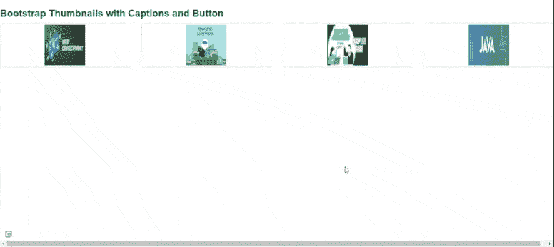
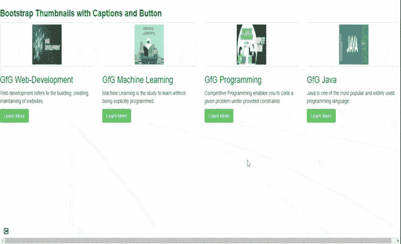

# 如何使用 bootstrap 生成缩略图并自定义？

> 原文:[https://www . geesforgeks . org/如何使用引导程序生成缩略图并进行自定义/](https://www.geeksforgeeks.org/how-to-generate-thumbnails-and-customize-using-bootstrap/)

[Bootstrap](https://www.geeksforgeeks.org/bootstrap-tutorials/) 帮助网络开发人员创建缩略图，用于在网格中显示链接的图像，这些网格具有预定义的类，有助于减少代码长度。创建缩略图是为了快速预览带有小图像的图像。

**缩略图:**缩略图是代表较大图像的小图像。Bootstrap 有一个简单的方法来处理缩略图。自举*。缩略图*类用于在网格中显示链接的图像( [<u>网格系统</u>](https://www.geeksforgeeks.org/bootstrap-4-grid-system/) )，使用类*创建缩略图。缩略图*内的元素 [<u><一></u>](https://www.geeksforgeeks.org/html-a-tag/#:~:text=HTML%20Tag,-Difficulty%20Level%20%3A%20Basic&text=The%20tag%20(anchor,as%20its%20%E2%80%9Chref%E2%80%9D%20value.) 。班级*。col-sm-** 和*。col-md-** (其中*代表数字)，用于创建图像的网格。

**分步实施指南:**

**步骤 1:** 将 Bootstrap 和 jQuery CDN 包含到所有其他样式表之前的<头>标签中，以加载我们的 CSS。

> <src = " https://Ajax . Google APIs . com/Ajax/libs/jquery/1 . 12 . 0/jquery . min . js "></script><src = " http://maxcdn . bootstracdn . com/bootstrap/3 . 3 . 6/脚本

**第二步:**在 HTML 正文中添加 [<u>< div ></u>](https://www.geeksforgeeks.org/div-tag-html/#:~:text=The%20div%20tag%20is%20used,%2C%20navigation%20bar%2C%20etc).&text=It%20is%20used%20to%20the,can%20be%20applied%20to%20them.) 标签，并带有类行。其中<分区>创建四个*分区*分区来创建四个图像。

**步骤 3:** 在创建网页响应的四个*分区*中添加“col-sm-6”和“col-md-3”。

**第四步:**添加 [<u><一个></u>](https://www.geeksforgeeks.org/html-a-tag/) 标签加上类值 *<u>缩略图</u>* 来定义下一行图像的链接。

```html
 <a href="#" class="thumbnail">
```

**示例 1:** 以下示例显示了缩略图图像的创建。

## 超文本标记语言

```html
<!DOCTYPE html>
<html lang="en">
  <head>
    <title>Thumbnail images</title>
    <link
      rel="stylesheet"
      href=
"http://maxcdn.bootstrapcdn.com/bootstrap/3.3.6/css/bootstrap.min.css"/>
    <script src=
"https://ajax.googleapis.com/ajax/libs/jquery/1.12.0/jquery.min.js">
    </script>
    <script src=
"http://maxcdn.bootstrapcdn.com/bootstrap/3.3.6/js/bootstrap.min.js">
    </script>
  </head>
  <body>
    <h3 style="color: green">Bootstrap thumbnails</h3>
    <div class="row">
      <div class="col-sm-6 col-md-3">
        <a href="#" class="thumbnail">
          
        </a>
      </div>
      <div class="col-sm-6 col-md-3">
        <a href="#" class="thumbnail">
          
        </a>
      </div>
      <div class="col-sm-6 col-md-3">
        <a href="#" class="thumbnail">
          
        </a>
      </div>
      <div class="col-sm-6 col-md-3">
        <a href="#" class="thumbnail">
          
        </a>
      </div>
    </div>
  </body>
</html>
```

**输出:**如下图所示，我们可以看到缩略图。这些也响应不同的屏幕尺寸。



响应式缩略图

**给缩略图添加标题和按钮:**

**第一步:**我们创建了 *div* ，类值为 *<u>缩略图</u>* 并插入图像，之后添加 *div* 类*。标题*定义图像的描述< p >。

**步骤 2:** 使用带有类*的<标签创建按钮。btn。BTN-成功*。

**示例:**以下示例演示了向缩略图添加标题和按钮。

## 超文本标记语言

```html
<!DOCTYPE html>
<html lang="en">
  <head>
    <link
      rel="stylesheet"
      href=
"http://maxcdn.bootstrapcdn.com/bootstrap/3.3.6/css/bootstrap.min.css"/>
    <script src=
"https://ajax.googleapis.com/ajax/libs/jquery/1.12.0/jquery.min.js">
    </script>
    <script src=
"http://maxcdn.bootstrapcdn.com/bootstrap/3.3.6/js/bootstrap.min.js">
    </script>
  </head>
  <body>
    <h3 style="color: green">
      <b>Bootstrap Thumbnails with Captions and Button</b>
    </h3>
    <div class="row">
      <div class="col-sm-6 col-md-3">
        <a href="#" class="thumbnail">
          
        </a>
        <div class="caption">
          <h3 style="color: green">GfG Web-Development</h3>

<p>
            Web development refers to the building,
            creating, maintaining of
            websites.
          </p>

<p>
            <a href="#" class="btn btn-success">
             Learn More
            </a>
          </p>

        </div>
      </div>
      <div class="col-sm-6 col-md-3">
        <a href="#" class="thumbnail">
          
        </a>
        <div class="caption">
          <h3 style="color: green">GfG Machine Learning</h3>

<p>
            Machine Learning is the study to
            learn without being explicitly
            programmed.
          </p>

<p>
            <a href="#" class="btn btn-success">
             Learn More
            </a>
          </p>

        </div>
      </div>
      <div class="col-sm-6 col-md-3">
        <a href="#" class="thumbnail">
          
        </a>
        <div class="caption">
          <h3 style="color: green">GfG Programming</h3>

<p>
            Competitive Programming enables you
            to code a given problem under
            provided constraints.
          </p>

<p>
            <a href="#" class="btn btn-success">
             Learn More
            </a>
            </p>

        </div>
      </div>
      <div class="col-sm-6 col-md-3">
        <a href="#" class="thumbnail">
          
        </a>
        <div class="caption">
          <h3 style="color: green">GfG Java</h3>

<p>
            Java is one of the most popular
            and widely used programming
            language.
          </p>

<p>
            <a href="#" class="btn btn-success">
             Learn More
            </a>
          </p>

        </div>
      </div>
    </div>
  </body>
</html>
```

**输出:**如下图输出图像，我们可以看到带有字幕和按钮的图像。这些也响应不同的屏幕尺寸。



#### 支持的浏览器:

*   谷歌 Chrome
*   火狐浏览器
*   微软公司出品的 web 浏览器
*   旅行队
*   歌剧