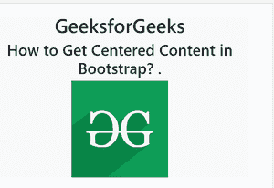

# 如何在 Bootstrap 中获取居中内容？

> 原文:[https://www . geeksforgeeks . org/如何获取以内容为中心的引导/](https://www.geeksforgeeks.org/how-to-get-centered-content-in-bootstrap/)

任务是使用引导程序集中内容。本文的方法是通过使用一个简单的内置类在 Bootstrap 中获得一个中心内容。**文本居中**居中对齐所有内联元素，如文本、图像、链接等。下一个区块元素即**[<>div](https://www.geeksforgeeks.org/div-tag-html/)或 [< p >](https://www.geeksforgeeks.org/html-paragraph/) 元素。**

**注意:**此解决方案仅适用于 Bootstrap 3 或 4 版本。

**示例:**

## 超文本标记语言

```html
<!DOCTYPE html>
<html lang="en">

<head>
    <meta charset="utf-8">
    <meta name="viewport" 
          content="width=device-width, 
                   initial-scale=1, 
                   shrink-to-fit=no">
    <title>Text Centering in Bootstrap</title>
    <link rel="stylesheet" 
          href=
"https://stackpath.bootstrapcdn.com/bootstrap/4.5.0/css/bootstrap.min.css">
    <script src=
"https://code.jquery.com/jquery-3.5.1.min.js">
 </script>
    <script src=
"https://stackpath.bootstrapcdn.com/bootstrap/4.5.0/js/bootstrap.min.js">
</script>
    <style>
        .bs-example {
            margin: 20px;
        }
    </style>
</head>

<body>
    <div class="bs-example">
        <div class="container">
            <div class="row">
                <div class="col-lg-12 bg-light text-center">
                    <h1>GeeksforGeeks</h1>
                    <h2>How to Get Centered Content in Bootstrap? .
                    </h2>
                    
                </div>
            </div>
        </div>
    </div>
</body>

</html>
```

**输出:**

