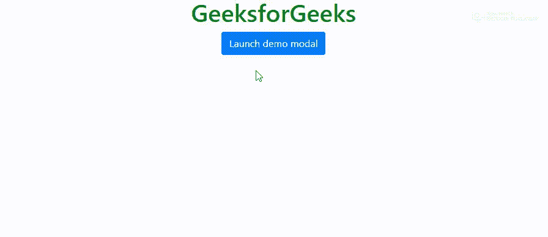

# 如何用 confirm 和 bootstrap 模态得到相同的行为？

> 原文:[https://www . geeksforgeeks . org/如何通过确认和引导模式获得相同的行为/](https://www.geeksforgeeks.org/how-to-get-the-same-behavior-with-confirm-and-bootstrap-modal/)

**[Bootstrap modal:](https://www.geeksforgeeks.org/bootstrap-4-modal/)**
简单来说，Modal 组件就是一个对话框/弹窗，一旦点击触发按钮，就会显示在当前页面的顶部。然而，点击模态的背景会自动关闭模态。此外，必须记住，Bootstrap 不支持嵌套模式，因为它们会给用户带来糟糕的用户界面体验。因此，一次只支持一个模态窗口。

**示例:**

```
<html>
<script src=
"https://cdnjs.cloudflare.com/ajax/libs/jquery/3.3.1/jquery.min.js">
  </script>
<script src=
"https://cdn.jsdelivr.net/npm/smartwizard@4.3.1/dist/js/jquery.smartWizard.min.js">
  </script>
<script src=
"https://cdnjs.cloudflare.com/ajax/libs/1000hz-bootstrap-validator/0.11.5/validator.min.js">
  </script>
<link rel="stylesheet"
      href=
"https://maxcdn.bootstrapcdn.com/bootstrap/4.0.0/css/bootstrap.min.css">
<link rel="stylesheet" 
      href=
"https://cdn.jsdelivr.net/npm/smartwizard@4.3.1/dist/css/smart_wizard.min.css">
<script src=
"https://cdnjs.cloudflare.com/ajax/libs/popper.js/1.12.9/umd/popper.min.js" 
        integrity=
"sha384-ApNbgh9B+Y1QKtv3Rn7W3mgPxhU9K/ScQsAP7hUibX39j7fakFPskvXusvfa0b4Q" 
        crossorigin="anonymous">
  </script>
<script src=
"https://maxcdn.bootstrapcdn.com/bootstrap/4.0.0/js/bootstrap.min.js" 
        integrity=
"sha384-JZR6Spejh4U02d8jOt6vLEHfe/JQGiRRSQQxSfFWpi1MquVdAyjUar5+76PVCmYl" 
        crossorigin="anonymous">
  </script>

<body>
    <center>
        <h1 style="color:green">GeeksforGeeks</h1>

        <!-- Button trigger modal -->
        <button type="button" 
                id="launchid" 
                class="btn btn-primary" 
                data-toggle="modal" 
                data-target="#exampleModal">
            Launch demo modal
        </button>

        <!-- Modal -->
        <div class="modal fade" 
             id="exampleModal"
             tabindex="-1"
             role="dialog" 
             aria-labelledby="exampleModalLabel" 
             aria-hidden="true">

            <div class="modal-dialog" 
                 role="document">
                <div class="modal-content">
                    <div class="modal-header">

                        <h5 class="modal-title" 
                            id="exampleModalLabel">
                          Modal title
                       </h5>
                        <button type="button" 
                                class="close"
                                data-dismiss="modal"
                                aria-label="Close">

                            <span aria-hidden="true">
                              ×
                          </span>
                        </button>
                    </div>
                    <div class="modal-body">
                        Woohoo, you're reading this text in a modal!
                    </div>
                    <div class="modal-footer">
                        <button type="button" 
                                id="closeid"
                                class="btn btn-secondary" 
                                data-dismiss="modal">
                          Close
                      </button>
                        <button type="button" 
                                id="saveid" 
                                class="btn btn-primary">
                          Save changes
                      </button>
                    </div>
                </div>
            </div>
        </div>

        <div class="alert" role="alert" id="result"></div>
    </center>
    <script>
        var modalConfirm = function(callback) {

            $("#launchid").on("click", function() {
                $("exampleModal").modal('show');
            });

            $("#saveid").on("click", function() {
                callback(true);
                $("#exampleModal").modal('hide');
            });

            $("#closeid").on("click", function() {
                callback(false);
                $("#exampleModal").modal('hide');
            });
        };

        modalConfirm(function(confirm) {
            if (confirm) {
                $("#result").html("Changes Saved");
            } else {

                $("#result").html("Not Saved");
            }
        });
    </script>
</body>

</html>
```

**输出:**
