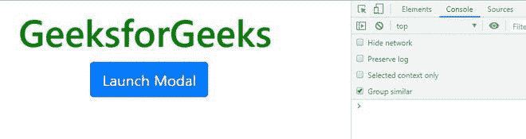
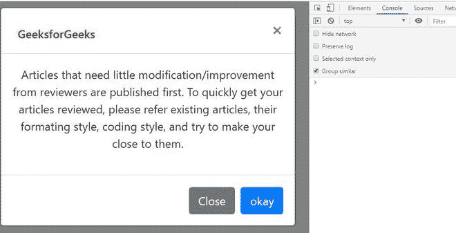
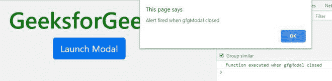

# 如何处理 Twitter Bootstrap 中的模态关闭事件？

> 原文:[https://www . geeksforgeeks . org/如何在 twitter-bootstrap/](https://www.geeksforgeeks.org/how-to-handle-the-modal-closing-event-in-twitter-bootstrap/) 中处理模式关闭事件

[推特引导中的模态关闭事件|第 1 集](https://www.geeksforgeeks.org/how-to-use-modal-closing-event-in-twitter-bootstrap/)

**先决知识:** [自举 4 |模态](https://www.geeksforgeeks.org/bootstrap-4-modal/)

Twitter Bootstrap 的模态类提供了一些在标准 Bootstrap **模态类中触发的事件。** Bootstrap Modals 提供了一个轻量级、多用途的 JavaScript 弹出窗口，可定制且响应迅速。它们可用于在网站中显示提醒弹出窗口、视频和图像。引导模式分为三个主要部分:页眉、正文和页脚。

引导事件有: **show.bs.modal** 、**show . bs . modal**、 **hide.bs.modal** 、 **hidden.bs.modal** 等。在所有这些事件中，我们对 **hide.bs.modal** 和**hide . bs . modal**事件感兴趣。

*   **hide.bs.modal** :调用 hide 实例方法后，立即触发此事件。
*   **hidden.bs.modal** :当 modal 完成对用户的隐藏后，该事件被触发，然后等待 CSS 转换完成。

**示例:**

## 超文本标记语言

```html
<!DOCTYPE html>
<html lang="en">

<head>
    <!-- Required meta tags -->
    <meta charset="utf-8">
    <meta name="viewport" content="width=device-width,
            initial-scale=1, shrink-to-fit=no">

    <!-- link to Bootstrap CSS CDN -->
    <link rel="stylesheet" href=
"https://maxcdn.bootstrapcdn.com/bootstrap/4.0.0/css/bootstrap.min.css"
        integrity=
"sha384-Gn5384xqQ1aoWXA+058RXPxPg6fy4IWvTNh0E263XmFcJlSAwiGgFAW/dAiS6JXm"
        crossorigin="anonymous">

    <title>
        Modal closing event in Bootstrap
    </title>

    <style>
        h1,
        h6 {
            margin: 2%;
        }

        .btn {
            margin-left: 2%;
        }
    </style>
</head>

<body>
    <center>
        <h1 style="color:green;">
            GeeksforGeeks
        </h1>

        <!-- Button trigger modal -->
        <button type="button" class="btn btn-primary"
            data-toggle="modal" data-target="#gfgModal">
            Launch Modal
        </button>

        <!-- Modal -->
        <div class="modal fade" id="gfgModal" tabindex="-1"
            role="dialog" aria-labelledby="gfgModalLabel"
            aria-hidden="true">
            <div class="modal-dialog" role="document">
                <div class="modal-content">
                    <div class="modal-header">
                        <h6 class="modal-title" 
                                id="gfgModalLabel" 
                                style="color:green;">
                            GeeksforGeeks
                        </h6>

                        <!-- The title of the modal -->
                        <button type="button" class="close" 
                                data-dismiss="modal" 
                                aria-label="Close">
                            <span aria-hidden="true">×</span>
                        </button>
                    </div>

                    <div class="modal-body">

                        <!-- The content inside the modal box -->

<p>
                            Articles that need little modification/
                            improvement from reviewers are published 
                            first. To quickly get your articles 
                            reviewed, please refer existing articles, 
                            their formating style, coding style, and
                            try to make your close to them.
                        </p>

                    </div>
                    <div class="modal-footer">
                        <button type="button" class="btn btn-secondary"
                                data-dismiss="modal">Close</button>

                        <!-- The close button in the bottom
                             of the modal -->
                        <button type="button" class="btn btn-primary">
                            okay
                        </button>
                        <!-- The save changes button in 
                            the bottom of the modal -->
                    </div>
                </div>
            </div>
        </div>

        <!-- Optional JavaScript -->
        <!-- jQuery first, then Popper.js, then Bootstrap JS -->
        <script src="https://code.jquery.com/jquery-3.2.1.slim.min.js"
            integrity=
"sha384-KJ3o2DKtIkvYIK3UENzmM7KCkRr/rE9/Qpg6aAZGJwFDMVNA/GpGFF93hXpG5KkN"
            crossorigin="anonymous">
        </script>

        <script src=
"https://cdnjs.cloudflare.com/ajax/libs/popper.js/1.12.9/umd/popper.min.js"
            integrity=
"sha384-ApNbgh9B+Y1QKtv3Rn7W3mgPxhU9K/ScQsAP7hUibX39j7fakFPskvXusvfa0b4Q" 
            crossorigin="anonymous">
        </script>

        <script src=
"https://maxcdn.bootstrapcdn.com/bootstrap/4.0.0/js/bootstrap.min.js"
            integrity=
"sha384-JZR6Spejh4U02d8jOt6vLEHfe/JQGiRRSQQxSfFWpi1MquVdAyjUar5+76PVCmYl"
            crossorigin="anonymous">
        </script>
    </center>

    <!-- Modal JQUERY logic -->
    <script type="text/javascript">
        $('#gfgModal').on('hidden.bs.modal', function (e) {

            // Fire a function in the console
            console.log('Function executed when gfgModal closed');

            // Alert the user
            alert('Alert fired when gfgModal closed')
        })
    </script>
</body>

</html>
```

**输出:**

**点击按钮前:**



**点击按钮后:**



**在关闭模式下，观察控制台:**



**所以当 modal 关闭**时，我们使用成功处理

*   **在控制台中触发输出**
*   **提醒用户**