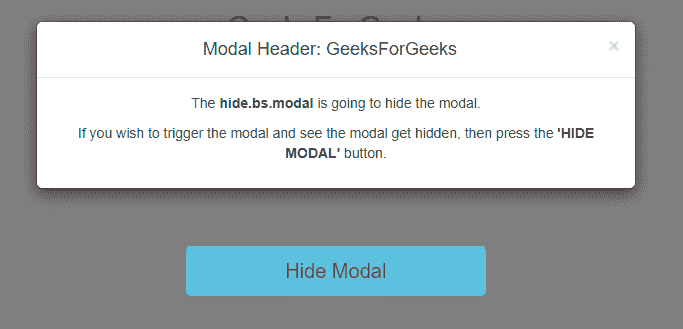
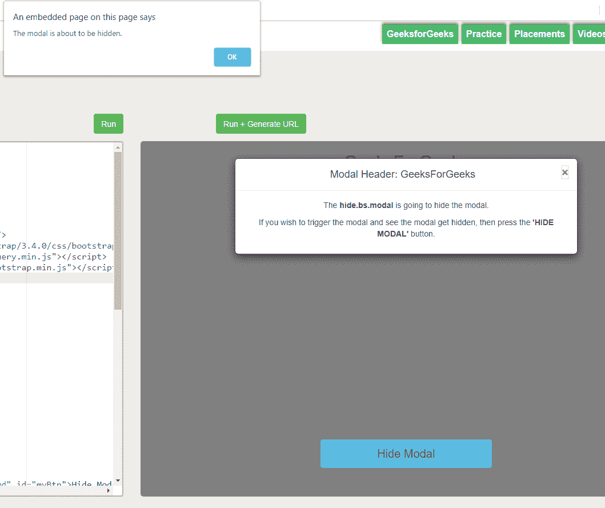
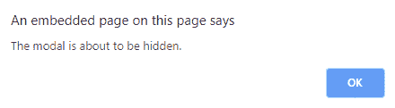
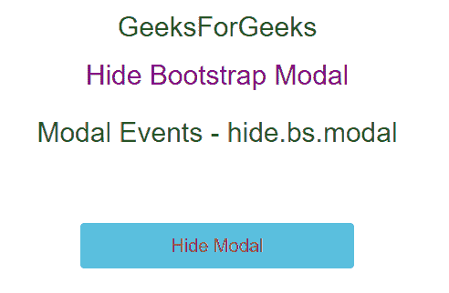
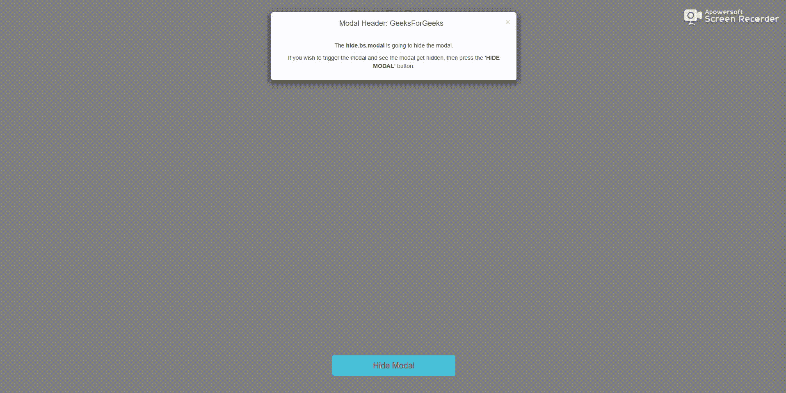

# 如何用 JavaScript 隐藏 Bootstrap 模态？

> 原文:[https://www . geesforgeks . org/how-hide-bootstrap-modal-with-JavaScript/](https://www.geeksforgeeks.org/how-to-hide-bootstrap-modal-with-javascript/)

本文将告诉我们当**时引导如何执行。模态**(模态窗口)关闭。在某个时间点，模态窗口——无论何时它被打开(和类模态一起)，它都会被关闭。
一旦模态完成，在对用户隐藏后，事件将被激发。只要模态窗口被隐藏，函数就会被执行，下面的语法也会被触发。顺便说一句，它会呼叫呼叫者/用户，然后立即消失。此外，这完全不由用户管理。引导库已经内置，它将为您完成最大的工作。

当引导模式即将被**隐藏**或**隐藏**引导模式时，将使用以下语法。
**语法:**

```html
hide.bs.modal
```

**例:**本例展示了 **hide.bs.modal** 的用法。

```html
<!DOCTYPE html>
<html>

<head>
    <h2 style="color:green">
      GeeksForGeeks
  </h2>
    <h2 style="color:purple">
      Hide Bootstrap Modal
  </h2>
    <meta name="viewport" 
          content="width=device-width, 
                   initial-scale=1">
    <link rel="stylesheet"
          href=
"https://maxcdn.bootstrapcdn.com/bootstrap/3.4.0/css/bootstrap.min.css">
    <script src=
"https://ajax.googleapis.com/ajax/libs/jquery/3.4.0/jquery.min.js">
  </script>
    <script src=
"https://maxcdn.bootstrapcdn.com/bootstrap/3.4.0/js/bootstrap.min.js">
  </script>
    <style>
        #myBtn {
            width: 300px;
            padding: 10px;
            font-size: 20px;
            position: absolute;
            margin: 0 auto;
            right: 0;
            left: 0;
            bottom: 50px;
            z-index: 9999;
        }
    </style>
</head>

<body style="text-align:center">
    <div class="container">
        <h2>Modal Events - hide.bs.modal</h2>
        <!-- Trigger the modal with a button -->
        <button type="button"
                style="color:brown"
                class="btn btn-info btn-md" 
                id="myBtn">
          Hide Modal
      </button>
        <!-- Modal -->
        <div class="modal fade"
             id="myModal" 
             role="dialog">
            <div class="modal-dialog">
                <!-- Modal content-->
                <div class="modal-content">
                    <div class="modal-header">
                        <button type="button" 
                                class="close" 
                                data-dismiss="modal">
                          ×
                        </button>
                        <h4 class="modal-title">
                          Modal Header: GeeksForGeeks
                        </h4>
                     </div>
                     <div class="modal-body">
                        <p>The <strong>hide.bs.modal</strong> 
                          is going to hide the modal.</p>
                        <p>If you wish to trigger the modal and 
                          see the modal get hidden, then press
                          the <strong>'HIDE MODAL'</strong> button.
                       </p>
                    </div>
                </div>
            </div>
        </div>
    </div>
    <script>
        $(document).ready(function() {
            $("#myModal").modal("show");

            $("#myBtn").click(function() {
                $("#myModal").modal("hide");
            });

            $("#myModal").on('hide.bs.modal', function() {
                alert('The modal is about to be hidden.');
            });
        });
    </script>
</body>

</html>
```

**输出:**
**当我们加载代码:**


**当我们点击‘X’按钮时:**


**弹出:**


**结果:**


**工作:**
