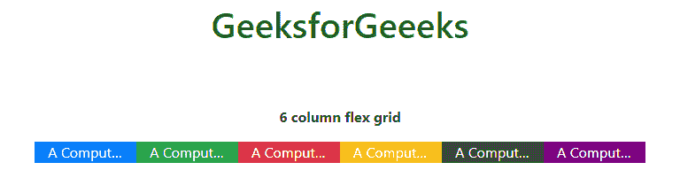
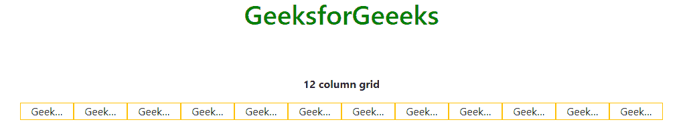

# 如何使用动态引导列将文本溢出隐藏为省略号？

> 原文:[https://www . geesforgeks . org/how-hide-text-overflow-as-省略号-use-dynamic-bootstrap-cols/](https://www.geeksforgeeks.org/how-to-hide-text-overflown-as-ellipsis-using-dynamic-bootstrap-cols/)

Bootstrap 4 中默认提供的各种实用程序和布局，使用动态 Bootstrap 列将溢出文本隐藏为省略号。这里，动态引导列意味着行或 flex 中的列即使在任何数字中都具有相同的属性。下面的方法会解释清楚。

**方法 1:** 使用 CSS 属性将溢出文本隐藏为省略号。

```html
<style>
selector {
    overflow: hidden;
    white-space: nowrap;
    text-overflow: ellipsis;
}
</style>
```

然后将其 select 添加到类 col 的元素中，并将其包装在 div 标签中。我们也可以用 d-flex 代替 row。

*   **示例 1:** 下面的程序演示了如何使用 CSS 属性和 Flex 使用动态引导列将溢出文本隐藏为省略号。

    ```html
    <!DOCTYPE html>
    <html lang="en">

    <head>
        <meta charset="utf-8">
        <meta name="viewport" content="width=device-width, initial-scale=1">
        <link rel="stylesheet" href=
    "https://maxcdn.bootstrapcdn.com/bootstrap/4.3.1/css/bootstrap.min.css">
        <script src=
    "https://ajax.googleapis.com/ajax/libs/jquery/3.4.1/jquery.min.js">
        </script>
        <script src=
    "https://cdnjs.cloudflare.com/ajax/libs/popper.js/1.14.7/umd/popper.min.js">
        </script>
        <script src=
    "https://maxcdn.bootstrapcdn.com/bootstrap/4.3.1/js/bootstrap.min.js">
        </script>
        <style>

            /* Use CSS properties for ellipsis */
            .ellipsis {
                overflow: hidden;
                white-space: nowrap;
                text-overflow: ellipsis;
            }

            .purple {
                background-color: purple;
            }
        </style>
    </head>

    <body>
        <div class="container">
            <center>
                <h1 style="color:green;padding:13px;">
                    GeeksforGeeeks
                </h1>
                <br><br>

                <p><strong>6 column flex grid</strong></p>
                <div class="d-flex bg-light mb-3">
                    <div class="col ellipsis bg-primary text-white">
                        A Computer Science Portal for Geeks
                    </div>
                    <div class="col ellipsis bg-success text-white">
                        A Computer Science Portal for Geeks
                    </div>
                    <div class="col ellipsis bg-danger text-white">
                        A Computer Science Portal for Geeks
                    </div>
                    <div class="col ellipsis bg-warning text-white">
                        A Computer Science Portal for Geeks
                    </div>
                    <div class="col ellipsis bg-dark text-white">
                        A Computer Science Portal for Geeks
                    </div>
                    <div class="col ellipsis purple text-white">
                        A Computer Science Portal for Geeks
                    </div>
                </div>
            </center>
        </div>
    </body>

    </html>                    
    ```

*   **输出:**
    

**方法 2:** 使用如下 Bootstrap4 实用程序将溢出文本隐藏为省略号。

然后使用 jquery**[append()](https://www.geeksforgeeks.org/jquery-append-method/)**函数将类 col 元素追加到类行的 div 标签中。

> $(')。列)。附录(
> 
> Lorem ipsum 疼痛静坐 amet，由此导致肥胖)；

最后，使用循环/条件语句动态生成列

*   **示例 2:** 下面的程序演示了如何使用 Bootstrap4 实用程序和 jQuery 使用动态引导列将溢出文本隐藏为省略号。

    ```html
    <!DOCTYPE html>
    <html lang="en">

    <head>
        <meta charset="utf-8">
        <meta name="viewport" content="width=device-width, initial-scale=1">
        <link rel="stylesheet" href=
    "https://maxcdn.bootstrapcdn.com/bootstrap/4.3.1/css/bootstrap.min.css">
        <script src=
    "https://ajax.googleapis.com/ajax/libs/jquery/3.4.1/jquery.min.js">
        </script>
        <script src=
    "https://cdnjs.cloudflare.com/ajax/libs/popper.js/1.14.7/umd/popper.min.js">
        </script>
        <script src=
    "https://maxcdn.bootstrapcdn.com/bootstrap/4.3.1/js/bootstrap.min.js">
        </script>

    </head>

    <body>
        <div class="container">
            <center>
                <h1 style="color:green;padding:13px;">
                    GeeksforGeeeks
                </h1>

                <br><br>

                <p><strong>12 column grid</strong></p>
                <div class="row">

                    <!-- Using Bootstrap 4 utilities for ellipsis-->
                    <div class="col overflow-hidden
                                text-truncate text-nowrap border
                                border-warning bg-bright">
                        GeeksforGeeks
                    </div>
                </div>
            </center>
        </div>

        <script>
            $(document).ready(function() {
                var cols = 12;

                // Looping til 12 col
                for (i = 1; i < cols; i++)

                // Appending class col div tag
                {
                    $('.row')
                    .append('<div class="col overflow-hidden text-truncate'+
                    ' text-nowrap border border-warning bg-bright">'+ 
                    ' GeeksforGeeks</div>');
                }
            });
        </script>
    </body>

    </html>
    ```

*   **输出:**
    