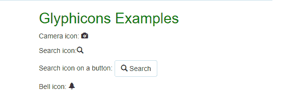
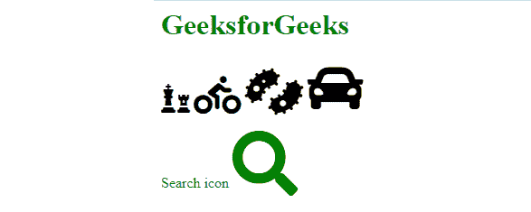

# 如何在引导中插入搜索图标？

> 原文:[https://www . geesforgeks . org/如何在引导中插入搜索图标/](https://www.geeksforgeeks.org/how-to-insert-a-search-icon-in-bootstrap/)

在本文中，我们将看到如何在 [Bootstrap](https://www.geeksforgeeks.org/bootstrap-tutorials/) 中插入搜索图标。虽然 Bootstrap 默认情况下不包括图标集，但它们确实有自己全面的图标库，称为 Bootstrap 图标。请随意使用它们或项目中设置的任何其他图标。有多种方法可以将搜索图标或其他图标添加到您的 HTML 页面中。图标库中的所有图标都可以使用 CSS 进行自定义(大小、对齐、旋转、阴影、颜色等)。).

**方法 1:使用 Bootstrap glyphicon:**Bootstrap 给了我们各种预定义的图标，包括搜索图标。你可以从 https://glyphicons.com/.添加各种类型的图标

#### 实施的分步指南:

**步骤 1:** 将 Bootstrap 和 jQuery CDN 包含到所有其他样式表之前的<头>标签中，以加载我们的 CSS。

> <src = " https://Ajax . Google APIs . com/Ajax/libs/jquery/3 . 5 . 1/jquery . min . js "></script><src = " https://maxcdn . bootstracdn . com/bootstrap/3 . 4 . 1/脚本

**第二步:**用类容器在 HTML 体中添加 [< div >](https://www.geeksforgeeks.org/div-tag-html/) 标签。

**步骤 3:** 现在使用下面的语法添加您想要的任何图标，其中名称是 glyphicon 的名称。

```html
<span class="glyphicon glyphicon-name"></span>
```

**示例:**下面的示例显示了不同类型的字形及其用法。

## 超文本标记语言

```html
<!DOCTYPE html>
<html lang="en">

<head>
    <link rel="stylesheet" href=
"https://maxcdn.bootstrapcdn.com/bootstrap/3.4.1/css/bootstrap.min.css">
    <script src=
"https://ajax.googleapis.com/ajax/libs/jquery/3.5.1/jquery.min.js">
    </script>
    <script src=
"https://maxcdn.bootstrapcdn.com/bootstrap/3.4.1/js/bootstrap.min.js">
    </script>
</head>

<body>

    <div class="container">
        <h2 style="color:green">Glyphicons Examples</h2>

        <p>Camera icon:
            <span class="glyphicon glyphicon-camera"></span>
        </p>

        <p>Search icon:<span 
            class="glyphicon glyphicon-search"></span></p>

        <p>Search icon on a button:
            <button type="button" class="btn btn-default">
                <span class="glyphicon 
                glyphicon-search"></span> Search
            </button>
        </p>

        <p>Bell icon:
            <span class="glyphicon glyphicon-bell"></span>
        </p>
    </div>
</body>

</html>
```

**输出:**



所有字形

**方法 2 使用字体 awesome 图标:**字体 Awesome 是一个网页字体，包含了来自 Twitter Bootstrap 框架的所有图标。Font Awesome 是一个广泛使用的图标集，它为您提供了可缩放的矢量图像，可以使用 CSS 进行自定义。

**分步实施指南:**

**第一步:**将你的工具包代码复制到你的项目中每个模板或页面的<头>中，在那里你想通过工具包使用 Font Awesome。如果您已经使用了其他版本或风格的 Font Awesome，请务必删除它们。

**步骤 2:** 用一行代码向项目添加任意自由图标。

**语法:**

```html
<i class="fas fa-camera"></i>   
<i class="fas fa-camera"></i>  
<span class="fas fa-camera"></span> 
```

**示例:**以下示例显示了不同类型的字体-令人敬畏的图标，包括搜索图标及其用法。

## 超文本标记语言

```html
<!DOCTYPE>
<html>

<head>
    <script src=
"https://kit.fontawesome.com/6ec9c7cfba.js"
        crossorigin="anonymous">
    </script>
</head>

<body>
    <h1 style="color:green">
        GeeksforGeeks
    </h1>

    <i class="fas fa-chess" style="font-size:32px;"></i>
    <i class="fas fa-biking" style="font-size:42px;"></i>
    <i class="fas fa-bacteria" style="font-size:52px;"></i>
    <i class="fa fa-car" style="font-size:62px;"></i>
    <p style="color:green">Search icon
        <i class="fas fa-search" style="font-size:72px;"></i>
    </p>
</body>

</html>
```

**输出:**



搜索图标