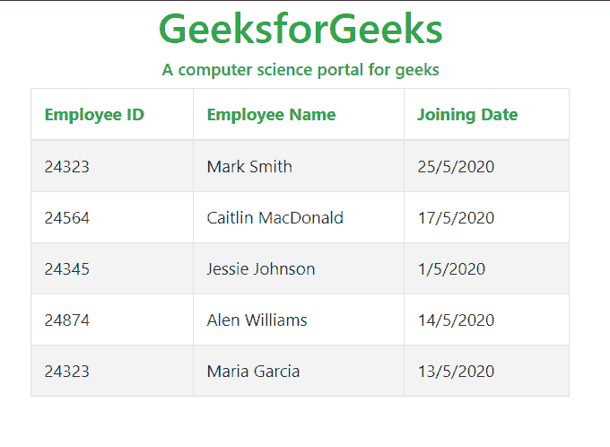

# 如何将 JSON 中的数据加载到引导表中？

> 原文:[https://www . geeksforgeeks . org/如何将数据从 json 加载到引导表/](https://www.geeksforgeeks.org/how-to-load-data-from-json-into-a-bootstrap-table/)

本文描述了如何使用给定的 JSON 数据创建引导表。数据可以通过导入或用 JavaScript 表示来检索。下面给出了两种方法。

**显示 JSON 数据不导入任何文件:**需要读取的 JSON 文件可以用 JavaScript 表示。然后，可以将其提供给引导表来表示数据。

**示例:**

## 超文本标记语言

```
<!DOCTYPE html>
<html lang="en">
<head>
  <meta charset="utf-8">
  <meta name="viewport" 
        content="width=device-width,
                 initial-scale=1,
                 shrink-to-fit=no">
  <title>
    load data from json file 
    into a bootstrap table
  </title>

  <!-- Include Bootstrap for styling -->
  <link rel="stylesheet"
        href=
"https://stackpath.bootstrapcdn.com/bootstrap/4.3.1/css/bootstrap.min.css">

  <!-- Include the Bootstrap Table CSS
  for the table -->
  <link rel="stylesheet" 
        href=
"https://unpkg.com/bootstrap-table@1.16.0/dist/bootstrap-table.min.css">
</head>
<body>
  <div class="container">
    <h1 class="text text-success text-center ">
      GeeksforGeeks
    </h1>
    <h6 class="text text-success text-center">
      A computer science portal for geeks
    </h6>
      <table class="table-striped border-success">
        <thead>
          <tr>
            <th data-field="id">
              <span class="text-success">
                Employee ID
              </span>
            </th>
            <th data-field="name">
              <span class="text-success">
                Employee Name 
              </span>
            </th>
            <th data-field="date">
              <span class="text-success">
                Joining Date 
              </span>
            </th>
          </tr>
        </thead>
      </table>
  </div>

  <!-- Include jQuery and other required
  files for Bootstrap -->
  <script src=
"https://code.jquery.com/jquery-3.3.1.min.js">
  </script>
  <script src=
"https://cdnjs.cloudflare.com/ajax/libs/popper.js/1.14.7/umd/popper.min.js">
  </script>
  <script src=
"https://stackpath.bootstrapcdn.com/bootstrap/4.3.1/js/bootstrap.min.js">
  </script>

  <!-- Include the JavaScript file
  for Bootstrap table -->
  <script src=
"https://unpkg.com/bootstrap-table@1.16.0/dist/bootstrap-table.min.js">
  </script>
  <script type="text/javascript">
    $(document).ready(function () {

      // Use the given data to create 
      // the table and display it
      $('table').bootstrapTable({
        data: mydata
      });
    });

    // Specify the JSON data to be displayed
    var mydata =
      [
        {
          "id": "24323",
          "name": "Mark Smith",
          "date": "25/5/2020"
        },
        {
          "id": "24564",
          "name": "Caitlin MacDonald",
          "date": "17/5/2020"
        },
        {
          "id": "24345",
          "name": "Jessie Johnson ",
          "date": "1/5/2020"
        },
        {
          "id": "24874",
          "name": "Alen Williams",
          "date": "14/5/2020"
        },
        {
          "id": "24323",
          "name": "Maria Garcia ",
          "date": "13/5/2020"
        }
      ];
  </script>
</body>
</html>
```

**输出:**



**从文件导入后显示 JSON 数据:**要显示的 JSON 数据存储在导入的 JavaScript 文件的本地文件夹中。然后，可以将导入的数据提供给引导表来表示数据。ES6 特征倒勾(` `)可用于多行字符串值插值。

**示例:**

*   **JSON 数据:****JSON 数据**存储在以下示例中:

    ## java 描述语言

    ```
    // Contents for test.js
    // Represents JSON of the data

    var da = `[
        { "id": "24323", 
          "name": "Mark Smith", 
          "date": "25/5/2020" },
        { "id": "24564",
          "name": "Caitlin MacDonald", 
          "date": "17/5/2020" }
    ]`;
    ```

*   **程序:**将数据从 JSON 加载到引导表中

    ## 超文本标记语言

    ```
    <!DOCTYPE html>
    <html lang="en">
    <head>
      <meta charset="utf-8">
      <meta name="viewport" 
            content="width=device-width, 
                     initial-scale=1, 
                     shrink-to-fit=no">
      <title>
        load data from json file
        into a bootstrap table
      </title>

      <!-- Include Bootstrap for styling -->
      <link rel="stylesheet" 
            href=
    "https://stackpath.bootstrapcdn.com/bootstrap/4.3.1/css/bootstrap.min.css">

      <!-- Include the Bootstrap Table
      CSS for the table -->
      <link rel="stylesheet"
            href=
    "https://unpkg.com/bootstrap-table@1.16.0/dist/bootstrap-table.min.css">
    </head>
    <body>
      <div class="container">
        <h1 class="text text-success text-center ">
          GeeksforGeeks
        </h1>
        <h6 class="text text-success text-center">
          A computer science portal for geeks
        </h6>
          <table class="table-striped border-success">
            <thead>
              <tr>
                <th data-field="id">
                  <span class="text-success">
                    Employee ID
                  </span>
                </th>
                <th data-field="name">
                  <span class="text-success">
                    Employee Name 
                  </span>
                </th>
                <th data-field="date">
                  <span class="text-success"> 
                    Joining Date 
                  </span>
                </th>
              </tr>
            </thead>
          </table>
      </div>

      <!-- Include jQuery and other required files for Bootstrap -->
      <script src=
    "https://code.jquery.com/jquery-3.3.1.min.js">
      </script>
      <script src=
    "https://cdnjs.cloudflare.com/ajax/libs/popper.js/1.14.7/umd/popper.min.js">
      </script>
      <script src=
    "https://stackpath.bootstrapcdn.com/bootstrap/4.3.1/js/bootstrap.min.js">
      </script>

      <!-- Include the JavaScript file for Bootstrap table -->
      <script src=
    "https://unpkg.com/bootstrap-table@1.16.0/dist/bootstrap-table.min.js">
      </script>

      <!-- Include the file where the JSON data is stored -->
      <script type="text/javascript" 
              src="test.js">
      </script>
      <script type="text/javascript">
        $(document).ready(function () {

          // Use the given data to create 
          // the table and display it
          $('table').bootstrapTable({
            data: mydata
          });
        });

        // Parse the imported data as JSON
        // and store it
        var mydata = JSON.parse(da)
      </script>
    </body>
    </html>
    ```

*   **输出:**

    