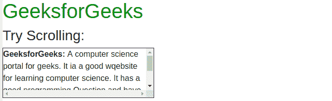
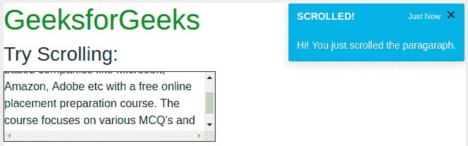

# 如何在不点击引导中按钮的情况下，在右上角加载通知提醒？

> 原文:[https://www . geesforgeks . org/如何加载通知-右上角警报-无需点击引导中的按钮/](https://www.geeksforgeeks.org/how-to-load-notification-alert-on-top-right-corner-without-click-of-button-in-bootstrap/)

Bootstrap **Toast** 组件提供了一种模拟推送通知功能的简单方法。Bootstrap Toast 就像一个警报框，无论何时发生事件，都可以向用户显示。这个组件是用 CSS flexbox 构建的，这使得它很容易定位和对齐。
不需要点击一个按钮就显示吐司。它可以显示浏览器中发生的任何类型的事件。我们来看一个例子。

**示例:**创建引导通知/吐司。在本例中，我们将在用户滚动页面中的< div >时显示推送通知。要创建引导吐司，我们需要在一个分部上使用**吐司**类，并在其中添加两个分部，类别为**吐司-标题**和**吐司-正文**。我们将使用 jquery 显示通知。

```html
<!DOCTYPE html>
<html lang="en">

<head>
    <title>
        How to load notification alert on top
        right corner without click of button 
        in bootstrap ?
    </title>

    <meta charset="utf-8">

    <meta name="viewport"
        content="width=device-width, initial-scale=1">

    <link rel="stylesheet" href=
"https://maxcdn.bootstrapcdn.com/bootstrap/4.3.1/css/bootstrap.min.css">

    <script src=
"https://ajax.googleapis.com/ajax/libs/jquery/3.4.1/jquery.min.js">
    </script>

    <script src=
"https://cdnjs.cloudflare.com/ajax/libs/popper.js/1.14.7/umd/popper.min.js">
    </script>

    <script src=
"https://maxcdn.bootstrapcdn.com/bootstrap/4.3.1/js/bootstrap.min.js">
    </script>

    <style>
        #notification {
            position: absolute;
            top: 0;
            right: 0;
        }
        #para {
            border: 1px solid black;
            width: 300px;
            height: 100px;
            overflow: scroll;
        }
        .toast-color {
            color: white;
            background-color: #33b5e5;
        }
        h1 {
            color:green;
        }
    </style>
</head>

<body>
    <h1>GeeksforGeeks</h1>

    <h3>Try Scrolling:</h3>

    <div id="para">
        <b>GeeksforGeeks:</b> A computer science portal
        for geeks. It ia a good website for learning
        computer science. It has a good programming
        Question and have many Interwiew Experiences.
        Prepare for the Recruitment drive of product
        based companies like Microsoft, Amazon, Adobe
        etc with a free online placement preparation
        course.
    </div>

    <div class="toast toast-color" id="notification"
                data-delay="3000">
        <div class="toast-header toast-color">
            <strong class="mr-auto">SCROLLED!</strong>
            <small>Just Now</small>

            <button type="button" class="ml-2 mb-1 close"
                    data-dismiss="toast" aria-label="Close">
                <span aria-hidden="true">×</span>
            </button>
        </div>

        <div class="toast-body">
            Hi! You just scrolled the paragaraph.
        </div>
    </div>

    <script>
        $(document).ready(function() {
            $("#para").scroll(function() {
                $('.toast').toast('show');
            });
        });
    </script>
</body>

</html>
```

**输出:**

*   **滚动内容前:**
    
*   **滚动内容后:**
    