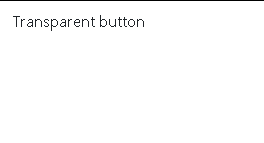
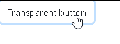

# 如何让引导按钮透明？

> 原文:[https://www . geesforgeks . org/how-to-make-bootstrap-button-transparent/](https://www.geeksforgeeks.org/how-to-make-bootstrap-button-transparent/)

通过使用内置的类属性，可以在引导中使按钮透明:

**语法:**

```html
<button class="btn bg-transparent">
    Transparent button
</button>
```

**描述:**

*   <button>标签用于在 HTML 中指定按钮元素，按下后执行。</button>
*   一般来说，引导的属性必须在课堂上提到。示例:class= " "
*   在 class=" "
    btn 内部–在提到 btn 属性时，指定它是一个引导按钮。
    BG–指定按钮的背景颜色。
    透明–使按钮透明。

**如何使用:**
确保你的代码中包含了引导代码( [Starter Template](https://getbootstrap.com/docs/4.4/getting-started/introduction/) )。

**示例:**

```html
<!doctype html>
<html lang="en">

<head>
    <!-- Required meta tags -->
    <meta charset="utf-8">
    <meta name="viewport" 
          content="width=device-width, 
                   initial-scale=1, 
                   shrink-to-fit=no">

    <!-- Bootstrap CSS -->
    <link rel="stylesheet" 
          href=
"https://stackpath.bootstrapcdn.com/bootstrap/4.4.1/css/bootstrap.min.css"
          integrity=
"sha384-Vkoo8x4CGsO3+Hhxv8T/Q5PaXtkKtu6ug5TOeNV6gBiFeWPGFN9MuhOf23Q9Ifjh" 
          crossorigin="anonymous">

    <title>Hello, world!</title>
</head>

<body>

    <button class="btn bg-transparent">

        Transparent button
    </button>

    <!-- Optional JavaScript -->
    <!-- jQuery first, then Popper.js, then Bootstrap JS -->
    <script src="https://code.jquery.com/jquery-3.4.1.slim.min.js"
            integrity=
"sha384-J6qa4849blE2+poT4WnyKhv5vZF5SrPo0iEjwBvKU7imGFAV0wwj1yYfoRSJoZ+n" 
            crossorigin="anonymous"></script>
    <script src=
"https://cdn.jsdelivr.net/npm/popper.js@1.16.0/dist/umd/popper.min.js"
            integrity=
"sha384-Q6E9RHvbIyZFJoft+2mJbHaEWldlvI9IOYy5n3zV9zzTtmI3UksdQRVvoxMfooAo" 
            crossorigin="anonymous"></script>
    <script src=
"https://stackpath.bootstrapcdn.com/bootstrap/4.4.1/js/bootstrap.min.js" 
            integrity=
"sha384-wfSDF2E50Y2D1uUdj0O3uMBJnjuUD4Ih7YwaYd1iqfktj0Uod8GCExl3Og8ifwB6" 
            crossorigin="anonymous"></script>
</body>

</html>
```

**输出:**
**压制前:**

压制后:


Bootstrap 的文档结构良好，易于理解。
**参考:** [官方文件](https://getbootstrap.com/)