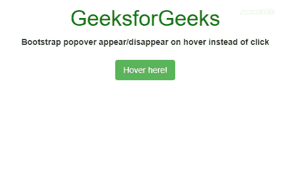

# 如何让 Bootstrap popover 在悬停而不是点击时出现/消失？

> 原文:[https://www . geesforgeks . org/如何制作-引导-弹出-出现-消失-悬停-代替点击/](https://www.geeksforgeeks.org/how-to-make-bootstrap-popover-appear-disappear-on-hover-instead-of-click/)

Bootstrap 为制作 [popovers](https://www.geeksforgeeks.org/popovers-in-bootstrap-with-examples/) 提供内置支持。当用户使用指定的元素选择器触发特定事件时，会出现一个**弹出框**。在这里，我们将讨论使用“悬停”而不是“点击”来触发 popover 的方法。

**方法 1:** 这里，我们将只使用 jQuery 初始化在‘悬停’中指定 popover 触发器。我们可以在 **popover()** 函数本身中添加标题细节和触发标准作为参数。

*   **程序:**

    ```html
    <!-- Using jQuery initialization only -->
    <!DOCTYPE html>
    <html>
    <head>
        <!-- CDN's required -->
        <link rel="stylesheet" href=
    "https://maxcdn.bootstrapcdn.com/bootstrap/3.4.1/css/bootstrap.min.css">
        <script src=
    "https://ajax.googleapis.com/ajax/libs/jquery/3.4.1/jquery.min.js">
        </script>
        <script src=
    "https://maxcdn.bootstrapcdn.com/bootstrap/3.4.1/js/bootstrap.min.js">
        </script>
    </head>

    <body>
        <div class="container">
            <center>
                <h1 style="color:green;">GeeksforGeeks</h1>
                <b>
                    Bootstrap popover appear/disappear 
                    on hover instead of click
                </b>
                <br><br>
                <button class="btn btn-success" 
                        data-toggle="popover" 
                        data-content="Computer Science Portal for Geeks" 
                        data-placement="bottom">
                  Hover here!
                </button>
            </center>
        </div>
        <script>
            $('[data-toggle="popover"]').popover({
                title: "GeeksforGeeks",
                trigger: "hover"
            });
        </script>
    </body>

    </html>
    ```

*   **输出:**
    

**方法 2:** 这里我们将使用‘数据-触发器’属性。我们也可以通过将**【头衔】**和**【数据触发】**作为属性来实现，而无需在 **popover()** 方法中将它们指定为参数。

*   **程序:**

    ```html
    <!-- Using data-trigger attribute -->
    <!DOCTYPE html>
    <html>
    <head>

        <!-- CDN's required -->
        <link rel="stylesheet" href=
    "https://maxcdn.bootstrapcdn.com/bootstrap/3.4.1/css/bootstrap.min.css">
        <script src=
    "https://ajax.googleapis.com/ajax/libs/jquery/3.4.1/jquery.min.js">
        </script>
        <script src=
    "https://maxcdn.bootstrapcdn.com/bootstrap/3.4.1/js/bootstrap.min.js">
        </script>
    </head>

    <body>
        <div class="container">
            <center>
                <h1 style="color:green;">GeeksforGeeks</h1>
                <b>
                    Bootstrap popover appear/disappear 
                    on hover instead of click
                </b>
                <br><br>
                <button class="btn btn-success"
                        title="GeeksforGeeks" 
                        data-toggle="popover" 
                        data-trigger="hover"
                        data-content="Computer Science Portal for Geeks"
                        data-placement="bottom">
                  Hover here!</button>
            </center>
        </div>
        <script>
            $('[data-toggle="popover"]').popover();
        </script>
    </body>

    </html>
    ```

*   **输出:**
    