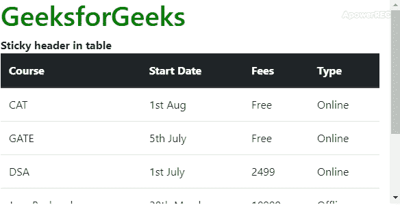
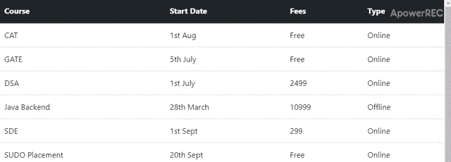

# 如何制作表头粘的 Bootstrap 表？

> 原文:[https://www . geeksforgeeks . org/如何制作带有粘性表头的引导表/](https://www.geeksforgeeks.org/how-to-make-bootstrap-table-with-sticky-table-head/)

[可用于正确对齐/记录数据的表格](https://www.geeksforgeeks.org/html-tables/)，但有时表格中的数据太长，因此为了正确读取数据，在遍历表格时，各列的标题应始终可用。在这种情况下，需要一个粘性表头来使表更具信息性和准确性，这可以使用 CSS 属性来实现，即它是头行元素的位置和顶部

**语法:**

*   **在 CSS 文件中:**

    ```html
    <style>
        .header{
            position:sticky;
            top: 0 ;
        }
    </style>
    ```

*   **在 HTML 文件中:**

    ```html
    <th class="header" scope="col">
    ```

下面的示例说明了这种方法:
**示例 1:** 顶部的表格有一长串列和一个固定的标题。

```html
<!DOCTYPE html>
<html lang="en">

<head>
    <meta charset="UTF-8" />
    <meta name="viewport" content="width=device-width, initial-scale=1.0" />
    <meta http-equiv="X-UA-Compatible" content="ie=edge" />
    <title>Document</title>
    <link rel="stylesheet" href=
"https://stackpath.bootstrapcdn.com/bootstrap/4.1.3/css/bootstrap.min.css"
        integrity=
"sha384-MCw98/SFnGE8fJT3GXwEOngsV7Zt27NXFoaoApmYm81iuXoPkFOJwJ8ERdknLPMO"
        crossorigin="anonymous" />
    <script src="https://code.jquery.com/jquery-3.3.1.slim.min.js"
            integrity=
"sha384-q8i/X+965DzO0rT7abK41JStQIAqVgRVzpbzo5smXKp4YfRvH+8abtTE1Pi6jizo"
            crossorigin="anonymous">
    </script>
    <script src=
"https://cdnjs.cloudflare.com/ajax/libs/popper.js/1.14.3/umd/popper.min.js"
            integrity=
"sha384-ZMP7rVo3mIykV+2+9J3UJ46jBk0WLaUAdn689aCwoqbBJiSnjAK/l8WvCWPIPm49"
            crossorigin="anonymous">
    </script>
    <script src=
"https://stackpath.bootstrapcdn.com/bootstrap/4.1.3/js/bootstrap.min.js"
            integrity=
"sha384-ChfqqxuZUCnJSK3+MXmPNIyE6ZbWh2IMqE241rYiqJxyMiZ6OW/JmZQ5stwEULTy"
            crossorigin="anonymous">
    </script>
    <style>
        .header {
            position: sticky;
            top:0;
        }
        .container {
            width: 600px;
            height: 300px;
            overflow: auto;
        }
        h1{
            color: green;
        }
    </style>
</head>

<body>
    <div class="container">
        <h1>GeeksforGeeks</h1>
        <b>Sticky header in table</b>
    <table class="table">
        <thead style="position: sticky;top: 0" class="thead-dark">
            <tr>
                <th class="header" scope="col">Course</th>
                <th class="header" scope="col">Start Date</th>
                <th class="header" scope="col">Fees</th>
                <th class="header" scope="col">Type</th>
            </tr>
        </thead>
        <tbody>
            <tr>
                <td>CAT</td>
                <td>1st Aug</td>
                <td>Free</td>
                <td>Online</td>
            </tr>
            <tr>
                <td>GATE</td>
                <td>5th July</td>
                <td>Free</td>
                <td>Online</td>
            </tr>
            <tr>
                <td>DSA</td>
                <td>1st July</td>
                <td>2499</td>
                <td>Online</td>
            </tr>
            <tr>
                <td>Java Backend</td>
                <td>28th March</td>
                <td>10999</td>
                <td>Offline</td>
            </tr>
            <tr>
                <td>SDE</td>
                <td>1st Sept</td>
                <td>299</td>
                <td>Online</td>
            </tr>
            <tr>
                <td>SUDO Placement</td>
                <td>20th Sept</td>
                <td>Free</td>
                <td>Online</td>
            </tr>
        </tbody>
    </table>

</body>

</html>                    
```

**输出:**


**示例 2** 带有文本的标题，后面是带有粘性标题的表格。

```html
<!DOCTYPE html>
<html lang="en">

<head>
    <meta charset="UTF-8" />
    <meta name="viewport" content="width=device-width, initial-scale=1.0" />
    <meta http-equiv="X-UA-Compatible" content="ie=edge" />
    <title>Document</title>
    <link rel="stylesheet" href=
"https://stackpath.bootstrapcdn.com/bootstrap/4.1.3/css/bootstrap.min.css"
        integrity=
"sha384-MCw98/SFnGE8fJT3GXwEOngsV7Zt27NXFoaoApmYm81iuXoPkFOJwJ8ERdknLPMO"
        crossorigin="anonymous" />
    <script src="https://code.jquery.com/jquery-3.3.1.slim.min.js"
            integrity=
"sha384-q8i/X+965DzO0rT7abK41JStQIAqVgRVzpbzo5smXKp4YfRvH+8abtTE1Pi6jizo"
            crossorigin="anonymous">
    </script>
    <script src=
"https://cdnjs.cloudflare.com/ajax/libs/popper.js/1.14.3/umd/popper.min.js"
            integrity=
"sha384-ZMP7rVo3mIykV+2+9J3UJ46jBk0WLaUAdn689aCwoqbBJiSnjAK/l8WvCWPIPm49"
            crossorigin="anonymous">
    </script>
    <script src=
"https://stackpath.bootstrapcdn.com/bootstrap/4.1.3/js/bootstrap.min.js"
            integrity=
"sha384-ChfqqxuZUCnJSK3+MXmPNIyE6ZbWh2IMqE241rYiqJxyMiZ6OW/JmZQ5stwEULTy"
            crossorigin="anonymous">
    </script>
    <style>
        .header {
            position: sticky;
            top:0;
        }
         body {
             height: 800px;
         }
    </style>
</head>

<body>
    <table class="table">
        <thead style="position: sticky;top: 0" class="thead-dark">
            <tr>
                <th class="header" scope="col">Course</th>
                <th class="header" scope="col">Start Date</th>
                <th class="header" scope="col">Fees</th>
                <th class="header" scope="col">Type</th>
            </tr>
        </thead>
        <tbody>
            <tr>
                <td>CAT</td>
                <td>1st Aug</td>
                <td>Free</td>
                <td>Online</td>
            </tr>
            <tr>
                <td>GATE</td>
                <td>5th July</td>
                <td>Free</td>
                <td>Online</td>
            </tr>
            <tr>
                <td>DSA</td>
                <td>1st July</td>
                <td>2499</td>
                <td>Online</td>
            </tr>
            <tr>
                <td>Java Backend</td>
                <td>28th March</td>
                <td>10999</td>
                <td>Offline</td>
            </tr>
            <tr>
                <td>SDE</td>
                <td>1st Sept</td>
                <td>299</td>
                <td>Online</td>
            </tr>
            <tr>
                <td>SUDO Placement</td>
                <td>20th Sept</td>
                <td>Free</td>
                <td>Online</td>
            </tr>
        </tbody>
    </table>
</body>

</html>                              
```

**输出:**


CSS 是网页的基础，通过设计网站和网络应用程序用于网页开发。你可以通过以下 [CSS 教程](https://www.geeksforgeeks.org/css-tutorials/)和 [CSS 示例](https://www.geeksforgeeks.org/css-examples/)从头开始学习 CSS。