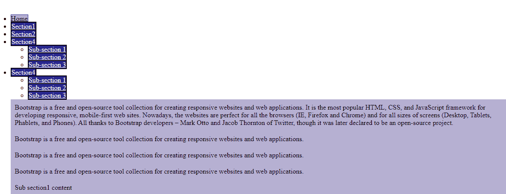

# 如何进行引导版本 2 标签下拉？

> 原文:[https://www . geeksforgeeks . org/how-make-bootstrap-version-2-tab-drop down/](https://www.geeksforgeeks.org/how-to-make-bootstrap-version-2-tab-dropdown/)

使用简单的 Bootstrap 插件，您可以通过使用**下拉类在**选项卡**中添加下拉菜单。**导航和导航标签类也用于实现这一点。

首先，制作一个**无序列表**，给它一个**类的导航和导航标签**。现在，给列表项标签一个下拉列表类，您希望它表现为下拉列表。

下一步是为下拉标签创建一个无序列表，并给它一个**下拉菜单的**类**。**

您也可以通过编写自己的 CSS 并覆盖 Bootstrap 的 CSS 来自定义下拉菜单和导航链接。这里有一个相同的工作示例。

**示例:**

```html
<!DOCTYPE html>
<html>
<head>
<title> Welcome to GFG </title>

<style>

.main {
margin-top: 20vh;
margin-left: 10vw;
}

.tab-pane {
    width:100%;
    background-color:#b6b0d2;
    padding:10px;
    color: black;
}

.nav-tabs > li a { 
    border: 2px solid black;
    background-color:#35218e; 
    color:#fff;
    margin-right: 1.2vw;
}

.nav-tabs > li.active > a {

    background-color:#b6b0d2;
    color:#000;
    border: 1px solid #35218e;

}

.nav-tabs > li.active > a:focus {
background-color: #c9bad1;
color:#000;
} 

.nav-tabs > li > a:hover {
    background-color: #b6b0d2 ;

}

</style>

</head>

<body>
<div class="container main">

<ul class="nav nav-tabs" role="tablist">
<li class="active homeTab">
    <a href="#home" 
    role="tab" 
    data-toggle="tab">Home</a></li>

<li ><a href="#section1" 
        data-toggle="tab" 
        role="tab">Section1</a></li>
<li ><a href="#section2" 
        data-toggle="tab" 
        role="tab" >Section2</a></li>

<li class="dropdown">
            <a class="dropdown-toggle"
               data-toggle="dropdown">
                Section4 <b class="caret">

                </b></a>
            <ul class="dropdown-menu">
                <li><a href="#subSection1" 
                       role="tab" 
                       data-toggle="tab">
                    Sub-section 1</a></li>
                <li><a href="#subSection2" 
                       role="tab" 
                       data-toggle="tab">
                    Sub-section 2</a></li>
                <li><a href="#subSection3" 
                       role="tab"
                       data-toggle="tab">
                    Sub-section 3</a></li>
            </ul>
</li> 

<li class="dropdown">
            <a class="dropdown-toggle" 
               data-toggle="dropdown">
                Section4 <b class="caret">

                </b></a>
            <ul class="dropdown-menu">
                <li><a href="#subSection1" 
                       role="tab" 
                       data-toggle="tab">
                    Sub-section 1</a></li>
                <li><a href="#subSection2" 
                       role="tab" 
                       data-toggle="tab">
                    Sub-section 2</a></li>
                <li><a href="#subSection3" 
                       role="tab" 
                       data-toggle="tab">
                    Sub-section 3</a></li>
            </ul>
</li> 

<div class="tab-content">
<div class="tab-pane active" id="home">
    Bootstrap is a free and open-source tool
    collection for creating responsive websites
    and web applications. It is the most popular
    HTML, CSS, and JavaScript framework for 
    developing responsive, mobile-first web sites.
    Nowadays, the websites are perfect for all
    the browsers (IE, Firefox and Chrome) and for
    all sizes of screens (Desktop, Tablets,
    Phablets, and Phones). All thanks to 
    Bootstrap developers – Mark Otto and Jacob
    Thornton of Twitter, though it was later 
    declared to be an open-source project.
    </div>
<div class="tab-pane" id="section1"> 
Bootstrap is a free and open-source tool
    collection for creating responsive websites
    and web applications. </div>
<div class="tab-pane" id="section2"> 
Bootstrap is a free and open-source tool
    collection for creating responsive websites
    and web applications.</div>

<div class="tab-pane" id="section3"> 
Bootstrap is a free and open-source tool
    collection for creating responsive websites
    and web applications.</div>

<div class="tab-pane" id="subSection1">
    Sub section1 content</div>
<div class="tab-pane" id="subSection2">
    Sub Section 2 content

</div>

</div>

</body>
</html>                    
```

**输出**

