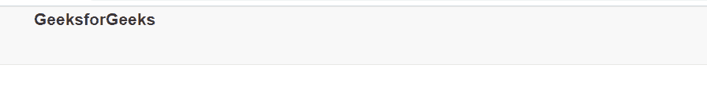
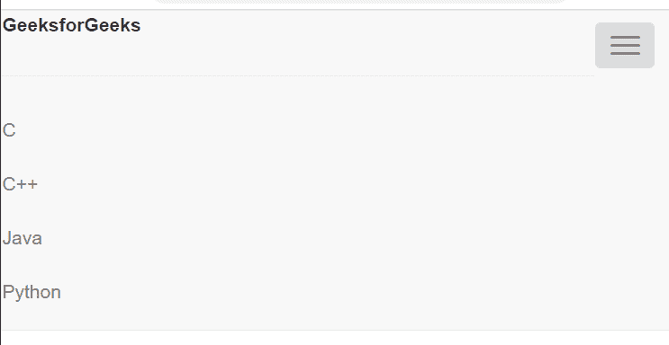

# 如何使用 Bootstrap 使可折叠按钮只出现在移动视图中？

> 原文:[https://www . geesforgeks . org/如何使用引导程序使可折叠按钮仅在移动视图中出现/](https://www.geeksforgeeks.org/how-to-make-collapsible-button-appear-only-in-mobile-view-using-bootstrap/)

可折叠按钮用于在单击按钮时隐藏或显示内容列表。单击可折叠按钮时，它会展开并显示要选择的内容列表，然后映射到特定内容。 Bootstrap 有不同的类来创建可折叠的元素。

移动视图中的可折叠按钮仅出现在移动大小的屏幕上，在大屏幕设备上消失。

**示例:**

## 超文本标记语言

```html
<!DOCTYPE html>
<html>

<head>
    <meta charset="utf-8">
    <meta http-equiv="X-UA-Compatible" 
        content="IE=edge">

    <meta name="viewport" content=
        "width=device-width,initial-scale=1">

    <!-- Bootstrap links -->
    <link rel="stylesheet" href=
"https://maxcdn.bootstrapcdn.com/bootstrap/3.4.1/css/bootstrap.min.css">

    <script src=
"https://ajax.googleapis.com/ajax/libs/jquery/3.5.1/jquery.min.js">
    </script>

    <script src=
"https://maxcdn.bootstrapcdn.com/bootstrap/3.4.1/js/bootstrap.min.js">
    </script>
</head>

<body>
    <nav id="header-nav" 
        class="navbar navbar-default">
        <div class="container">
            <div class="navbar-header">
                <span><b>GeeksforGeeks</b></span>

                <!-- Button to extend the  menu -->
                <button type="button" 
                    class="navbar-toggle collapsed" 
                    data-toggle="collapse"
                    data-target="#collapsable-nav" 
                    aria-expanded="false">
                    <span class="sr-only">
                        Toggle navigation
                    </span>
                    <span class="icon-bar"></span>
                    <span class="icon-bar"></span>
                    <span class="icon-bar"></span>
                </button>

                <!--  Display content of 
                    collapse button  -->
                <div class="collapse navbar-collapsed" 
                    id="collapsable-nav">

                    <ul id="nav-list" class="nav 
                        navbar-nav navbar-right">
                        <hr>
                        <li><a href="#c">C</a></li>
                        <li><a href="#b">C++</a></li>
                        <li><a href="#s">Java</a></li>
                        <li><a href="#s">Python</a></li>
                    </ul>
                </div>
            </div>
        </div>
    </nav>
</body>

</html>
```

**输出:**

**大屏幕/台式机/笔记本电脑屏幕:**



**在小屏幕/手机屏幕上:**

