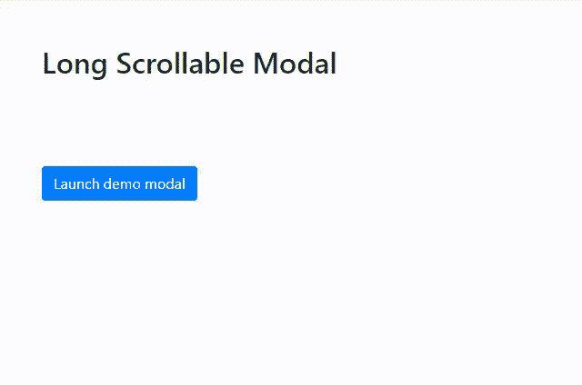

# 如何在安卓设备上制作可拖动和可滚动的 Bootstrap 模式？

> 原文:[https://www . geeksforgeeks . org/如何制作可拖动和可滚动的安卓设备引导模式/](https://www.geeksforgeeks.org/how-to-make-draggable-and-scrollable-bootstrap-modal-on-android-device/)

给定一个 HTML 文档，任务是创建一个可以在移动设备上滚动和拖动的引导模式。使用引导库中可用的“滚动长内容”模式可以轻松完成此任务。

**方法:**模态是用 HTML、CSS 和 JavaScript 构建的。它们位于文档中的所有内容之上，因此它们从<主体>元素中移除了滚动，从而模态内容改为滚动。当模态对于用户的视窗或设备变得太长时，它们独立于页面本身滚动。因此，为了创建一个在移动设备中可拖动和可滚动的模式，除了从引导库导出默认模式之外，不需要做任何额外的工作，一旦我们在模式体中添加一些长内容，它就会自动变成可滚动的。请参考给定的示例进行进一步演示。

**示例:**

## 超文本标记语言

```html
<!DOCTYPE html>
<html lang="en">

<head>
    <meta charset="UTF-8" />
    <meta name="viewport" content=
        "width=device-width,initial-scale=1.0" />

    <!--Bootstrap CSS CDN-->
    <link rel="stylesheet" href=
"https://maxcdn.bootstrapcdn.com/bootstrap/4.0.0/css/bootstrap.min.css"
        integrity=
"sha384-Gn5384xqQ1aoWXA+058RXPxPg6fy4IWvTNh0E263XmFcJlSAwiGgFAW/dAiS6JXm"
        crossorigin="anonymous" />

    <!--Bootstrap javascript plugins-->
    <script src="https://code.jquery.com/jquery-3.2.1.slim.min.js"
        integrity=
"sha384-KJ3o2DKtIkvYIK3UENzmM7KCkRr/rE9/Qpg6aAZGJwFDMVNA/GpGFF93hXpG5KkN"
        crossorigin="anonymous">
    </script>

    <script src=
"https://cdnjs.cloudflare.com/ajax/libs/popper.js/1.12.9/umd/popper.min.js"
        integrity=
"sha384-ApNbgh9B+Y1QKtv3Rn7W3mgPxhU9K/ScQsAP7hUibX39j7fakFPskvXusvfa0b4Q"
        crossorigin="anonymous">
    </script>

    <script src=
"https://maxcdn.bootstrapcdn.com/bootstrap/4.0.0/js/bootstrap.min.js"
        integrity=
"sha384-JZR6Spejh4U02d8jOt6vLEHfe/JQGiRRSQQxSfFWpi1MquVdAyjUar5+76PVCmYl"
        crossorigin="anonymous">
    </script>
</head>

<body>
    <h2 class="m-5">Long Scrollable Modal</h2>

    <!-- Button trigger modal -->
    <button type="button" class="btn btn-primary m-5" 
        data-toggle="modal" 
        data-target="#exampleModalLong">
        Launch demo modal
    </button>

    <!-- Modal -->
    <div class="modal fade" id="exampleModalLong" 
        tabindex="-1" role="dialog" 
        aria-labelledby="exampleModalLongTitle"
        aria-hidden="true">

        <div class="modal-dialog" role="document">
            <div class="modal-content">
                <div class="modal-header">
                    <h5 class="modal-title" 
                        id="exampleModalLongTitle">
                        GeeksforGeeks
                    </h5>
                    <button type="button" class="close" 
                        data-dismiss="modal" 
                        aria-label="Close">

                        <span aria-hidden="true">
                            ×</span>
                    </button>
                </div>
                <div class="modal-body">
                    Bootstrap is a free and open-source
                    tool collection for creating responsive 
                    websites and web applications. It is the
                    most popular HTML, CSS, and JavaScript 
                    framework for developing responsive, 
                    mobile-first web sites. Nowadays, the 
                    websites are perfect for all the browsers
                    (IE, Firefox and Chrome) and for all sizes
                    of screens (Desktop, Tablets, Phablets, 
                    and Phones). All thanks to Bootstrap
                    developers – Mark Otto and Jacob Thornton
                    of Twitter, though it was later declared
                    to be an open-source project.
                </div>

                <div class="modal-footer">
                    <button type="button" 
                        class="btn btn-secondary" 
                        data-dismiss="modal">
                        Close
                    </button>

                    <button type="button" 
                        class="btn btn-primary">
                        Save changes
                    </button>
                </div>
            </div>
        </div>
    </div>
</body>

</html>
```

**输出:**

