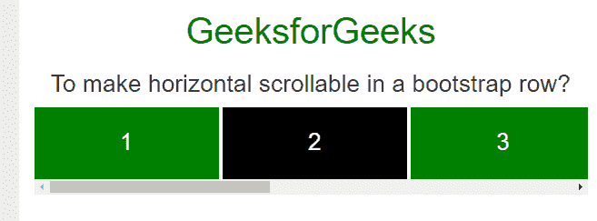

# 如何在一个 bootstrap 行中进行横向滚动？

> 原文:[https://www . geesforgeks . org/如何在引导行中进行水平滚动/](https://www.geeksforgeeks.org/how-to-make-horizontal-scrollable-in-a-bootstrap-row/)

这里的任务是在引导行中进行水平滚动。
可以通过以下方式完成:

**进场:**

*   使用**显示使所有 div 元素内联:内联块；**属性
*   使用**溢出-x: auto 将滚动条添加到所有 div 元素；**属性。
*   **空白:nowrap**属性用于在一行中制作所有 div。

**示例:**

```html
<!DOCTYPE html>
<html lang="en">

<head>
    <title>How to make horizontal 
      scrollable in a bootstrap row?</title>

    <meta charset="utf-8">
    <meta name="viewport" 
          content="width=device-width, initial-scale=1">

    <link rel="stylesheet" 
          href=
"https://maxcdn.bootstrapcdn.com/bootstrap/3.3.7/css/bootstrap.min.css">
    <style>
        /* The heart of the matter */

        .horizontal-scrollable > .row {
            overflow-x: auto;
            white-space: nowrap;
        }

        .horizontal-scrollable > .row > .col-xs-4 {
            display: inline-block;
            float: none;
        }
        /* Decorations */

        .col-xs-4 {
            color: white;
            font-size: 24px;
            padding-bottom: 20px;
            padding-top: 18px;
        }

        .col-xs-4:nth-child(2n+1) {
            background: green;
        }

        .col-xs-4:nth-child(2n+2) {
            background: black;
        }
    </style>
</head>

<body>
    <center>
        <div class="container">

            <h1 style="text-align:center;color:green;"> 
            GeeksforGeeks 
        </h1>
            <h3>
            To make horizontal scrollable in a bootstrap row?
        </h3>
            <div class="container horizontal-scrollable">
                <div class="row text-center">
                    <div class="col-xs-4">1</div>
                    <div class="col-xs-4">2</div>
                    <div class="col-xs-4">3</div>
                    <div class="col-xs-4">4</div>
                    <div class="col-xs-4">5</div>
                    <div class="col-xs-4">6</div>
                    <div class="col-xs-4">7</div>
                </div>
            </div>
        </div>
    </center>
</body>

</html>
```

**输出:**
