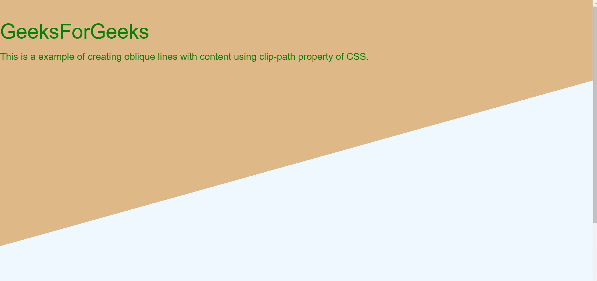
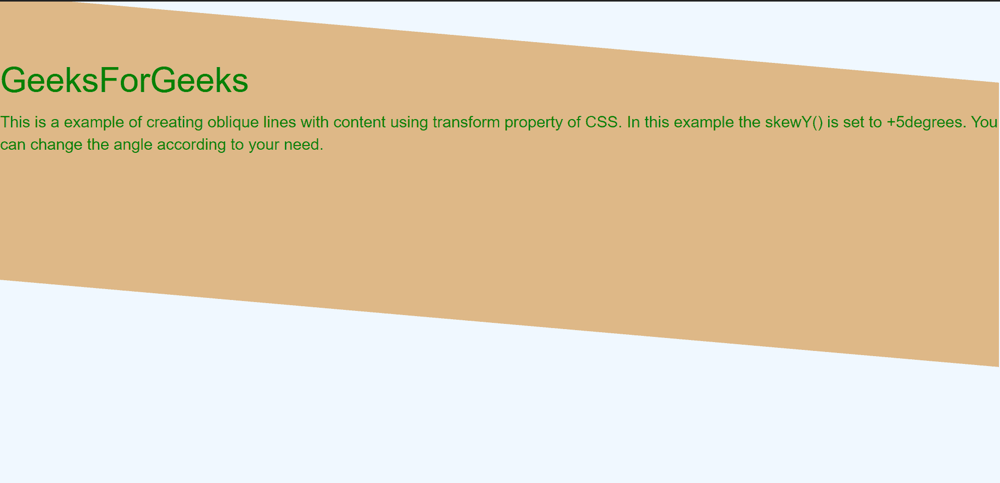

# 如何用 CSS / Bootstrap 3 制作斜线？

> 原文:[https://www . geeksforgeeks . org/如何用 css 制作斜线-bootstrap-3/](https://www.geeksforgeeks.org/how-to-make-oblique-lines-with-css-bootstrap-3/)

用 CSS 制作斜线，主要有两种方法。 ***第一种方法*** 涉及 CSS 的裁剪路径属性，在**第二种方法**中，我们使用 CSS 的带有 skew()的变换属性。

**方法 1:使用裁剪路径属性:**裁剪路径属性通常用于将元素裁剪为基本形状。但是它也可以用来创建斜线与剪辑路径多边形形状的调整属性。这个属性的主要缺点是它的实现，并且因为需要观察和改变许多变化来将其转换成斜线。

## 超文本标记语言

```html
<!DOCTYPE html>
<html lang="en">
<head>
    <meta charset="UTF-8">
    <meta name="viewport" content=
        "width=device-width, initial-scale=1.0">

    <title>Oblique Lines in CSS</title>

    <link rel="stylesheet" href=
"https://maxcdn.bootstrapcdn.com/bootstrap/3.3.7/css/bootstrap.min.css"
        integrity=
"sha384-BVYiiSIFeK1dGmJRAkycuHAHRg32OmUcww7on3RYdg4Va+PmSTsz/K68vbdEjh4u"
        crossorigin="anonymous">

    <style>
        body{
            background-color: burlywood;
            margin:0;
          }
          div.polygon{
            height: 100vh;
            width: 100vw;
            background: aliceblue;
            clip-path: polygon(0 60%, 
                100% 3%, 100% 100%, 0 75%);
            display:flex;
          }

          .content{
            height: 50%;
            width: 100%;
            padding-top: 10px;
            margin: auto;
            color: green;
          }
    </style>
</head>

<body>
    <div class="content">
        <h2>GeeksForGeeks</h2>

        <p>
            This is a example of creating 
            oblique lines with content 
            using clip-path property of CSS. 
        </p>
    </div>  

    <div class="polygon"></div>
</body>

</html>
```

**输出:**

*输出图像包含两条斜线这是上面部分的放大输出。*



使用剪辑路径属性和多边形作为形状

**方法 2:使用变换属性:**CSS 的变换偏斜属性有助于沿着 x 轴和 y 轴旋转分割。skewX()和 skewY()将旋转度数作为输入。与剪辑路径相比，这个属性实现很简单。另外，如果你不想旋转内容，那么我们需要以相反的方向旋转。

## 超文本标记语言

```html
<!DOCTYPE html>
<html lang="en">

<head>
    <meta charset="UTF-8">
    <meta name="viewport" content=
        "width=device-width, initial-scale=1.0">

    <title>Oblique line using CSS</title>

    <link rel="stylesheet" href=
"https://maxcdn.bootstrapcdn.com/bootstrap/3.3.7/css/bootstrap.min.css"
        integrity=
"sha384-BVYiiSIFeK1dGmJRAkycuHAHRg32OmUcww7on3RYdg4Va+PmSTsz/K68vbdEjh4u"
        crossorigin="anonymous">

    <style>
        body {
            background-color: aliceblue;
        }

        .maintransform {
            margin-right: 1px;
            margin-left: 0px;
            background-color: burlywood;
            position: absolute;
            top: 33px;
            left: 0px;
            right: 0px;
            height: 250px;
            color: green;
            font-family: Arial, Helvetica, sans-serif;
            -ms-transform: skewY(5deg);
            -webkit-transform: skewY(5deg);
            transform: skewY(5deg);
        }

        .content {
            -ms-transform: skewY(5deg);
            -webkit-transform: skewY(5deg);
            transform: skewY(-5deg);
            padding-left: 0px;
        }
    </style>
</head>

<body>

    <div class="maintransform">
        <h2 class="content">GeeksForGeeks</h2>

        <p class="content">
            This is a example of creating oblique 
            lines with content using transform 
            property of CSS. In this example 
            the skewY() is set to +5degrees. 
            You can change the angle according 
            to your need.
        </p>
    </div>
</body>

</html>
```

**输出:**

*这里的旋转是围绕 y 轴的，倾斜角度是+5(度)，而文本角度是-5(度)，以使文本变直。*

