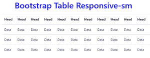

# 如何让现有的 bootstrap 2 表具有响应性？

> 原文:[https://www . geeksforgeeks . org/如何制作现有的引导-2 表响应/](https://www.geeksforgeeks.org/how-to-make-the-existing-bootstrap-2-table-responsive/)

*   **Method 1:**

    要使表格对所有视口大小都有响应，请将表格包装在一个开始和结束

    标签内，在开始标签内有类“表格响应”。

    **语法:**

    ```
    <div class="table-responsive">
      <table class="table">
        ...
      </table>
    </div>

    ```

    **示例:**该示例描述了“表响应”类。

    ```
    <!DOCTYPE html> 
    <html lang="en"> 
    <head> 
        <!-- Required meta tags -->
        <meta charset="utf-8"> 
        <meta name="viewport"
              content="width=device-width, 
                       initial-scale=1, 
                       shrink-to-fit=no"> 

        <!-- Bootstrap CSS -->
        <link rel="stylesheet" 
              href=
    "https://stackpath.bootstrapcdn.com/bootstrap/4.2.1/css/bootstrap.min.css" 
              integrity=
    "sha384-GJzZqFGwb1QTTN6wy59ffF1BuGJpLSa9DkKMp0DgiMDm4iYMj70gZWKYbI706tWS" 
              crossorigin="anonymous"> 

        <title>Bootstrap | Tables</title> 

        <style> 
        h1{ 
            color:blue; 
            text-align: center; 
        } 
        div{ 
            margin-top: 20px; 
        } 
        </style> 

    </head> 
    <body> 
        <div class="container"> 
        <h1>Bootstrap Table Responsive</h1> 

        <!-- table-responsive -->
        <div class="table-responsive"> 

            <!-- table -->
            <table class="table"> 
            <thead> 
                <tr> 
                <th scope="col">Head</td> 
                <th scope="col">Head</td> 
                <th scope="col">Head</td> 
                <th scope="col">Head</td> 
                <th scope="col">Head</td> 
                <th scope="col">Head</td> 
                <th scope="col">Head</td> 
                <th scope="col">Head</td> 
                <th scope="col">Head</td> 
                <th scope="col">Head</td> 
                <th scope="col">Head</td> 
                <th scope="col">Head</td> 
                </tr> 
            </thead> 
            <tbody> 
                <tr> 
                <td>Data</td> 
                <td>Data</td> 
                <td>Data</td> 
                <td>Data</td> 
                <td>Data</td> 
                <td>Data</td> 
                <td>Data</td> 
                <td>Data</td> 
                <td>Data</td> 
                <td>Data</td> 
                <td>Data</td> 
                <td>Data</td> 
                </tr> 
                <tr> 
                <td>Data</td> 
                <td>Data</td> 
                <td>Data</td> 
                <td>Data</td> 
                <td>Data</td> 
                <td>Data</td> 
                <td>Data</td> 
                <td>Data</td> 
                <td>Data</td> 
                <td>Data</td> 
                <td>Data</td> 
                <td>Data</td> 
                </tr> 
                <tr> 
                <td>Data</td> 
                <td>Data</td> 
                <td>Data</td> 
                <td>Data</td> 
                <td>Data</td> 
                <td>Data</td> 
                <td>Data</td> 
                <td>Data</td> 
                <td>Data</td> 
                <td>Data</td> 
                <td>Data</td> 
                <td>Data</td> 
                </tr> 
            </tbody> 
            </table> 

        </div> 
        </div> 
    </body> 
    </html>
    ```

    **输出:**

    **当窗口大小正常时:**

    

    **当窗口小时，即平板模式:**

    ***在平板和移动模式下都会出现滚动条。**T3】*

    

*   **Method 2:** Breakpoint specific

    使用。表响应{-sm|-md|-lg|-xl}来创建直到特定断点的响应表。从该断点向上，表将正常运行，不会水平滚动。

    <figure class="table">

    | level | Screen width |
    | . Table -sm | < 576 像素 |
    | . Table-Response -MD | < 768 像素 |
    | . Table-Response -LG | < 992 像素 |
    | . Table-Response -XL | < 1200 像素 |

    </figure>

    **语法:**

    ```
    <div class="table-responsive-sm">
      <table class="table">
        ...
      </table>
    </div>

    ```

    **示例:**该示例描述了“表响应 sm”类。

    ```
    <!DOCTYPE html> 
    <html lang="en"> 
    <head> 
        <!-- Required meta tags -->
        <meta charset="utf-8"> 
        <meta name="viewport"
              content="width=device-width, 
              initial-scale=1, 
              shrink-to-fit=no"> 

        <!-- Bootstrap CSS -->
        <link rel="stylesheet" 
              href=
    "https://stackpath.bootstrapcdn.com/bootstrap/4.2.1/css/bootstrap.min.css"
              integrity=
    "sha384-GJzZqFGwb1QTTN6wy59ffF1BuGJpLSa9DkKMp0DgiMDm4iYMj70gZWKYbI706tWS" 
              crossorigin="anonymous"> 

        <title>Bootstrap | Tables</title> 

        <style> 
        h1{ 
            color:blue; 
            text-align: center; 
        } 
        div{ 
            margin-top: 20px; 
        } 
        </style> 

    </head> 
    <body> 
        <div class="container"> 
        <h1>Bootstrap Table Responsive-sm</h1> 

        <!-- table-responsive -->
        <div class="table-responsive-sm"> 

            <!-- table -->
            <table class="table"> 
            <thead> 
                <tr> 
                <th scope="col">Head</td> 
                <th scope="col">Head</td> 
                <th scope="col">Head</td> 
                <th scope="col">Head</td> 
                <th scope="col">Head</td> 
                <th scope="col">Head</td> 
                <th scope="col">Head</td> 
                <th scope="col">Head</td> 
                <th scope="col">Head</td> 
                <th scope="col">Head</td> 
                <th scope="col">Head</td> 
                <th scope="col">Head</td> 
                </tr> 
            </thead> 
            <tbody> 
                <tr> 
                <td>Data</td> 
                <td>Data</td> 
                <td>Data</td> 
                <td>Data</td> 
                <td>Data</td> 
                <td>Data</td> 
                <td>Data</td> 
                <td>Data</td> 
                <td>Data</td> 
                <td>Data</td> 
                <td>Data</td> 
                <td>Data</td> 
                </tr> 
                <tr> 
                <td>Data</td> 
                <td>Data</td> 
                <td>Data</td> 
                <td>Data</td> 
                <td>Data</td> 
                <td>Data</td> 
                <td>Data</td> 
                <td>Data</td> 
                <td>Data</td> 
                <td>Data</td> 
                <td>Data</td> 
                <td>Data</td> 
                </tr> 
                <tr> 
                <td>Data</td> 
                <td>Data</td> 
                <td>Data</td> 
                <td>Data</td> 
                <td>Data</td> 
                <td>Data</td> 
                <td>Data</td> 
                <td>Data</td> 
                <td>Data</td> 
                <td>Data</td> 
                <td>Data</td> 
                <td>Data</td> 
                </tr> 
            </tbody> 
            </table> 

        </div> 
        </div> 
    </body> 
    </html>
    ```

    **输出:**

    **当窗口大小为> 576px 时:**

    

    **当窗口尺寸小于< 576px 时:**

    