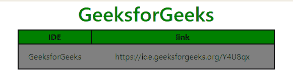
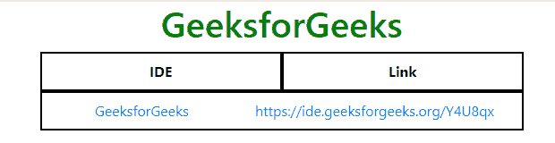

# 如何在 Bootstrap 中使表格中的整行都可以作为链接点击？

> 原文:[https://www . geeksforgeeks . org/如何在表中创建整行-可点击引导链接/](https://www.geeksforgeeks.org/how-to-make-whole-row-in-a-table-clickable-as-link-in-bootstrap/)

Bootstrap 中的表可以使用传统的标签或者使用内置的‘网格’系统来形成。早期，

标签经常被用来为网站设计网格，但是现在有了 CSS 中的 flexbox 和表格显示属性，只使用 div 就更容易了。

在下面的例子中，我们将看到如何使一个完整的行作为两种情况的链接可点击。

**Tradition <table> tag:**

现在要使整行成为可点击的，可以考虑将标签的内容包装成一个链接(

我们可以在< tr >标签上调用 **onclick** 方法，然后按照要求导航到任意位置。这里有一个例子解释如何做到这一点。

在这种情况下，示例表的标记如下所示:

```
<table>
  <tr>
    <th>IDE</th>
    <th>Link</th>
  </tr>
  <tr>
    <td>GeeksforGeeks</td>
    <td>https://ide.geeksforgeeks.org/Y4U8qx</td>
  </tr>
</table&gt
```

**例:1**

```
<!DOCTYPE html>
<html>

<head>
    <meta charset="utf-8">
    <meta name="viewport" 
     content="width=device-width, initial-scale=1, shrink-to-fit=no">

    <link rel="stylesheet" 
href="https://maxcdn.bootstrapcdn.com/bootstrap/4.0.0/css/bootstrap.min.css" />

    <title>Table Row Clickable</title>

    <style>
        th {
            background: green;
            border: 2px solid black;
        }

        .clickable {
            height: 50px;
            background: gray;
            border: 2px solid black;
        }

        .clickable:hover {
            background: green;
        }
    </style>
</head>

<body>
    <h1 style="color:green;text-align:center;">GeeksforGeeks</h1>

    <div class="container">
        <table class="w-100">
            <tr class="text-center">
               <th>IDE</th>
               <th>link</th>
            </tr>
            <tr class="clickable text-center" 
               onclick="window.location='https://ide.geeksforgeeks.org/Y4U8qx'">
               <td>GeeksforGeeks</td>
               <td>https://ide.geeksforgeeks.org/Y4U8qx</td>
            </tr>
        </table>
    </div>

    <script src="https://code.jquery.com/jquery-3.2.1.slim.min.js">
    </script>
    <script src=
     "https://maxcdn.bootstrapcdn.com/bootstrap/4.0.0/js/bootstrap.min.js">
    </script>
</body>

</html>
```

**Output:**

*   **点击行前:**
    *   **点击该行后:**

    ```
    GeeksforGeeks IDE will open
    ```

**Using Bootstrap Grid System:**

使用引导网格系统构建表格比使用标签要容易得多，并且提供了更多的灵活性。

在这种情况下，要使整行可点击，可以使用链接

可以使用 Bootstrap 重新设计前面示例中完全相同的表，如下所示:

```
<div class="row">
   <div class="col-6"><b>IDE</b></div>
   <div class="col-6"><b>Link</b></div>
   <div class="col-6 py-3">GeeksforGeeks</div>
   <div class="col-6 py-3">https://ide.geeksforgeeks.org/Y4U8qx</div>
</div>

```

**示例:**

```
<!DOCTYPE html>
<html>

<head>
    <meta charset="utf-8">
    <meta name="viewport" 
    content="width=device-width, initial-scale=1, shrink-to-fit=no">

    <link rel="stylesheet" 
href="https://maxcdn.bootstrapcdn.com/bootstrap/4.0.0/css/bootstrap.min.css" />

    <title>Table Row Clickable</title>

    <style>
        .clickable {
            height: 40px;
        }
    </style>
</head>

<body>
    <h1 style="color:green;text-align:center;">GeeksforGeeks</h1>
    <div class="container">
        <center class="row">
            <div style="border:2px solid black" 
                 class="col-6 py-2">
              <b>IDE</b>
            </div>
            <div style="border:2px solid black"
                 class="col-6 py-2">
              <b>Link</b>
            </div>

            <div style="border:2px solid black" class="col-12">
                <a class="row clickable" 
                   href="https://ide.geeksforgeeks.org/Y4U8qx">
                    <div class="col-5 py-2">
                      GeeksforGeeks
                    </div>
                    <div class="col-5 py-2">
                      https://ide.geeksforgeeks.org/Y4U8qx
                    </div>
                </a>
            </div>
        </center>
    </div>

    <script src="https://code.jquery.com/jquery-3.2.1.slim.min.js"></script>
    <script src=
     "https://maxcdn.bootstrapcdn.com/bootstrap/4.0.0/js/bootstrap.min.js">
    </script>
</body>

</html>
```

**Output:**

*   **点击行前:**
    *   **点击后排:**

    ```
    GeeksforGeeks IDE will open
    ```