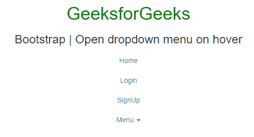
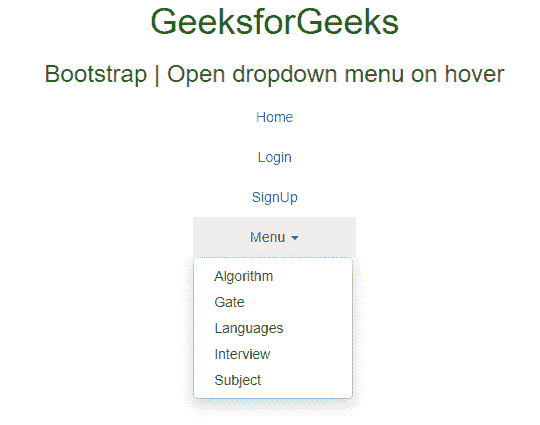
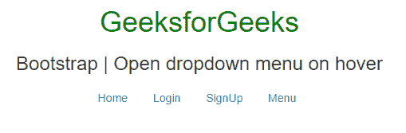
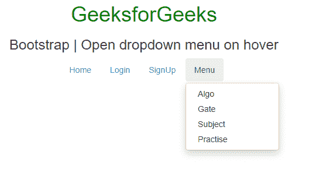

# 如何在 Bootstrap 中悬停时打开下拉菜单？

> 原文:[https://www . geesforgeks . org/如何打开-下拉菜单-悬停在引导中/](https://www.geeksforgeeks.org/how-to-open-dropdown-menu-on-hover-in-bootstrap/)

以下是在引导中悬停时打开下拉菜单的任务。鼠标悬停时的下拉菜单可以使用以下方法完成。

1.  **Using the jQuery [hover() method](https://www.geeksforgeeks.org/jquery-hover-with-examples/)**: It is used to specify two functions to start when mouse pointer move over the selected element.

    **语法:**

    ```html
    $(selector).hover(Function_in, Function_out);
    ```

    **进场:**

    *   **。悬停()方法**用于处理鼠标进入事件的发生
    *   使用**存储所选元素的所有直接子元素。小儿()法**。
    *   使用**检查元素是否可见。是(":可见")法**。
    *   使用**显示元素。toggleClass(“打开”)方法**。

    **示例:**

    ```html
    <!DOCTYPE html>
    <html lang="en">

    <head>
        <meta charset="UTF-8">
        <title>How to open dropdown menu 
          on hover in Bootstrap</title>

        <link rel="stylesheet" 
              href=
    "https://maxcdn.bootstrapcdn.com/bootstrap/3.3.7/css/bootstrap.min.css">
        <script src=
    "https://ajax.googleapis.com/ajax/libs/jquery/1.12.4/jquery.min.js">
      </script>
        <script src=
    "https://maxcdn.bootstrapcdn.com/bootstrap/3.3.7/js/bootstrap.min.js">
      </script>

        <style type="text/css">
            .bs-example {
                margin: auto;
                width: 25%;
            }

            @media screen {
                .dropdown:hover .dropdown-menu,
                .btn-group:hover .dropdown-menu {
                    display: block;
                }
                .dropdown-menu {
                    margin: auto;
                }
                .dropdown-toggle {
                    margin: auto;
                }
                .navbar .dropdown-toggle,
                .nav-tabs .dropdown-toggle {
                    margin: auto;
                }
            }
        </style>
    </head>

    <body>
        <center>
            <div class="container">

                <h1 style="text-align:center;color:green;"> 
                GeeksforGeeks 
            </h1>
                <h3>
                How to open dropdown menu on hover in Bootstrap
            </h3>
                <div class="bs-example">
                    <!--Tabs with dropdown menu-->
                    <ul class="nav">
                        <li class="active"><a href="#">Home</a></li>
                        <li><a href="#">Login</a></li>
                        <li><a href="#">SignUp</a></li>
                        <li class="dropdown">
                            <a href="#"
                               data-toggle="dropdown" 
                               class="dropdown-toggle">
                              Menu 
                              <b class="caret"></b>
                          </a>
                            <ul class="dropdown-menu">
                                <li><a href="#">Algorithm</a></li>
                                <li><a href="#">Gate</a></li>
                                <li><a href="#">Languages</a></li>
                                <li><a href="#">Interview</a></li>
                                <li><a href="#">Subject</a></li>
                            </ul>
                        </li>
                    </ul>
                    <hr>
                </div>
            </div>
            <script type="text/javascript">
                $(document).ready(function() {
                    $(".dropdown, .btn-group").hover(function() {
                        var dropdownMenu = 
                            $(this).children(".dropdown-menu");
                        if (dropdownMenu.is(":visible")) {
                            dropdownMenu.parent().toggleClass("open");
                        }
                    });
                });
            </script>
        </center>
    </body>

    </html>
    ```

    **输出:**
    **将鼠标移至下拉菜单前:**
    
    **将鼠标移至下拉菜单后:**
    

2.  **Using the CSS property**
    Section of code to be used in the program

    ```html
    .dropdown:hover .dropdown-menu {
      display: block;
    }
    ```

    **示例:**

    ```html
    <!DOCTYPE html>
    <html lang="en">

    <head>
        <title>How to open dropdown 
          menu on hover in Bootstrap</title>
        <link href=
    "https://cdnjs.cloudflare.com/ajax/libs/twitter-bootstrap/3.3.7/css/bootstrap.min.css"
              rel="stylesheet" />
        <script src=
    "https://cdnjs.cloudflare.com/ajax/libs/jquery/3.1.0/jquery.min.js">
      </script>
        <script src=
    "https://cdnjs.cloudflare.com/ajax/libs/twitter-bootstrap/3.3.7/js/bootstrap.min.js">
      </script>
        <style type="text/css">
            .bs-example {
                margin: auto;
                width: 25%;
            }

            .dropdown:hover .dropdown-menu {
                display: block;
            }
        </style>
    </head>

    <body>
        <center>
            <div class="container">
                <h1 style="text-align:center;color:green;">
                  GeeksforGeeks 
                 </h1>
                <h3>How to open dropdown menu on hover in Bootstrap
                 </h3>
                <div class="bs-example">
                    <ul id="nav"
                        class="nav nav-pills clearfix right" 
                        role="tablist">
                        <li><a href="#">Home</a></li>
                        <li><a href="#">Login</a></li>
                        <li><a href="#">SignUp</a></li>
                        <li class="dropdown">

                          <a href="#"
                             class="dropdown-toggle" 
                             data-toggle="dropdown">
                            Menu
                          </a>

                            <ul id="products-menu" 
                                class="dropdown-menu clearfix" 
                                role="menu">
                                <li><a href="">Algo</a></li>
                                <li><a href="">Gate</a></li>
                                <li><a href="">Subject</a></li>
                                <li><a href="">Practise</a></li>
                            </ul>
                        </li>
                    </ul>
                </div>
            </div>
        </center>
    </body>

    </html>
    ```

    **输出:**
    **将鼠标移至下拉菜单前:**
    
    **将鼠标移至下拉菜单后:**
    